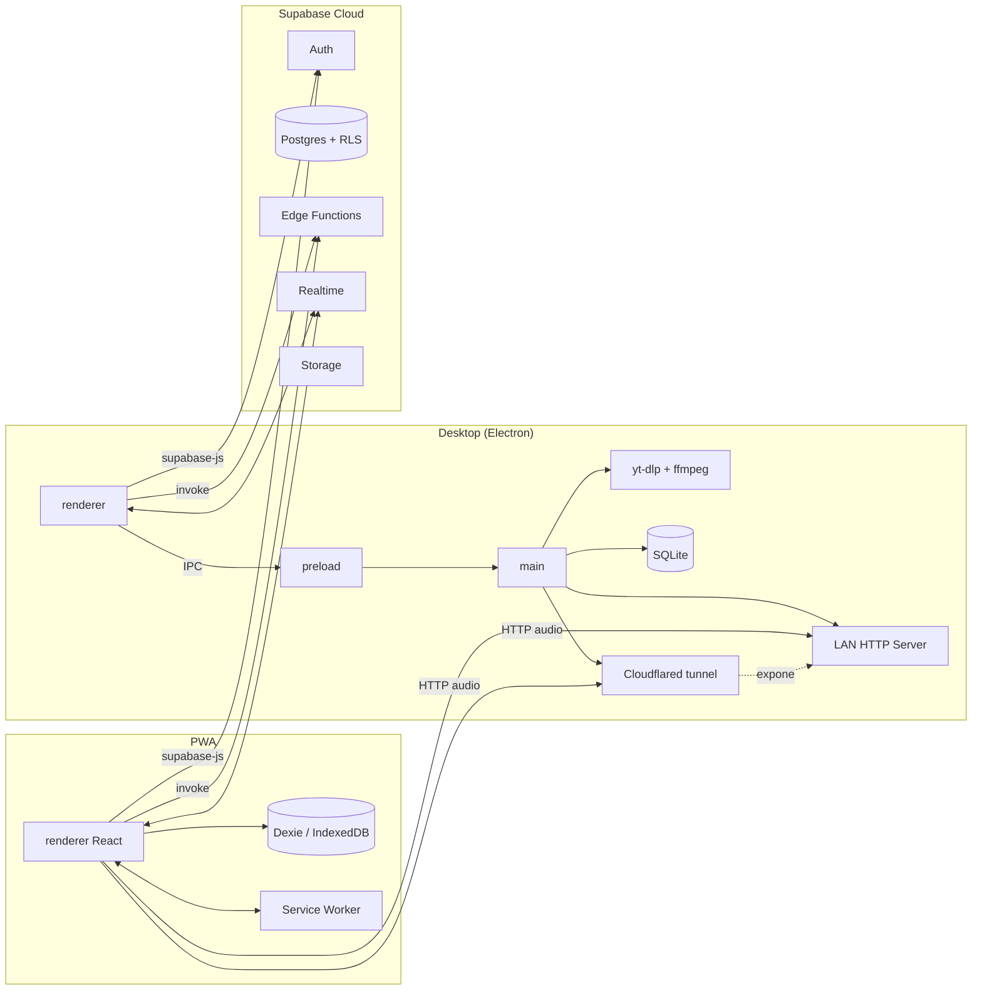
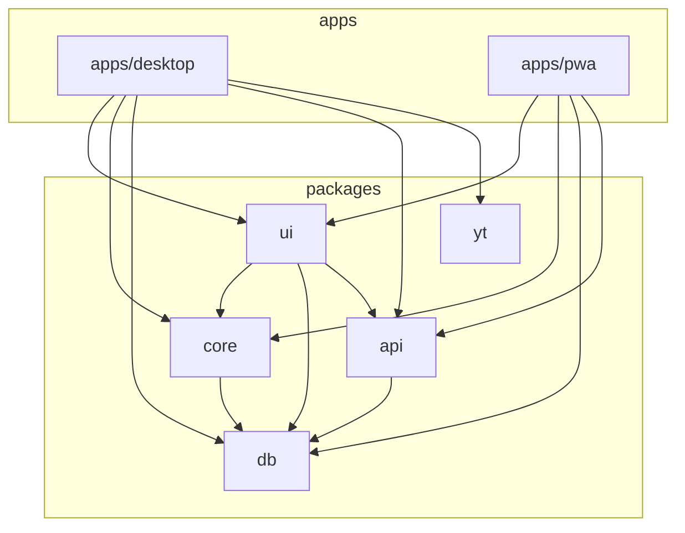

# Visión General

Ritmiq es un reproductor de música personal multiplataforma con tres pilares:

1. **Cliente Desktop** (Electron) — fuente de verdad local, baja a YouTube con `yt-dlp` y sirve audio a la PWA por LAN.
2. **Cliente PWA** (iOS / Android) — reutiliza la UI de `@ritmiq/ui` y consume audio del Desktop (LAN) o de Supabase Edge Functions.
3. **Backend Supabase** — auth, sync de biblioteca, social, recomendaciones, Edge Functions para resolver streams.

## Diagrama alto nivel

## Capas del monorepo

## Decisiones macro

- **JS + JSDoc** en vez de TypeScript: menor fricción de build en Electron, tipos en hot-paths.
- **Zustand + TanStack Query**: estado UI ligero + cache de red declarativo.
- **Howler.js** como abstracción de audio en Desktop; HTML Audio puro en PWA por compatibilidad con MediaSession en iOS.
- **better-sqlite3** en Desktop por sincronía y velocidad; **Dexie** en PWA porque IndexedDB es lo único disponible.
- **Cloudflared** en lugar de NAT punching: estable y gratis hasta 50 túneles.
- **yt-dlp embebido** en Desktop, no en PWA (binario no portable). PWA usa Edge Function [[resolve-stream]].

Ver detalles en [[Decisiones-Tecnicas-ADR]] y [[Monorepo-y-Workspaces]].
