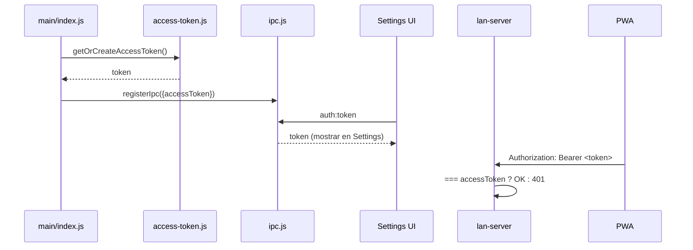

# `main/access-token.js`

> Genera y persiste el token Bearer del *owner* (33 bytes random) que clientes externos usan para autenticarse contra el [[lan-server]].

## Ubicación
`apps/desktop/main/access-token.js:1` (39 líneas)

## Exports

### `getOrCreateAccessToken(): string`

Lee `userData/access-token.txt`. Si no existe, genera 32 bytes random en `base64url` (43 chars sin padding) y lo persiste. Idempotente.

### `regenerateAccessToken(): string`

Genera un token nuevo, sobrescribe el archivo, invalida cualquier cliente que use el anterior.

## Anatomía del código (snippet completo)

`apps/desktop/main/access-token.js:22-38`

```js
export function getOrCreateAccessToken() {
  const p = tokenPath();
  if (existsSync(p)) {
    const t = readFileSync(p, 'utf8').trim();
    if (t) return t;
  }
  // 32 bytes en base64url → 43 chars sin padding.
  const t = randomBytes(32).toString('base64url');
  writeFileSync(p, t, 'utf8');
  return t;
}

export function regenerateAccessToken() {
  const t = randomBytes(32).toString('base64url');
  writeFileSync(tokenPath(), t, 'utf8');
  return t;
}
```

**Por qué `base64url` y no `hex`**: `base64url` da 43 chars para 32 bytes vs 64 chars en hex. Más corto, mismo espacio entropía, URL-safe (sin `+`, `/`, `=`). Útil porque el usuario lo copia/pega en la PWA → Settings.

**Por qué `.trim()`**: si el archivo se editó a mano puede tener newline final. Sin trim, el token comparado server-side falla por 1 byte.

**Por qué plaintext (no cifrado)**: el modelo de amenaza asume que si un atacante tiene acceso a `userData/` ya tiene la DB, las cookies de YouTube y el resto. Cifrar este archivo no aporta defensa real.

## Path resultante

```
<userData>/access-token.txt
```

| OS | Ruta típica |
|---|---|
| Linux | `~/.config/Ritmiq/access-token.txt` |
| macOS | `~/Library/Application Support/Ritmiq/access-token.txt` |
| Windows | `%APPDATA%/Ritmiq/access-token.txt` |

## Flujo de uso



## Dependencias entrantes
- [[index|main/index.js]] → `getOrCreateAccessToken()` al boot.
- [[ipc]] → handlers `auth:token` y `auth:regenerateToken`.
- [[lan-server]] valida `Authorization: Bearer` contra este token.

## Dependencias salientes
- `node:crypto.randomBytes`.
- `node:fs` (persistencia plaintext).
- `electron.app.getPath('userData')`.

## Side-effects
- Crea/sobrescribe `userData/access-token.txt`.

## Qué puede romper este cambio

| Cambio | Síntoma observable |
|---|---|
| Quitar `.trim()` en read | Token comparado falla si el archivo tiene newline final → 401 inexplicable. |
| Cambiar a `hex` sin actualizar UI | Token mostrado tiene 64 chars; el usuario copia mal por longitud y obtiene 401. |
| Bajar a < 16 bytes | Brute force teóricamente viable; baja defensa. |
| Borrar `regenerateAccessToken` | Si el token se filtra, no hay forma de rotar sin borrar el archivo a mano. |

## Notas / Changelog
- 2026-05-22: nivel simple.
