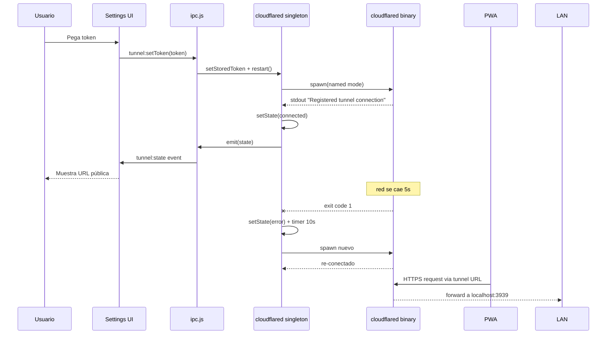

# `main/cloudflared.js`

> Gestor del Cloudflare Tunnel embebido. Spawnea el binario `cloudflared`, expone estado reactivo, parsea la URL pública de los logs y reinicia automáticamente si el proceso muere.

## Ubicación
`apps/desktop/main/cloudflared.js:1` (252 líneas)

## Modelo

Singleton `cloudflared` instancia de `CloudflaredManager`. Vive todo el ciclo del proceso main. Estado expuesto vía `onChange(cb)` con shape `TunnelState`:

```js
/**
 * @typedef {Object} TunnelState
 * @property {'idle'|'connecting'|'connected'|'error'} status
 * @property {string|null} url
 * @property {string|null} error
 */
```

## Modos de tunnel

| Modo | Comando | URL | Persistencia |
|---|---|---|---|
| `'quick'` | `cloudflared tunnel --no-autoupdate --url http://localhost:3939` | `*.trycloudflare.com` aleatoria | No: cambia al reiniciar |
| `'named'` | `cloudflared tunnel --no-autoupdate run --token <token>` | Definida en CF Dashboard | Sí: dominio propio |
| `'auto'` o vacío | Named si hay token, Quick si no | — | — |

## Exports y API del singleton

| Export | Tipo |
|---|---|
| `getStoredToken(): string \| null` | función |
| `setStoredToken(token: string \| null): void` | función |
| `getCustomUrl(): string \| null` | función |
| `setCustomUrl(url: string \| null): void` | función |
| `cloudflared.start(opts?): Promise<void>` | método |
| `cloudflared.stop(): Promise<void>` | método |
| `cloudflared.restart(): Promise<void>` | método |
| `cloudflared.onChange(cb): () => void` | suscripción |
| `cloudflared.state: TunnelState` | propiedad read-only |
| `cloudflared.isRunning(): boolean` | método |

## Paths persistentes

| Archivo | Contenido |
|---|---|
| `<userData>/tunnel-token.txt` | Token Cloudflare Tunnel (Named mode) |
| `<userData>/tunnel-custom-url.txt` | URL pública custom configurada por el usuario |

## Anatomía del código (snippets clave)

### 1. Resolución del binario con 3 niveles
`apps/desktop/main/cloudflared.js:22-31`

```js
function getCloudflaredPath() {
  const bin = process.platform === 'win32' ? 'cloudflared.exe' : 'cloudflared';
  if (app.isPackaged) {
    const packed = join(process.resourcesPath, 'bin', bin);
    if (existsSync(packed)) return packed;
  }
  const dev = join(__dirname, '..', 'bin', bin);
  if (existsSync(dev)) return dev;
  return bin; // fallback PATH
}
```

**Patrón consistente con [[ytdlp-path]]**: packaged → dev → PATH. Difiere en que NO hay capa "user override" porque cloudflared no necesita parches del usuario (su API es estable; YouTube cambia, Cloudflare casi nunca).

### 2. Decisión de modo basada en presencia de token
`apps/desktop/main/cloudflared.js:144-156`

```js
async start(opts = {}) {
  const token = getStoredToken();
  const mode = opts.mode === 'quick' ? 'quick'
             : opts.mode === 'named' ? 'named'
             : (token ? 'named' : 'quick');

  if (mode === 'named' && !token) {
    this.setState({
      status: 'error', url: null,
      error: 'No hay token de tunnel configurado.',
    });
    return;
  }
  if (this.isRunning()) return;
  // ...
}
```

**Por qué `mode === 'auto'` está implícito**: cualquier valor distinto de `'quick'`/`'named'` cae al ternario final. Si el caller pasa `{}` o `undefined`, decidimos según token. Hace la API tolerante: la UI puede llamar `start()` sin pensar el modo y nosotros elegimos.

**Por qué `isRunning()` guard**: si la UI clickea "Start" dos veces seguidas, evitamos spawnear dos procesos cloudflared compitiendo por el mismo puerto.

### 3. Parser de URL pública desde stdout
`apps/desktop/main/cloudflared.js:173-190`

```js
const onLine = (line) => {
  const text = String(line);
  // cloudflared emite líneas con timestamp + message. Buscar URL pública.
  // Para Named Tunnels con dominio custom NO aparece la URL en logs
  // (depende de la config en CF Dashboard).
  // Extraemos URL si aparece formato `https://<name>.cfargotunnel.com`
  // o `https://<name>.trycloudflare.com`.
  const m = text.match(/https:\/\/[a-z0-9-]+\.(cfargotunnel\.com|trycloudflare\.com)/);
  if (m && this.state.url !== m[0]) {
    this.setState({ status: 'connected', url: m[0], error: null });
  }
  // Otra señal: "Registered tunnel connection".
  if (text.includes('Registered tunnel connection')) {
    if (this.state.status !== 'connected') {
      this.setState({ status: 'connected', error: null });
    }
  }
};
```

**Por qué dos señales**: la URL aparece para Quick tunnels y para Named sin dominio custom. Para Named con dominio custom (`https://music.midominio.com`) cloudflared NO la imprime — solo loguea `Registered tunnel connection`. Necesitamos ambos detectores para no quedar en `'connecting'` eternamente.

**Por qué el regex no captura dominios custom**: precisamente porque son arbitrarios. El usuario los proporciona via `setCustomUrl()` y los reflejamos a los 8s (snippet 5).

### 4. Auto-restart con guardia de intencionalidad
`apps/desktop/main/cloudflared.js:199-212`

```js
child.on('exit', (code, signal) => {
  this.process = null;
  if (this.intentStopped) {
    this.setState({ status: 'idle', url: null });
    return;
  }
  this.setState({
    status: 'error',
    error: `cloudflared salió (code=${code} signal=${signal})`,
  });
  // Auto-restart con backoff de 10s si no fue intencional.
  if (this.restartTimer) clearTimeout(this.restartTimer);
  this.restartTimer = setTimeout(() => this.start(), 10_000);
});
```

**Por qué `intentStopped` flag**: distingue "el usuario clickeó Stop" de "cloudflared crasheó". Sin esto, llamar `stop()` desencadenaría un restart automático que no querés. El flag se setea a `true` en `stop()` y a `false` en `start()`.

**Por qué backoff fijo de 10s**: cloudflared raramente falla; cuando lo hace suele ser un blip de red. 10s es suficiente para que la red se recupere sin entrar en un loop de spawn frenético. No usamos exponential backoff porque rara vez encadenamos > 2 reintentos en la práctica.

### 5. Reflejo de URL custom con delay
`apps/desktop/main/cloudflared.js:214-224`

```js
// Si el usuario tiene una URL custom guardada (Named Tunnel con dominio
// propio), la reflejamos como URL "activa" después de unos segundos
// independientemente de que cloudflared la imprima o no.
setTimeout(() => {
  const custom = getCustomUrl();
  if (custom && this.state.status === 'connecting') {
    this.setState({ status: 'connected', url: custom });
  } else if (custom && this.state.status === 'connected' && !this.state.url) {
    this.setState({ url: custom });
  }
}, 8000);
```

**Por qué 8 segundos**: tiempo empírico que toma cloudflared en conectar realmente (DNS + handshake con CF edge). Si pones menos, marcás "connected" antes de que el tunnel sea funcional → la UI dice OK pero el primer stream falla.

**Edge case que cubre**: Named tunnel con dominio custom donde cloudflared imprime solo "Registered tunnel connection" sin URL. Sin este timer, el usuario vería `status:'connected'` pero `url: null` y no sabría a dónde apuntar la PWA.

## Flujo end-to-end



## Casos de borde y gotchas

- **Token cambiado mientras conectado**: `setStoredToken` solo guarda el archivo. El restart se debe pedir explícitamente desde [[ipc]] (`tunnel:setToken` hace exactamente eso).
- **`cloudflared` no encontrado**: spawn emite `error` → state `'error'` con mensaje. Backoff retry intentará indefinidamente sin éxito. Mitigación: validar `getCloudflaredPath` antes de start (no implementado).
- **`SIGKILL` tarda**: el `setTimeout(SIGKILL, 3000)` se ejecuta aunque el proceso ya hubiera muerto antes. Inofensivo (`kill` sobre proceso muerto es no-op).
- **Múltiples ventanas, múltiples listeners**: `onChange` permite N suscriptores. El [[ipc]] broadcast a todas las `BrowserWindow.getAllWindows()` — implementación correcta.
- **URL custom mal escrita**: `setCustomUrl` normaliza (añade `https://`, quita `/` final). Pero no valida dominio real → si el usuario pone basura, la UI muestra URL falsa.
- **Modo Quick + custom URL**: si el usuario configuró `customUrl` pero ahora hace `start({mode:'quick'})`, el snippet 5 reflejaría la custom URL en lugar de la auto-generada. Bug latente, no priorizado.

## Performance y costes

| Operación | Coste |
|---|---|
| `start()` | spawn proceso, parseo de stdout/stderr stream, ~8s hasta `connected` |
| `stop()` | SIGTERM (graceful, ~100ms) + SIGKILL fallback a 3s |
| `restart()` | stop + 500ms delay + start = ~10s |
| Tráfico via tunnel | latencia +30-100ms vs LAN directa (depende de cercanía al edge CF) |

CPU del proceso cloudflared: ~0% idle, picos breves durante negotiation. RAM: ~30-50MB residente.

## Dependencias entrantes
- [[index|main/index.js]] → `cloudflared.start({mode:'named'})` al boot si hay token.
- [[ipc]] → handlers `tunnel:status`, `tunnel:start`, `tunnel:stop`, `tunnel:setToken`, `tunnel:setCustomUrl`, `tunnel:startQuick`. Subscribe a `onChange` para broadcast.

## Dependencias salientes
- `node:child_process.spawn`.
- `node:fs` (token + custom URL).
- `electron.app` (userData, isPackaged, resourcesPath).

## Side-effects
- Spawnea proceso hijo cloudflared.
- Escribe/lee `<userData>/tunnel-token.txt` y `<userData>/tunnel-custom-url.txt`.
- Emite eventos a listeners suscritos.

## Errores manejados
- `child.on('error')` → setState `'error'`.
- `child.on('exit')` no intencional → setState `'error'` + auto-restart 10s.
- Sin token en modo named → setState `'error'` con mensaje.
- Lectura de archivo falla → retorna null (no throw).

## Qué puede romper este cambio

| Cambio | Síntoma observable |
|---|---|
| Quitar el flag `intentStopped` | `stop()` desencadena restart automático en 10s; usuario no puede apagar el tunnel. |
| Bajar el delay de URL custom de 8000 a < 3000 | Marcamos `connected` antes de que el tunnel sea funcional; primer stream falla. |
| Cambiar regex para que también capture dominios custom | Reflejamos URL detectada en logs aunque el usuario haya configurado otra; confusión. |
| Quitar `isRunning()` guard | Doble click en Start spawnea 2 procesos compitiendo por el mismo puerto local. |
| Cambiar backoff fijo a exponencial sin límite | Si cloudflared está roto permanentemente, el desktop entra en loop infinito; cap necesario. |
| Eliminar el `SIGKILL` fallback | Si `SIGTERM` no llega (cloudflared colgado), el proceso queda zombie y bloquea el puerto. |
| Olvidar `emit()` tras `setState` | UI no recibe el cambio; estado interno divergente del visual. |

## Notas / Changelog
- 2026-05-22: nivel pleno.
