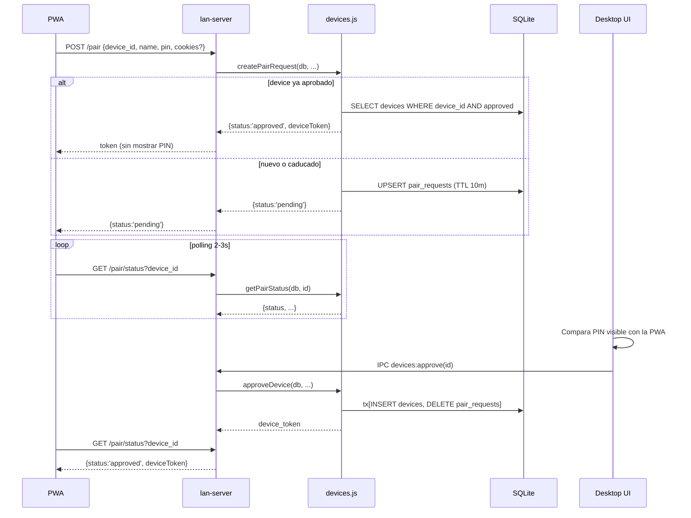

# `main/devices.js`

> Gestión de dispositivos pareados con el desktop. Implementa el **Modelo Y** (decisión del 17/05/2026): cada desktop autoriza por sí mismo qué PWAs pueden reproducir, sin depender de RLS de Supabase.

## Ubicación
`apps/desktop/main/devices.js:1` (383 líneas, 16 funciones exportadas)

## Por qué Modelo Y

Antes el flujo dependía de la cuenta Supabase: si Ana se logueaba en cualquier PWA con su cuenta, automáticamente podía streamear del desktop. Una sesión Supabase comprometida implicaba acceso total al desktop.

Modelo Y desacopla autorización de cuenta:

- Cada PWA se parea **explícitamente** con el desktop una sola vez, con confirmación visual por PIN.
- El desktop guarda un `device_token` random; ese es el único válido para reproducir.
- Revocar es local e inmediato (no depende de propagación de Supabase).
- Auto-pair por cuenta Supabase **desactivado** desde el 17/05/2026.

## Tablas usadas

| Tabla | Rol |
|---|---|
| `devices` | Devices aprobados (`status='approved'`) o revocados (`status='revoked'`). |
| `pair_requests` | Solicitudes pendientes, TTL 10 min. Una por `device_id`. |
| `device_activity` | Log rotativo de eventos por device. |

Ver [[schema]] (capa `db`) para columnas exactas.

## Tipos

```js
/**
 * @typedef {Object} DeviceRow
 * @property {string}         device_id          UUID del cliente PWA.
 * @property {string}         device_token       Bearer token (43 chars base64url).
 * @property {string}         display_name       Nombre humano editable.
 * @property {string|null}    supabase_user_id   Opcional, para auditoría.
 * @property {'approved'|'revoked'} status
 * @property {string}         approved_at        ISO datetime.
 * @property {string|null}    last_seen_at       ISO datetime, best-effort.
 * @property {string|null}    revoked_at         ISO datetime.
 * @property {string|null}    cookies_updated_at ISO datetime de la última subida de cookies YT.
 */
```

## Constantes

```js
const PAIR_REQUEST_TTL_MS = 10 * 60 * 1000; // 10 min
const DEVICE_TOKEN_BYTES  = 32;             // → 43 chars base64url sin padding
```

## Inventario de exports

| # | Función | Línea | Tipo |
|---|---|---|---|
| 1 | `createPairRequest` | `:67` | mutación |
| 2 | `approveDevice` | `:132` | mutación |
| 3 | `rejectPairRequest` | `:178` | mutación |
| 4 | `revokeDevice` | `:188` | mutación (soft-delete) |
| 5 | `forgetDevice` | `:200` | mutación destructiva |
| 6 | `renameDevice` | `:210` | mutación |
| 7 | `getPairStatus` | `:224` | lectura + side-effect (TTL vacuum) |
| 8 | `findDeviceByToken` | `:257` | lectura + side-effect (last_seen) |
| 9 | `listDevices` | `:272` | lectura |
| 10 | `listPairRequests` | `:285` | lectura + side-effect (TTL vacuum) |
| 11 | `logActivity` | `:308` | mutación, best-effort |
| 12 | `updateDeviceCookies` | `:330` | mutación |
| 13 | `getDeviceActivity` | `:340` | lectura |
| 14 | `pruneOldActivity` | `:357` | mantenimiento |
| 15 | `deriveDisplayNameFromUA` | `:368` | utilitario puro |
| 16 | `newDeviceId` | `:381` | utilitario puro |

## Firmas detalladas

### `createPairRequest(db, input)`

```js
function createPairRequest(db, {
  deviceId, displayName, supabaseUserId = null, pin,
  cookiesBlob = null, clientIp = null,
}): { status: 'approved'|'pending', deviceToken?: string, displayName: string }
```

| Param | Tipo | Obligatorio | Validación |
|---|---|---|---|
| `deviceId` | string | sí | throw si vacío |
| `displayName` | string | sí | throw si vacío |
| `pin` | string | sí | throw si vacío |
| `supabaseUserId` | string \| null | no | informativo |
| `cookiesBlob` | Buffer \| null | no | ya cifrado por [[device-cookies#encryptCookies]] |
| `clientIp` | string \| null | no | informativo |

### `approveDevice(db, input): string`

Devuelve `device_token`. Inputs: `deviceId`, `displayName`, `supabaseUserId?`, `cookiesBlob?`.

### `getPairStatus(db, deviceId)`

```js
function getPairStatus(db, deviceId): {
  status: 'approved' | 'pending' | 'rejected',
  deviceToken?: string,
  displayName?: string
}
```

| Caso | status |
|---|---|
| `devices.status='approved'` | `'approved'` + token |
| `devices.status='revoked'` | `'rejected'` |
| `pair_requests` vigente | `'pending'` + name |
| `pair_requests` caducada (auto-borra) | `'rejected'` |
| No existe | `'rejected'` |

### Resto

```js
findDeviceByToken(db, token): DeviceRow | null   // solo 'approved', actualiza last_seen
rejectPairRequest(db, deviceId): void
revokeDevice(db, deviceId): void                  // soft-delete
forgetDevice(db, deviceId): void                  // destructivo, tx
renameDevice(db, deviceId, newName: string): void // valida len <= 80
listDevices(db): DeviceRow[]
listPairRequests(db): PairRequestRow[]
logActivity(db, { deviceId, action, trackId?, ytId?, meta? }): void
updateDeviceCookies(db, deviceId, cookiesBlob: Buffer): void
getDeviceActivity(db, deviceId, limit=100): ActivityRow[]
pruneOldActivity(db, daysToKeep=5): number
deriveDisplayNameFromUA(ua: string): string
newDeviceId(): string
```

---

## Anatomía del código (snippets clave)

### 1. Idempotencia: device ya aprobado vuelve a pedir pareo
`apps/desktop/main/devices.js:75-86`

```js
const existing = db.prepare(
  "SELECT device_token, display_name FROM devices WHERE device_id = ? AND status = 'approved'"
).get(deviceId);
if (existing) {
  return {
    status: 'approved',
    deviceToken: existing.device_token,
    displayName: existing.display_name,
  };
}
```

**Por qué**: una PWA puede perder su `device_token` (storage borrado, reinstalación) pero conservar el `device_id`. Sin este short-circuit, mostraríamos PIN al usuario otra vez aunque ya esté aprobado. Devolver el token existente cierra el caso con cero fricción.

### 2. Por qué auto-pair por cuenta Supabase está desactivado
`apps/desktop/main/devices.js:87-91`

```js
// DECISION (Sun May 17 2026): auto-pair per cuenta Supabase DESACTIVADO.
// El owner debe aprobar cada device manualmente con PIN. Compromiso
// de cuenta Supabase != compromiso de devices. Si en el futuro se
// reactiva auto-pair, el bloque se restaura con un check de feature
// flag en el config del desktop.
```

**Decisión explícita**: si alguna vez recuperás auto-pair, tiene que ir **detrás de un feature flag**, no como default. Razón: separar "tener tu cuenta" de "tener tu PC".

### 3. Aprobación atómica con preservación de cookies
`apps/desktop/main/devices.js:137-170`

```js
const tx = db.transaction(() => {
  const pr = db.prepare(
    'SELECT cookies_blob FROM pair_requests WHERE device_id = ?'
  ).get(deviceId);
  const finalCookies = cookiesBlob ?? pr?.cookies_blob ?? null;

  db.prepare(/* sql */ `
    INSERT INTO devices (device_id, device_token, ..., status, cookies_blob, ...)
    VALUES (?, ?, ..., 'approved', ?, ...)
    ON CONFLICT(device_id) DO UPDATE SET
      device_token = excluded.device_token,
      status = 'approved',
      cookies_blob = COALESCE(excluded.cookies_blob, devices.cookies_blob),
      cookies_updated_at = CASE
        WHEN excluded.cookies_blob IS NOT NULL THEN excluded.cookies_updated_at
        ELSE devices.cookies_updated_at END,
      revoked_at = NULL
  `).run(/* ... */);
  db.prepare('DELETE FROM pair_requests WHERE device_id = ?').run(deviceId);
});
tx();
```

**Tres decisiones concentradas**:

1. **Transacción**: INSERT + DELETE son atómicos. Sin tx, un crash entre las dos sentencias dejaría device aprobado + pair_request fantasma que la PWA seguiría poll-eando.
2. **Re-approve de revocado**: `ON CONFLICT … status='approved', revoked_at=NULL` reactiva sin borrar `device_activity` previo.
3. **`COALESCE` preserva cookies**: si el caller no pasa `cookiesBlob` y el device ya tenía, **no las borramos**. El `cookies_updated_at` solo avanza si realmente cambiaron.

### 4. Polling de estado con vacuum oportunista
`apps/desktop/main/devices.js:239-248`

```js
const pr = db.prepare(
  'SELECT expires_at, display_name FROM pair_requests WHERE device_id = ?'
).get(deviceId);
if (!pr) return { status: 'rejected' };
if (new Date(pr.expires_at).getTime() < Date.now()) {
  db.prepare('DELETE FROM pair_requests WHERE device_id = ?').run(deviceId);
  return { status: 'rejected' };
}
return { status: 'pending', displayName: pr.display_name };
```

**Side-effect en lectura**: si la pair_request expiró, la borramos antes de responder. Es vacuum oportunista — limpiamos sólo lo que tropezamos. Evita que `pair_requests` crezca sin cron.

### 5. Validación de token tolerante a fallos
`apps/desktop/main/devices.js:257-269`

```js
export function findDeviceByToken(db, token) {
  if (!token) return null;
  const row = db.prepare(
    "SELECT * FROM devices WHERE device_token = ? AND status = 'approved'"
  ).get(token);
  if (!row) return null;
  try {
    db.prepare('UPDATE devices SET last_seen_at = ? WHERE device_id = ?')
      .run(new Date().toISOString(), row.device_id);
  } catch {}
  return row;
}
```

**Por qué try/catch silencioso**: la actualización de `last_seen_at` es telemetría pura. Si falla (lock, disco lleno), **no podemos romper la auth**. La función devuelve igual la fila. UX prevalece sobre métrica.

**Por qué no `timingSafeEqual`**: el token es 32 bytes random (espacio 2^256). Timing attack sobre comparación en SQLite es irrelevante a esa entropía.

---

## Flujo de pareo end-to-end



---

## Casos de borde y gotchas

- **Device aprobado mientras la PWA ya cerró**: el `device_token` queda colgado en `devices` aunque la PWA nunca lo recoja. En el próximo `POST /pair` la idempotencia (snippet 1) lo recupera.
- **`pair_requests` caducada justo durante approve**: `approveDevice` no chequea TTL — sólo lee la pair_request si existe. El TTL se enforce en lecturas (`getPairStatus`, `listPairRequests`).
- **Cookies muy grandes**: `updateDeviceCookies` no tiene límite. El límite (1MB) vive en [[lan-server]] `/cookies/upload`. Llamarlo directo desde el main bypasea esa protección.
- **Token revocado + archivo de cookies huérfano**: al revocar, las cookies del device siguen en `<userData>/device-cookies/<id>.txt` hasta que [[ipc]] llame a [[device-cookies#invalidateDeviceCookies]]. Olvidar esa llamada deja archivo huérfano (no leído por nadie, pero ocupa disco).

## Performance y costes

| Operación | Coste típico | Bloquea event loop |
|---|---|---|
| `createPairRequest` | 1 UPSERT + 1 SELECT, ~1-2ms | sí (better-sqlite3 es sync) |
| `approveDevice` | tx con 2 SELECT + 1 UPSERT + 1 DELETE, ~3-5ms | sí |
| `findDeviceByToken` | 1 SELECT + 1 UPDATE, ~1ms | sí |
| `getPairStatus` | 2 SELECT (+1 DELETE si caducada), ~1-2ms | sí |
| `listDevices` / `listPairRequests` | 1 SELECT + sort, ~5ms con cientos de filas | sí |
| `logActivity` | 1 INSERT, ~1ms | sí |

Para uso doméstico (1–10 devices) el coste es despreciable. Si alguna vez sirviese a 100+ devices simultáneos, el UPDATE síncrono de `last_seen_at` en cada request de stream empieza a notarse. Mitigación: batch cada 30s en lugar de por request.

---

## Dependencias entrantes
- [[lan-server]] → POST `/pair` (`createPairRequest`), GET `/pair/status` (`getPairStatus`), todos los endpoints autenticados (`findDeviceByToken`), `/cookies/upload` (`updateDeviceCookies`, `logActivity`), endpoints de streaming (`logActivity`).
- [[ipc]] → handlers `devices:*` mapean 1:1 con los exports.
- `apps/desktop/main/devices.test.js` (suite de tests).

## Dependencias salientes
- `node:crypto` → `randomBytes(32)`, `randomUUID()`.
- DB via `better-sqlite3` (instancia inyectada por el caller).

## Side-effects
- Mutaciones en `devices`, `pair_requests`, `device_activity`.
- `forgetDevice` borra `device_activity` en transacción.
- `findDeviceByToken` actualiza `last_seen_at` best-effort.
- `getPairStatus` y `listPairRequests` borran `pair_requests` caducadas (vacuum oportunista).
- No abre archivos, no spawnea, no toca red.

## Errores manejados
- Inputs requeridos faltantes → throw.
- `renameDevice` con nombre vacío o > 80 chars → throw `'invalid name'`.
- `updateDeviceCookies` sobre device inexistente o no-approved → throw `'device not found or not approved'`.
- `logActivity` errores → `console.warn` + tragado.
- `findDeviceByToken` errores en UPDATE de `last_seen_at` → tragados.

## Qué puede romper este cambio

| Cambio | Síntoma observable |
|---|---|
| Sacar la transacción de `approveDevice` | Crash entre INSERT y DELETE → device aprobado + pair_request fantasma → owner ve solicitud "pendiente" eternamente. |
| Sacar la idempotencia (snippet 1) | Usuario reinstala PWA con mismo `device_id` y debe re-aprobar manualmente con PIN. |
| Cambiar `DEVICE_TOKEN_BYTES` a < 16 | Brute force teóricamente posible; baja defensa en profundidad. |
| Hacer `forgetDevice` sin transacción | Si peta a mitad → `device_activity` huérfana. `getDeviceActivity` devuelve fantasmas. |
| Reactivar auto-pair Supabase sin feature flag | Compromiso de cuenta = compromiso de devices (regresión del Modelo Y). |
| Cambiar UPSERT a INSERT puro en `createPairRequest` | Segundo intento del mismo device tira UNIQUE constraint → PWA recibe 500 y queda atascada. |

## Tests

- `apps/desktop/main/devices.test.js` — 291 líneas. Cubre pareo, idempotencia, approve/reject/revoke/forget, `getPairStatus` en sus 5 casos, rename con validación. Correr con `pnpm test`.

## Notas / Changelog
- 2026-05-22: nota con nivel pleno (5 snippets + matriz qué-rompe + perf + diagrama).
- 2026-05-17: auto-pair per cuenta Supabase DESACTIVADO (decisión inline línea 87-91).
