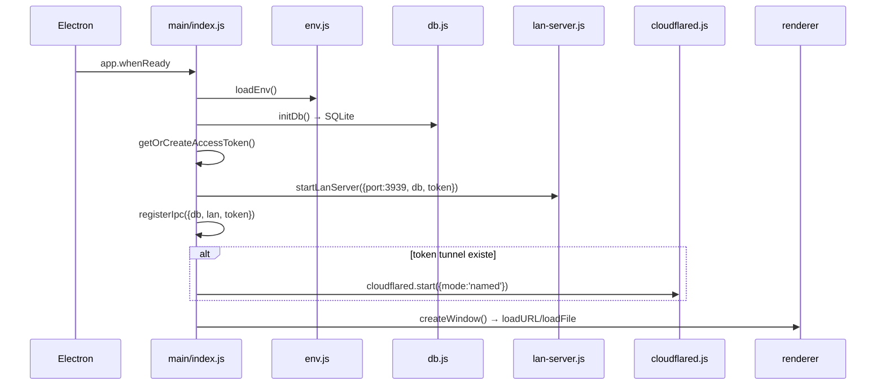

# `main/index.js`

> Entry point del proceso main de Electron. Orquesta el arranque: env → DB → access token → LAN server → IPC → tunnel → ventana.

## Ubicación
`apps/desktop/main/index.js:1` (131 líneas)

## Responsabilidades

1. Cargar variables de entorno **antes** de cualquier import que dependa de `process.env`.
2. Inicializar SQLite via [[db]].
3. Generar/cargar access token Bearer via [[access-token]].
4. Arrancar el [[lan-server]] en `:3939` (no bloqueante).
5. Registrar handlers IPC via [[ipc]].
6. Si hay token guardado → arranca [[cloudflared]] en modo Named.
7. Crear `BrowserWindow` con `backgroundThrottling: false` (crítico para audio en background).
8. Bloquear zoom (`Ctrl +/-/0` y `wheel`).
9. Capturar excepciones no manejadas.

## Configuración de la ventana

| Parámetro | Valor | Razón |
|---|---|---|
| `width × height` | 1280 × 800 | Default cómodo |
| `minWidth × minHeight` | 940 × 560 | UI no se rompe debajo de esto |
| `backgroundColor` | `#0a0a0c` | Evita flash blanco al cargar |
| `titleBarStyle` | `hiddenInset` | Look macOS-like, custom traffic lights |
| `webPreferences.preload` | `../preload/index.cjs` | Puente seguro a APIs main |
| `webPreferences.contextIsolation` | `true` | Renderer NO accede a Node directo |
| `webPreferences.nodeIntegration` | `false` | Igual, defensa en profundidad |
| `webPreferences.sandbox` | `false` | Necesario para que el preload use `require('electron')` |
| `webPreferences.backgroundThrottling` | `false` | Audio sigue funcionando con ventana minimizada |

## Anatomía del código (snippets clave)

### 1. Orden estricto: `loadEnv` antes de TODO
`apps/desktop/main/index.js:4-12`

```js
import { loadEnv } from './env.js';
// Cargar .env.production / .env.development ANTES que cualquier otro módulo
// que dependa de process.env (supabase-server, etc.).
loadEnv();
import { startLanServer } from './lan-server.js';
import { initDb } from './db.js';
// ...
```

**Por qué**: si `loadEnv()` corre después de los imports, esos módulos ya hayan leído `process.env` con valores ausentes. JavaScript ESM hoist los `import`, pero la llamada `loadEnv()` se ejecuta solo cuando se llega a esa línea. Por eso `loadEnv` está literalmente entre los imports, intercalado.

### 2. `backgroundThrottling: false`: el bug que justifica esta línea
`apps/desktop/main/index.js:41-61`

```js
// CRITICO: deshabilitar el background throttling de Electron.
//
// Sin esto, cuando el usuario minimiza la ventana o cambia a
// otra app, Chromium aplica throttling agresivo:
//   - AudioContext pasa a 'suspended' — silencia el graph WebAudio.
//   - Timers (setTimeout, setInterval, requestAnimationFrame)
//     se ejecutan a 1Hz max o se pausan.
//   - Bug reportado: al cambiar de track con la app minimizada,
//     el siguiente suena EN SILENCIO. Al traer la ventana a
//     foreground, vuelve el audio.
//
// Trade-off: ligero aumento de CPU/RAM en background, pero
// es un reproductor de musica — ese ES su trabajo en background.
backgroundThrottling: false,
```

**No tocar esta línea sin replicar el bug primero**. El comentario captura un debugging real de varias horas.

### 3. Arranque no bloqueante del LAN server
`apps/desktop/main/index.js:92-98`

```js
let lan = { port: null, stop: () => {} };
try {
  lan = await startLanServer({ port: 3939, db, accessToken });
} catch (err) {
  console.error('[main] LAN server no arrancó:', err.message);
}
```

**Por qué fallback en lugar de throw**: si el puerto 3939 está ocupado por otra instancia de Ritmiq, queremos que la app siga abriéndose con UI funcional pero sin LAN. El usuario verá un indicador degradado en lugar de un crash silencioso.

## Flujo de arranque



## Casos de borde y gotchas

- **Puerto 3939 ocupado**: la app arranca igual sin LAN. Reproducir desde PWA no funcionará hasta que liberes el puerto o cambies el config.
- **`app.isPackaged` cambia el path del icon**: en dev usa `../build-resources/icon.png`, en empaquetado `process.resourcesPath/build-resources/icon.png`. Si movés el icon de carpeta, romper dev y prod simultáneamente.
- **macOS dock click**: el handler `activate` recrea la ventana si todas se cerraron. Otros OS cierran toda la app con la última ventana.

## Dependencias entrantes
- `electron` lo invoca como `main` del `package.json` de `@ritmiq/desktop`.

## Dependencias salientes
- [[env]], [[db]], [[lan-server]], [[ipc]], [[cloudflared]], [[access-token]].
- `apps/desktop/preload/index.cjs` (cargado por Electron).

## Side-effects
- Lee env files via [[env]].
- Crea `userData/ritmiq.sqlite`.
- Crea `userData/access-token.txt`.
- Escucha TCP en `:3939`.
- Si tunnel arranca: spawn `cloudflared`.
- Abre ventana 1280×800.

## Errores manejados
- LAN server falla → `console.error`, app sigue.
- Tunnel falla → `console.error`, app sigue.
- `uncaughtException` / `unhandledRejection` → logueado, no crashea.

## Qué puede romper este cambio

| Cambio | Síntoma observable |
|---|---|
| Mover `loadEnv()` después de los imports | Variables `RITMIQ_*` aparecen como `undefined` en módulos que las leen al cargarse. |
| Quitar `backgroundThrottling: false` | Audio se silencia al minimizar la ventana durante un cambio de track. |
| Cambiar el puerto 3939 sin actualizar PWA | PWAs dejan de descubrir el desktop por mDNS / fallan al conectar por LAN. |
| Convertir el `try/catch` del LAN en `await` puro | Una vez que el puerto está ocupado, la app crashea al arrancar sin UI. |
| Quitar handlers `uncaughtException` / `unhandledRejection` | Cualquier error no controlado abre el diálogo nativo de Electron al usuario final. |

## Notas / Changelog
- 2026-05-22: nivel medio (3 snippets, matriz qué-rompe, diagrama).
