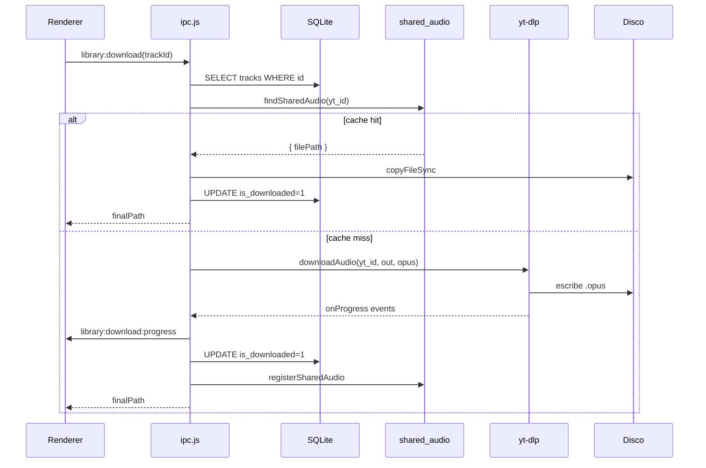

# `main/ipc.js`

> Registra todos los handlers `ipcMain.handle` del proceso main. Es el puente entre el renderer (React) y la capa Node: yt-dlp, SQLite, devices, tunnel, cache compartido.

## Ubicación
`apps/desktop/main/ipc.js:1` (582 líneas)

## Firma del export principal

```js
function registerIpc({ db, lan, accessToken }): void
```

Llamado una sola vez desde [[index|main/index.js]] al arrancar. Recibe la instancia de DB compartida, el handle del [[lan-server]] y el access token.

## Inventario de canales IPC

Todos son `ipcMain.handle` (request/response async). Los listeners push se emiten con `webContents.send` a TODAS las ventanas.

### Resumen por dominio

| Dominio | Canales | Push events |
|---|---|---|
| App | `app:info` | — |
| Tunnel | `tunnel:status/start/startQuick/stop/setToken/setCustomUrl` | `tunnel:state` |
| Auth | `auth:token/regenerateToken` | — |
| YT (yt-dlp) | `yt:metadata/streamUrl/search` | — |
| YT binary | `ytdlp:info/update` | — |
| Library | `library:list/addFromYoutube/addFromMetadata/syncRemote/deleteRemote/download/undownload/fileSize` | `library:download:progress` |
| Shared cache | `sharedCache:stats/clear` | — |
| Playlists | `playlists:list/upsert/delete/tracks/addTrack/removeTrack/reorder/contents` | — |
| Devices | `devices:list/pending/approve/reject/revoke/forget/rename/activity` | `devices:pair-request` |

Mapeo 1:1 con [[preload|preload/index.cjs]] (`window.ritmiq.*`).

## ytOpts construido al boot

`ipc.js:104-130` construye `ytOpts` una vez al arrancar y lo reutiliza en cada llamada a `getMetadata`, `getStreamUrl`, `search`, `downloadAudio`:

| Campo | Origen |
|---|---|
| `binary` | [[ytdlp-path#getYtDlpPath]] |
| `cookiesFromBrowser` | [[cookies-detect#detectCookiesBrowser]] |
| `cookiesFile` | [[cookies-detect#exportCookiesToFile]] (async, se setea cuando termina) |
| `jsRuntime` | [[cookies-detect#detectJsRuntime]] |
| `cacheDir` | `<userData>/yt-dlp-cache` |

## Anatomía del código (snippets clave)

### 1. ID drift: track con UUID viejo, mismo `yt_id`
`apps/desktop/main/ipc.js:50-96`

```js
function syncRemoteTrack(db, track) {
  if (!track?.id) return false;

  // Caso A: ya está bajo el mismo id.
  const sameId = db
    .prepare('SELECT is_downloaded, file_path FROM tracks WHERE id = ?')
    .get(track.id);
  if (sameId) {
    upsertTrack(db, {
      ...track,
      isDownloaded: !!sameId.is_downloaded,
      filePath: sameId.file_path,
    });
    return true;
  }

  // Caso B: existe con OTRO id pero mismo (user_id, yt_id) → migrar.
  if (track.ytId) {
    const dup = db.prepare(/* sql */ `
      SELECT id, is_downloaded, file_path
      FROM tracks WHERE user_id = ? AND yt_id = ?
    `).get(track.userId, track.ytId);

    if (dup) {
      const migrate = db.transaction(() => {
        // Reasignar FKs antes de borrar la fila vieja.
        db.prepare('UPDATE playlist_tracks SET track_id = ? WHERE track_id = ?')
          .run(track.id, dup.id);
        db.prepare('UPDATE play_history    SET track_id = ? WHERE track_id = ?')
          .run(track.id, dup.id);
        db.prepare('DELETE FROM tracks WHERE id = ?').run(dup.id);
        upsertTrack(db, {
          ...track,
          isDownloaded: !!dup.is_downloaded,
          filePath: dup.file_path,
        });
      });
      migrate();
      return true;
    }
  }

  // Caso C: no existe en absoluto.
  upsertTrack(db, { ...track, isDownloaded: false, filePath: null });
  return true;
}
```

**El problema que resuelve**: dos clientes (desktop A y desktop B) insertan independientemente la misma canción `yt_id=abc` con UUIDs distintos. Cuando sincronizan via Supabase, el desktop A recibe del cloud el track con el UUID de B; localmente ya tenía el suyo. Sin esta función, terminás con dos filas iguales en SQLite local; las FK de `playlist_tracks` y `play_history` apuntan a la "vieja" mientras la lógica busca por la "canónica del cloud".

**Por qué migrar FKs antes de DELETE**: las FK `playlist_tracks.track_id → tracks.id` y `play_history.track_id → tracks.id` no tienen ON DELETE CASCADE → un DELETE puro las dejaría sueltas o, peor, tiraría error de constraint. Reasignamos al UUID nuevo y después borramos la fila vieja, todo en transacción.

**Por qué preservar `is_downloaded` y `file_path` del registro local**: el cloud no sabe si TÚ tenías el archivo descargado. Al migrar, conservamos ese estado. Si lo perdiéramos, el usuario vería sus tracks "descargados" como "online-only" tras un sync.

### 2. Cache shared FIRST, yt-dlp después
`apps/desktop/main/ipc.js:281-306`

```js
// ── CACHE COMPARTIDO FIRST ──────────────────────────────────────────
// Antes saltabamos directo a yt-dlp aunque otro user (o sesion vieja)
// ya tuviese el archivo en shared_audio. Resultado: re-fetch innecesario
// y si YouTube ahora bloquea el video, fallo total cuando teniamos copia
// local valida.
try {
  const cached = findSharedAudio(db, row.yt_id);
  if (cached && cached.filePath && existsSync(cached.filePath)) {
    const ext = cached.filePath.match(/\.(\w+)$/)?.[1] ?? 'm4a';
    const finalPath = `${out}.${ext}`;
    if (cached.filePath !== finalPath) {
      copyFileSync(cached.filePath, finalPath);
    }
    db.prepare(/* sql */ `
      UPDATE tracks SET is_downloaded = 1, file_path = ?, updated_at = ?
      WHERE id = ?
    `).run(finalPath, new Date().toISOString(), row.id);
    return finalPath;
  }
} catch (err) {
  console.warn('[ipc] cache lookup failed, falling back to yt-dlp:', err?.message);
}
```

**Decisión arquitectónica clave**: `shared_audio` actúa como índice global de descargas previas. Si Ana descargó "Bohemian Rhapsody" ayer y Bea hoy la quiere descargar (misma máquina, otra cuenta Supabase), se la copiamos al instante del archivo de Ana en lugar de re-descargar.

**Por qué `copyFileSync` y no symlink**: queremos que la colección de cada owner sea autocontenida. Si Ana borra su archivo, el de Bea sigue. Trade-off: gasta disco doble. Aceptable para escala doméstica.

**Por qué try/catch + fallback**: si el cache está corrupto o el archivo cacheado se borró fuera de la app, NO debemos fallar el play. Logueamos y caemos a yt-dlp.

### 3. Después de descargar, indexar en cache para otros
`apps/desktop/main/ipc.js:329-341`

```js
// Indexar también en cache compartido para que otras cuentas que
// tengan este mismo ytId reciban el archivo sin re-descargar.
try {
  const size = statSync(finalPath).size;
  registerSharedAudio(db, {
    ytId: row.yt_id,
    filePath: finalPath,
    mime: 'audio/ogg', // opus en contenedor ogg
    size,
  });
} catch (err) {
  console.warn('[ipc] registerSharedAudio failed:', err.message);
}
```

**Simétrico al snippet 2**: completa el ciclo. Sin esto, el cache nunca se poblaría. Si falla (constraint violation, etc.) NO rompemos el download del usuario actual.

### 4. Aprobación de device desde UI: lee pair_request + delega
`apps/desktop/main/ipc.js:444-458`

```js
ipcMain.handle('devices:approve', (_e, deviceId) => {
  // Mueve la pair_request -> devices y emite device_token. Lee la fila
  // pendiente para obtener display_name + supabase_user_id + cookies.
  const pending = db.prepare(
    'SELECT display_name, supabase_user_id, cookies_blob FROM pair_requests WHERE device_id = ?'
  ).get(deviceId);
  if (!pending) throw new Error('pair_request not found or expired');
  const token = approveDevice(db, {
    deviceId,
    displayName: pending.display_name,
    supabaseUserId: pending.supabase_user_id,
    cookiesBlob: pending.cookies_blob,
  });
  return { ok: true, deviceToken: token };
});
```

**Por qué leer la pair_request aquí en lugar de en `approveDevice`**: `approveDevice` ([[devices#approveDevice]]) está diseñada agnóstica de "viene de pair_request" o "viene de auto-pair" — recibe los datos como params. Aquí en el IPC traducimos del modelo de UI ("aprobá este pair_request") al modelo del módulo ("aprobá este device con estos datos").

**Por qué throw si no existe**: si la UI muestra una pair_request que caducó entre el render y el click, el usuario merece un error claro en lugar de "se aprobó algo, no sé qué". El renderer puede catch y refrescar la lista.

### 5. Pair request push: 3 destinos a la vez
`apps/desktop/main/ipc.js:482-500`

```js
try {
  lan.onPairRequest?.((pairReq) => {
    for (const win of BrowserWindow.getAllWindows()) {
      try { win.webContents.send('devices:pair-request', pairReq); } catch {}
    }
    try {
      const { Notification } = require('electron');
      if (Notification.isSupported()) {
        new Notification({
          title: 'Ritmiq · Nueva solicitud de pareo',
          body: `${pairReq.displayName} pide acceso · PIN ${pairReq.pin}`,
        }).show();
      }
    } catch {}
  });
} catch (err) {
  console.warn('[ipc] could not subscribe to pair-request events:', err?.message);
}
```

**Tres destinos en una llamada**: cuando llega un POST /pair a [[lan-server]], notificamos a:
1. Todas las ventanas Electron (`devices:pair-request` event al renderer).
2. El sistema operativo (`Notification` nativa) si está soportado.
3. Logs (implícito si algo falla).

**Por qué `try/catch` envolviendo la suscripción entera**: si `lan.onPairRequest` no existe (LAN server no arrancó porque puerto ocupado), no rompemos el IPC. La app sigue funcionando sin notificaciones de pareo — degradación elegante.

**Por qué `require('electron')` inline**: pequeño overhead pero permite que el módulo se cargue si Notification API no existe. Para módulos opcionales, lazy require evita crash al import time.

### 6. Update yt-dlp: pipeline streaming a disco
`apps/desktop/main/ipc.js:211-229`

```js
ipcMain.handle('ytdlp:update', async () => {
  const platform = process.platform;
  const target = platform === 'win32'  ? 'yt-dlp.exe'
               : platform === 'darwin' ? 'yt-dlp_macos'
               : 'yt-dlp';
  const url = `https://github.com/yt-dlp/yt-dlp/releases/latest/download/${target}`;
  const out = getYtDlpUserDataPath();

  const res = await fetch(url, { redirect: 'follow' });
  if (!res.ok) throw new Error(`Descarga falló: HTTP ${res.status}`);
  if (!res.body) throw new Error('Respuesta vacía');

  await pipeline(res.body, createWriteStream(out));
  if (platform !== 'win32') chmodSync(out, 0o755);

  const r = spawnSync(out, ['--version'], { encoding: 'utf8' });
  return { path: out, version: r.stdout?.trim() ?? null };
});
```

**Por qué `pipeline` y no `res.arrayBuffer()`**: el binario yt-dlp pesa ~3MB. Cargarlo en RAM antes de escribir es derroche; `pipeline` lo pasa stream→stream sin buffer intermedio. Importante en máquinas con RAM ajustada.

**Por qué `chmod 0755` solo no-Windows**: Windows ejecuta `.exe` por extensión, no por bit ejecutable. Hacer chmod en Windows tira error o lo ignora — saltamos directamente.

**Por qué `spawnSync(--version)` al final**: confirmar que el binario descargado funciona antes de devolver. Si la versión es null o spawn falla, el caller sabe que algo está mal sin tener que probar de nuevo.

## Flujo: descarga de track con cache shared



## Casos de borde y gotchas

- **`library:download` con string vs payload**: el handler acepta tanto un string `trackId` como `{ trackId, fallback }`. El fallback se usa cuando el track vive en Supabase pero aún no se sincronizó a SQLite (típico tras import Spotify). Detectar el caso con `typeof payload === 'string'`.
- **Cache shared apuntando a archivo borrado**: `existsSync(cached.filePath)` lo cubre — si el archivo desapareció, caemos a yt-dlp. Pero `shared_audio` queda con entry stale. Pendiente: limpieza al detectar miss.
- **Progress events tras desmontaje**: `e.sender.send('library:download:progress', ...)` envía al webContents que originó el invoke. Si la ventana se cerró, `send` puede tirar; el try/catch alrededor lo absorbe.
- **`syncRemote` con `ytId` null**: caso C (insert nuevo) sin posibilidad de detectar duplicados. Esperado para tracks de fuentes no-YouTube.
- **`devices:pair-request` cuando hay 0 ventanas abiertas**: el `for` itera sobre array vacío → notification se muestra de todas formas. El usuario ve la notif del OS aunque la UI no esté abierta. Click → no abre ventana automáticamente (no implementado).
- **`approve` con cookies > 1MB**: no hay límite aquí. La validación vive en [[lan-server]] `/cookies/upload`. Aprobar desde IPC con cookies gigantes funciona.

## Performance y costes

| Handler | Bloqueo dominante |
|---|---|
| `library:list` / `playlists:*` | Query SQLite ~1-5ms |
| `yt:metadata` / `yt:streamUrl` / `yt:search` | spawn yt-dlp 200ms-3s (depende cache) |
| `library:download` cache hit | copy ~10-100ms (depende tamaño) |
| `library:download` cache miss | yt-dlp download 5-30s |
| `ytdlp:update` | fetch + pipeline ~3-10s |
| `devices:approve` | tx SQLite ~3-5ms |
| `tunnel:setToken` | I/O archivo + restart ~10s (cloudflared) |

## Dependencias entrantes
- [[index|main/index.js]] → `registerIpc(...)`.
- [[preload|preload/index.cjs]] → expone cada canal al renderer.

## Dependencias salientes
- [[ytdlp-path]], [[cookies-detect]] (ytOpts).
- [[cloudflared]] (todos los `tunnel:*`).
- [[access-token]] (`auth:*`).
- [[devices]], [[device-cookies]] (`devices:*`).
- [[lan-server]] hook `onPairRequest`.
- `@ritmiq/yt/ytdlp` → `getMetadata`, `downloadAudio`, `getStreamUrl`, `search`.
- `@ritmiq/yt` → `translateYtdlpError`.
- `@ritmiq/db/sqlite` → `upsertTrack`, `listTracks`, `registerSharedAudio`, `sharedAudioStats`, `clearSharedAudio`, `findSharedAudio`.

## Side-effects
- Spawnea yt-dlp (downloads, search, metadata).
- Lee/escribe SQLite (`tracks`, `playlists`, `playlist_tracks`, `play_history`, `shared_audio`, devices vía [[devices]]).
- Escribe `<userData>/audio/<trackId>.<ext>`.
- Push events `library:download:progress`, `tunnel:state`, `devices:pair-request`.
- Muestra `electron.Notification` en pair-request.

## Errores manejados
- yt-dlp falla → `translateYtdlpError(err)` traduce stderr a español accionable.
- Cache lookup falla → fallback a yt-dlp.
- `registerSharedAudio` falla → `console.warn`.
- `Notification` falla → ignorado.
- `lan.onPairRequest` ausente → ignorado.

## Qué puede romper este cambio

| Cambio | Síntoma observable |
|---|---|
| Quitar `syncRemoteTrack` o sus casos B/C | Tras sync Supabase, FKs huérfanas en `playlist_tracks` → playlists con tracks "fantasma". |
| Quitar la transacción en migración (caso B) | Si peta entre UPDATE FKs y DELETE, queda fila vieja con FKs apuntando a la nueva → estado inconsistente. |
| Cache shared sin `existsSync` guard | Apuntás a archivo borrado, `copyFileSync` falla, el play del usuario muere. |
| Olvidar `registerSharedAudio` post-download | Cache nunca se popula → cada owner re-descarga lo mismo. |
| Quitar el try/catch del Notification | En Linux sin daemon de notifs, el handler de pair-request crashea y el IPC queda mudo. |
| `library:download` que NO acepte fallback | Tracks importados de Spotify (existen en cloud, no en SQLite) no se pueden descargar. |
| Cambiar `chmod 0755` por 0644 tras `ytdlp:update` | El binario actualizado no es ejecutable → próximo play tira `Permission denied`. |
| Quitar el log `[ipc] cache hit/miss` | Diagnóstico de regresiones de cache se vuelve adivinanza. |

## Notas / Changelog
- 2026-05-22: nivel pleno.
