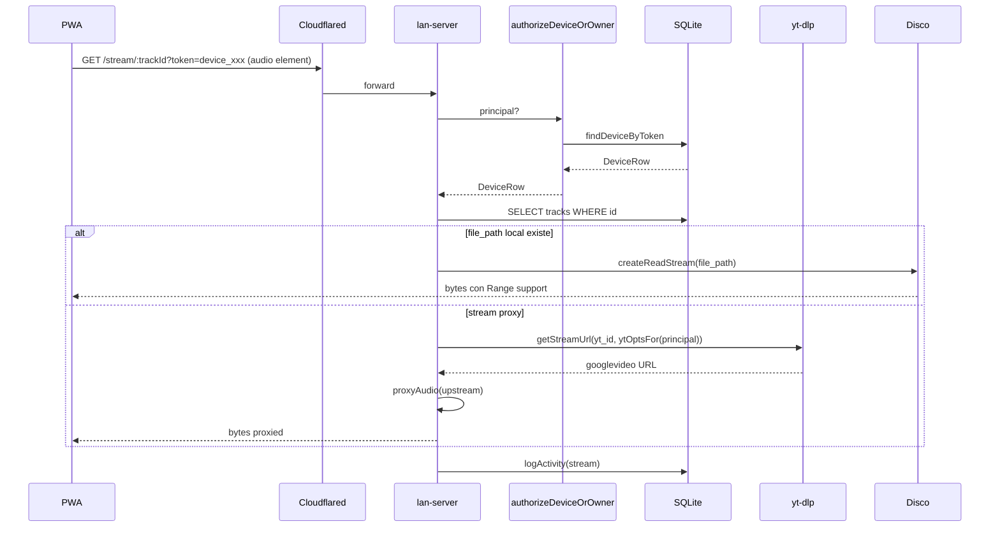

# `main/lan-server.js`

> Servidor HTTP local del Desktop. Sirve audio (file local o stream yt-dlp) a otros dispositivos en la misma WiFi o expuestos vía [[cloudflared]]. Anuncia el servicio por mDNS (`_ritmiq._tcp.local`). Implementa coalescing de descargas, cache LRU de stream URLs y cola con prioridades para yt-dlp.

## Ubicación
`apps/desktop/main/lan-server.js:1` (1216 líneas)

## Firma del export principal

```js
async function startLanServer({ port, db, accessToken }): Promise<{
  port: number,
  stop(): void,
  onPairRequest(cb): void
}>
```

Inicia HTTP server con fallback de puertos (3939 → 3940 … hasta 3943) y anuncia mDNS.

## CORS

Orígenes reflejados (los demás caen a `*`):

- `http://localhost(:port)?` / `http://127.0.0.1(:port)?`
- `http://192.168.x.x(:port)?` / `http://10.x.x.x(:port)?`
- `https://*.vercel.app` / `https://*.cfargotunnel.com` / `https://*.trycloudflare.com`

Métodos: `GET, POST, OPTIONS`. Headers: `Range, Content-Type, Authorization`. Expuestos: `Content-Range, Accept-Ranges, Content-Length`.

## Modelo de autenticación

Tres mecanismos conviven:

| Mecanismo | Habilita | Cómo se pasa |
|---|---|---|
| **Bearer owner** | Todos los endpoints | `Authorization: Bearer <accessToken>` o `?token=<accessToken>` |
| **device_token** (Modelo Y) | `/yt/*`, `/stream/*`, `/download/*`, `/cookies/upload`, `/shared-cache/check` | Mismo header/query con el token del device |
| **Signed URL HMAC** | `/stream/*`, `/download/*` | `?sig=<HMAC>&exp=<ts>` validado contra `RITMIQ_STREAM_SIGNING_SECRET` |

Flag de compat: `RITMIQ_ACCEPT_UNSIGNED_STREAMS=true` bypasea token en `/yt/*`, `/stream/*`, `/download/*`, `/shared-cache/check`. La autorización real se hace "más adentro" (firma o presencia en SQLite). Necesario porque la PWA en Vercel a veces no tiene token sincronizado en localStorage.

## Endpoints

| Endpoint | Método | Auth | Rate-limit |
|---|---|---|---|
| `/health` | GET | público | — |
| `/pair` | POST | público | 5/min/IP |
| `/pair/status` | GET | público | — |
| `/yt/search` | GET | owner \| device | — |
| `/yt/prewarm` | GET | owner \| device | — |
| `/yt/metadata` | GET | owner \| device | — |
| `/spotify/playlist` | GET | owner | — |
| `/cookies/upload` | POST | **solo device** | — |
| `/shared-cache/check` | GET | auth | — |
| `/shared-cache` | GET/DELETE | owner | — |
| `/download/:trackId` | GET | owner \| device \| signed | — |
| `/stream/:trackId` | GET | owner \| device \| signed | — |

## Anatomía del código (snippets clave)

### 1. Cookies refresh periódico para adelantarse a YouTube
`apps/desktop/main/lan-server.js:118-127`

```js
// Refresh periódico cada 50 min (TTL pragmático: YouTube suele rotar
// cookies cada ~1h; nos adelantamos un poco).
setInterval(() => {
  exportCookiesToFile(ytBinary, cookiesFromBrowser, 0).then((file) => {
    if (file) {
      ytOpts.cookiesFile = file;
      console.log('[lan-server] cookies file refrescado');
    }
  });
}, 50 * 60 * 1000).unref();
```

**Por qué `maxAgeMs: 0`**: forzamos regeneración del archivo aunque sea reciente. Si dejáramos default 1h, el `setInterval` cada 50 min no haría nada porque el archivo "todavía es válido". El 0 fuerza el spawn de yt-dlp.

**Por qué `.unref()`**: si el timer fuera el único handle activo, mantendría el process vivo cuando no debe. `.unref()` permite que Node salga si solo queda este timer pendiente.

**Por qué mutar `ytOpts` directamente**: `ytOpts` es el objeto que todos los handlers leen. Cambiar `ytOpts.cookiesFile` propaga al instante a las próximas llamadas sin necesidad de pasarle el nuevo path explícitamente.

### 2. Cola con prioridades y kill de baja prio
`apps/desktop/main/lan-server.js:293-360`

```js
const MAX_CONCURRENT = 3;
let running = 0;
const waitQueue = [];
const runningJobs = new Set();

function scheduleNext() {
  if (running >= MAX_CONCURRENT) return;
  if (waitQueue.length === 0) return;
  // Orden descendente por prioridad — saca el de mayor prioridad.
  waitQueue.sort((a, b) => b.priority - a.priority);
  const job = waitQueue.shift();
  running++;
  runningJobs.add(job);
  job.run();
}

function killLowPriorityRunning(threshold) {
  let killed = 0;
  for (const job of runningJobs) {
    if (job.priority < threshold) {
      try { job.childPromise?.kill?.(); } catch {}
      streamCache.delete(job.ytId);
      killed++;
    }
  }
}

function evictLowPriorityQueued(threshold) {
  for (let i = waitQueue.length - 1; i >= 0; i--) {
    const j = waitQueue[i];
    if (j.priority < threshold) {
      waitQueue.splice(i, 1);
      streamCache.delete(j.ytId);
      j.cancel?.();
    }
  }
}
```

**Por qué MAX_CONCURRENT = 3**: yt-dlp con `cookiesFile` cacheado consume CPU moderada. Pasando de 3 procesos simultáneos, una sola invocación pasa de 2.8s a 7+s por contención. 3 es el sweet spot empírico para máquinas modernas.

**Por qué dos tipos de cancelación**:
- `killLowPriorityRunning` mata procesos ya **ejecutándose** (con yt-dlp activo) cuando llega un click p=10 y ya estamos saturados.
- `evictLowPriorityQueued` descarta jobs **encolados** (todavía no spawneados). Es barato y siempre seguro.

**Prioridades en uso**:
| Origen | Prioridad |
|---|---|
| Click real del usuario (stream/download) | 10 |
| Prewarm explícito (`/yt/prewarm`) | 5 |
| Auto-prewarm de top-2 resultados de search | 1 |

### 3. Coalescing de descargas: una sola yt-dlp para N requests
`apps/desktop/main/lan-server.js:251-283`

```js
async function downloadSharedAudio(ytId, dlOpts) {
  const existing = findSharedAudio(db, ytId);
  if (existing) return existing.filePath;

  const inflight = inflightDownloads.get(ytId);
  if (inflight) return inflight;

  const promise = (async () => {
    const outBase = join(sharedAudioDir, ytId);
    await downloadAudio(ytId, outBase, {
      ...dlOpts,
      format: 'm4a', // iOS Safari no decodifica opus/webm
    });
    const finalPath = `${outBase}.m4a`;
    let size = 0;
    try { size = statSync(finalPath).size; } catch {}
    registerSharedAudio(db, {
      ytId, filePath: finalPath, mime: 'audio/mp4', size,
    });
    return finalPath;
  })().finally(() => {
    inflightDownloads.delete(ytId);
  });

  inflightDownloads.set(ytId, promise);
  return promise;
}
```

**El problema que resuelve**: si 3 PWAs piden el mismo `ytId` simultáneamente, sin coalescing spawneamos 3 yt-dlp idénticos compitiendo por escribir el mismo archivo → corruptions y desperdicio de CPU.

**Cómo funciona**: el primer caller crea la Promise y la registra en `inflightDownloads`. Los siguientes encuentran la entrada y `await` esa misma Promise. `finally` limpia la entrada. Patron clásico de promise memoization para deduplicación.

**Por qué `m4a` aquí pero `opus` en [[ipc]] `library:download`**: el download de `lan-server` se sirve a la PWA en iOS, que solo decodifica m4a. El download de `library` lo consume el desktop Howler, que soporta opus. Mismo paquete `@ritmiq/yt`, distintos formatos según destino.

### 4. Autenticación múltiple en una función
`apps/desktop/main/lan-server.js:166-175`

```js
/**
 * Device-or-owner auth. Devuelve sentinel { owner: true } o DeviceRow.
 */
function authorizeDeviceOrOwner(req, url) {
  const token = extractBearer(req, url);
  if (!token) return null;
  if (accessToken && token === accessToken) return { owner: true };
  const dev = findDeviceByToken(db, token);
  return dev ?? null;
}
```

**Por qué un sentinel `{ owner: true }` en lugar de un boolean**: el caller necesita un objeto con la misma "shape" en ambos casos (owner vs device) para los chequeos siguientes. Si devolviéramos `true | DeviceRow`, cada handler haría `principal === true || principal.device_id` repetidamente. El sentinel uniforma: `principal.owner === true` o `principal.device_id`.

**Por qué `?token=` además del header**: el elemento HTML `<audio>` no permite headers custom en sus requests. La PWA pone el token en query string para `/stream/`. Es feo (token en URL queda en logs de proxy si los hay) pero único camino para reproducir audio nativo.

### 5. Ruteo de cookies por principal
`apps/desktop/main/lan-server.js:182-192`

```js
function ytOptsFor(principal) {
  if (principal && principal.owner !== true) {
    try {
      const file = getCookieFileForDevice(principal);
      if (file) return { ...ytOpts, cookiesFile: file, cookiesFromBrowser: undefined };
    } catch (e) {
      console.warn('[lan-server] device cookies failed, fallback to owner:', e?.message ?? e);
    }
  }
  return ytOpts;
}
```

**La separación de cookies por device**: si Ana parea su iPhone con su sesión de YouTube en él, y Bea parea su iPad con SU sesión, cada uno usa las cookies que subió. El owner del desktop ve un fallback a sus propias cookies (las del browser donde corre la app) si el device no tiene.

**Por qué `cookiesFromBrowser: undefined`**: cuando usamos cookies del device, queremos NEGAR explícitamente las del browser. Si no lo hiciéramos, yt-dlp recibe ambos flags y mezcla — comportamiento indefinido.

### 6. Rate limit en /pair con ventana deslizante
`apps/desktop/main/lan-server.js:194-207`

```js
const pairRateMap = new Map();
const PAIR_RATE_WINDOW_MS = 60 * 1000;
const PAIR_RATE_MAX = 5;
function pairRateLimit(ip) {
  if (!ip) return true;
  const now = Date.now();
  const arr = (pairRateMap.get(ip) ?? []).filter((t) => now - t < PAIR_RATE_WINDOW_MS);
  if (arr.length >= PAIR_RATE_MAX) return false;
  arr.push(now);
  pairRateMap.set(ip, arr);
  return true;
}
```

**Sliding window**: para cada IP guardamos timestamps de los últimos requests; filtramos los > 60s; si quedan ≥ 5, denegamos. Más permisivo que un token bucket fijo y suficiente para nuestra escala.

**Por qué `if (!ip) return true`**: si por algún motivo no podemos obtener la IP (proxy mal configurado), preferimos no denegar a denegar — UX gana. La capa de autenticación posterior (PIN + approval) absorbe el riesgo.

**Memory leak potencial**: `pairRateMap` crece sin tope. Para escala doméstica (10 IPs distintas/día) es irrelevante. Si alguna vez se expusiera públicamente, añadir cleanup periódico.

## Flujo: PWA reproduce un track via /stream



## Casos de borde y gotchas

- **Puerto 3939 ocupado**: `listenWithFallback` prueba 3940..3943. Si todos ocupados, [[index]] capta el throw y la app sigue sin LAN.
- **mDNS deshabilitado en el sistema**: la PWA no descubre el desktop por mDNS; el usuario debe ingresar la IP manualmente. El servidor HTTP sigue accesible.
- **Tunnel sin LAN local**: `cloudflared --url http://localhost:3939` apunta a un servidor que no respondió. La PWA externa recibe 502. Mitigación: confirmar LAN antes de start del tunnel (no implementado).
- **Stream URL caducada después de cache TTL**: las URLs de googlevideo caducan a las ~6h; cacheamos 30 min (`TTL_MS`). Si una PWA usa una URL caducada (caso raro: tabs en background), recibe 403 y debe re-resolver.
- **Kill de prio baja durante uso legítimo**: si un prewarm está casi terminado (95% del trabajo hecho) y llega un click p=10, lo matamos. Trabajo perdido. Tolerable porque el click vale más.
- **`/cookies/upload` con device revocado**: la auth de device falla antes → 401. El cliente reaproveca con el PIN.
- **`/health` no requiere auth pero tampoco rate-limit**: si alguien lo spamea, no rompe nada (respuesta JSON constante) pero satura I/O del Node loop. En escala doméstica irrelevante.
- **Coalescing con error**: si el primer `downloadSharedAudio` falla, los esperantes reciben el mismo error. Correcto (no es bug) pero implica que un fallo afecta a todos los simultáneos. Sin retry automático.

## Performance y costes

| Operación | Coste típico |
|---|---|
| `/health` | < 1ms |
| `/pair` | 1-2ms (UPSERT SQL) |
| `/yt/search` | 800ms-2s (yt-dlp con cookies) |
| `/yt/metadata` | 200-800ms (yt-dlp metadata) |
| `/stream` file local | <50ms hasta primer byte, luego throughput de disco |
| `/stream` proxy | 200-500ms hasta primer byte (resolve + proxy setup) |
| `/download/` cache hit | <50ms (lectura SQLite + copy) |
| `/download/` cache miss | 3-30s (yt-dlp + write) |
| Refresh de cookies cada 50min | ~1s (spawn yt-dlp, no bloquea) |
| `pruneOldActivity` cada 12h | <100ms |

**Throughput de streaming**: limitado por disco (~hundred MB/s SSD) o por banda upload del usuario via tunnel.

## Dependencias entrantes
- [[index|main/index.js]] → `startLanServer(...)` al boot.
- PWA via HTTP (en LAN o vía Cloudflared).
- [[ipc]] se suscribe a `onPairRequest` para reenviar eventos al renderer y notificación nativa.

## Dependencias salientes
- [[ytdlp-path]], [[cookies-detect]], [[devices]], [[device-cookies]].
- `@ritmiq/yt/ytdlp` → `getStreamUrl`, `getMetadata`, `search`, `downloadAudio`.
- `@ritmiq/yt` → `translateYtdlpError`.
- `@ritmiq/db/sqlite` → `findSharedAudio`, `registerSharedAudio`, `sharedAudioStats`, `clearSharedAudio`, `findSharedAudioBulk`.
- `bonjour-service` (mDNS).
- `node:http`, `node:crypto` (HMAC, `timingSafeEqual`).

## Side-effects
- Listening TCP en :3939 (o fallback hasta 3943).
- Anuncio mDNS `_ritmiq._tcp.local`.
- Spawns yt-dlp (search, prewarm, metadata, download).
- Refresh cookies cada 50 min (background).
- Prune actividad cada 12h.
- Mutaciones SQLite: `devices.last_seen_at`, `device_activity`, `shared_audio`, `tracks.is_downloaded`.
- Escribe `<userData>/shared-audio/<ytId>.m4a` para downloads cacheados.

## Errores manejados
- yt-dlp falla → `translateYtdlpError`, 500 con mensaje en español.
- 401 si auth inválida.
- 429 en `/pair` si rate-limit.
- 413 en `/cookies/upload` si > 1MB.
- 502 si Spotify falla.
- 405 method not allowed.

## Decisiones documentadas inline

- **`/yt/streamurl` eliminado** (`:690-703`): las URLs directas de googlevideo están firmadas con la IP del PC; el iPhone vía Tunnel recibía 403 y caía al proxy → doble round-trip más lento que ir directo al proxy. Conservado el comentario para futuras iteraciones (Tailscale mesh).
- **Pre-resolve 2 resultados** (no 3): no saturar la cola con búsquedas seguidas.
- **`preferM4a: true`** en ytOpts global: iOS Safari no decodifica opus/webm.

## Qué puede romper este cambio

| Cambio | Síntoma observable |
|---|---|
| Bajar `MAX_CONCURRENT` a 1 | Click sobre track 1 + prewarm activo → click espera al prewarm; latencia perceptible. |
| Subir `MAX_CONCURRENT` a 6+ | Contención de CPU en yt-dlp; cada invocación pasa de 2.8s a 7+s; toda la cola se ralentiza. |
| Olvidar `inflightDownloads.delete` en `finally` | Caches falsos: tras un download todos los siguientes esperan una Promise resuelta para siempre. |
| Cambiar `format: 'm4a'` a `'opus'` en `downloadSharedAudio` | PWA en iOS recibe archivo que no puede decodificar; barra de progreso avanza, no se escucha audio. |
| Aceptar `cookiesFromBrowser` junto con `cookiesFile` en `ytOptsFor` | yt-dlp recibe ambos flags, comportamiento indefinido. |
| Quitar `?token=` query support | El `<audio>` HTML no puede mandar Authorization; toda reproducción nativa rompe. |
| Subir `PAIR_RATE_MAX` a 1000 | Atacante por IP puede flood-ear pair_requests; UI del owner se llena de basura. |
| Quitar `.unref()` del setInterval | Process no termina nunca aunque la app se cierre; queda zombie hasta SIGKILL. |
| Eliminar `killLowPriorityRunning` | Click p=10 espera al prewarm corriendo; latencia inaceptable en clicks tras un search. |
| Cambiar el regex de CORS para no incluir trycloudflare | PWA vía Quick Tunnel recibe error CORS al primer fetch. |

## Notas / Changelog
- 2026-05-22: nivel pleno (6 snippets, 10 filas qué-rompe, diagrama, perf, casos de borde).
