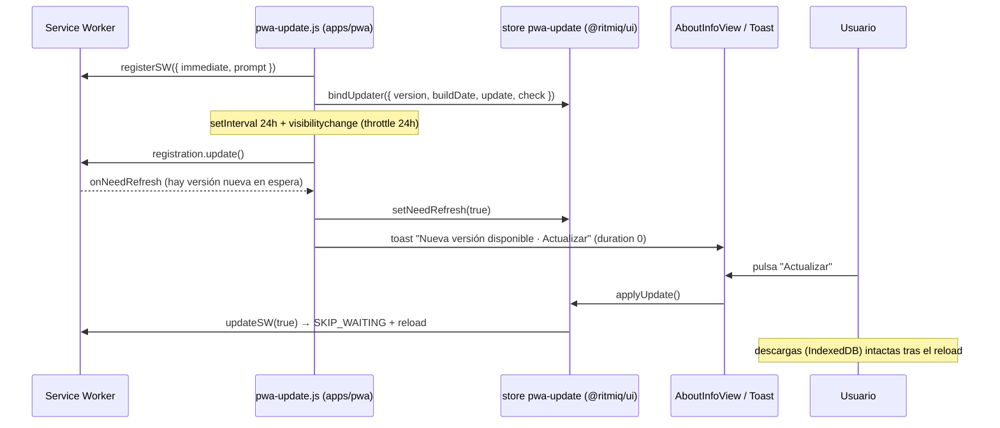

# Actualización de la PWA (sin reinstalar)

> La PWA instalada se actualiza **in-app** sin reinstalar y **sin borrar las descargas**.
> Cuando hay una versión nueva, un toast "Actualizar" deja que el usuario aplique el cambio
> cuando quiera (no se recarga solo para no cortar la reproducción).

## Por qué hacía falta

Antes el SW se registraba con el `registerSW.js` default (`registerType: 'autoUpdate'`): solo
hacía `serviceWorker.register('/sw.js')` al `load`, **sin comprobar updates periódicamente ni
avisar**. En una PWA standalone que el usuario deja en background, la versión nueva no se
activaba → el usuario recurría a **reinstalar**, lo que **sí borra IndexedDB** (las descargas).

## Garantía sobre las descargas

Las canciones descargadas viven en **IndexedDB** (`ritmiq-local` → `audioBlobs`, ver
[[local-downloads]]) con `navigator.storage.persist()` solicitado. **Actualizar el SW / recargar
la app NUNCA borra IndexedDB.** Solo se pierde al **desinstalar** la PWA. Por eso el flujo de
actualización in-app es seguro para las descargas; lo dice también el hint de [[AboutInfoView]].

## Diagrama



## Piezas

| Pieza | Ubicación | Rol |
|---|---|---|
| `registerType: 'prompt'` + `cleanupOutdatedCaches` | `apps/pwa/vite.config.js` | No auto-recarga; purga precaches viejos (no IndexedDB). |
| `define __APP_VERSION__ / __BUILD_DATE__` | `apps/pwa/vite.config.js` | Sello de versión/fecha del build. |
| `setupPwaUpdates()` | `apps/pwa/src/pwa-update.js` | Registra SW vía `virtual:pwa-register`, programa auto-check 24h + visibilitychange, dispara el toast, enlaza el store. |
| store `pwa-update` | `packages/ui/src/stores/pwa-update.js` | Estado desacoplado (`version`, `needRefresh`, `checking`, `bound`) + acciones (`applyUpdate`, `checkForUpdate`). **No** importa `virtual:pwa-register` → el build de Electron compila sin el plugin. |
| UI | [[AboutInfoView]] | Muestra versión + botón "Buscar actualizaciones" / "Actualizar" + nota de descargas seguras (solo PWA). |

## Anatomía (snippets)

### Auto-check 24h + visibilitychange con throttle
`apps/pwa/src/pwa-update.js`

```js
setInterval(() => { registration.update(); markChecked(); }, CHECK_INTERVAL_MS); // 24h
const onVisible = () => {
  if (document.visibilityState !== 'visible') return;
  if (elapsedSinceLastCheck() < CHECK_INTERVAL_MS) return; // throttle 24h
  registration.update(); markChecked();
};
document.addEventListener('visibilitychange', onVisible);
```

**Por qué**: el intervalo cubre sesiones largas; el `visibilitychange` cubre el caso típico
de PWA (el usuario la deja en background y vuelve). El throttle de 24h en localStorage evita
martillar el servidor en cada cambio de app.

### Desacople para no romper Electron
El store en `@ritmiq/ui` **no** importa `virtual:pwa-register` (módulo virtual que solo existe
con el plugin PWA). La capa `apps/pwa` enlaza las funciones reales con `bindUpdater()`. En
desktop nunca se enlaza (`bound=false`) → la sección de actualizaciones no se muestra.

## Gotchas

- **iOS Safari PWA**: comprueba updates de forma perezosa; el `update()` en `visibilitychange`
  mitiga, pero la activación puede tardar hasta cerrar la app del app-switcher. Evita la
  reinstalación, que es el objetivo.
- **No recargar durante reproducción**: por eso `prompt` (el usuario decide). El toast es
  persistente (`duration: 0`) hasta que actúe.
- **`workbox-window`**: dependencia directa de `apps/pwa` requerida por `virtual:pwa-register`.
- **Versión visible**: `__APP_VERSION__ (__BUILD_DATE__)` en [[AboutInfoView]] para confirmar
  que la app se actualizó.

## Módulos involucrados

- [[manifest-y-service-worker]] (config workbox base).
- [[AboutInfoView]] (UI), [[local-downloads]] (IndexedDB de descargas), [[toast]] (aviso).
- Ver [[Decisiones-Tecnicas-ADR|ADR-021]].

## Notas / Changelog

- 2026-05-31: flujo creado. `autoUpdate` → `prompt` + auto-check 24h + control de versión.
