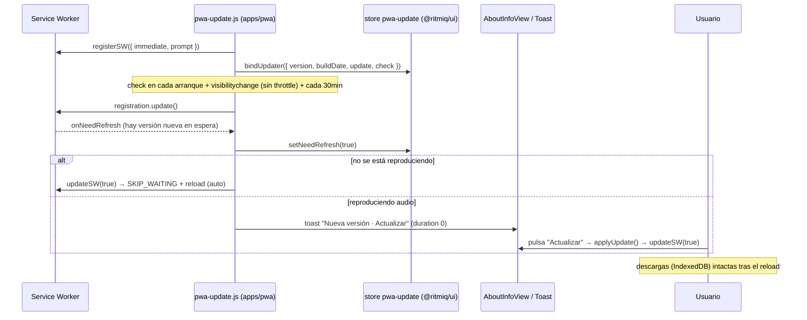

# Actualización de la PWA (sin reinstalar)

> La PWA instalada se actualiza **in-app** sin reinstalar y **sin borrar las descargas**.
> **Desde 2026-07**: comprueba en cada arranque y cada `visibilitychange` (sin
> throttle) + cada 30 min, y **auto-aplica** la versión nueva con recarga suave.
> Excepción: si se está **reproduciendo audio**, no recarga — muestra el toast
> "Actualizar" para que el usuario decida (no cortar la música).

## Por qué hacía falta

Antes el SW se registraba con el `registerSW.js` default (`registerType: 'autoUpdate'`): solo
hacía `serviceWorker.register('/sw.js')` al `load`, **sin comprobar updates periódicamente ni
avisar**. En una PWA standalone que el usuario deja en background, la versión nueva no se
activaba → el usuario recurría a **reinstalar**, lo que **sí borra IndexedDB** (las descargas).

## Garantía sobre las descargas

Las canciones descargadas viven en **IndexedDB** (`ritmiq-local` → `audioBlobs`, ver
[[local-downloads]]) con `navigator.storage.persist()` solicitado. **Actualizar el SW / recargar
la app NUNCA borra IndexedDB.** Solo se pierde al **desinstalar** la PWA. Por eso el flujo de
actualización in-app es seguro para las descargas; lo dice también el hint de [[AboutInfoView]].

## Diagrama


```mermaid
sequenceDiagram
  participant SW as Service Worker
  participant REG as pwa-update.js (apps/pwa)
  participant STORE as store pwa-update (@ritmiq/ui)
  participant UI as AboutInfoView / Toast
  participant U as Usuario

  REG->>SW: registerSW({ immediate, prompt })
  REG->>STORE: bindUpdater({ version, buildDate, update, check })
  Note over REG: check en cada arranque + visibilitychange (sin throttle) + cada 30min
  REG->>SW: registration.update()
  SW-->>REG: onNeedRefresh (hay versión nueva en espera)
  REG->>STORE: setNeedRefresh(true)
  alt no se está reproduciendo
    REG->>SW: updateSW(true) → SKIP_WAITING + reload (auto)
  else reproduciendo audio
    REG->>UI: toast "Nueva versión · Actualizar" (duration 0)
    U->>UI: pulsa "Actualizar" → applyUpdate() → updateSW(true)
  end
  Note over U: descargas (IndexedDB) intactas tras el reload
```

## Piezas

| Pieza | Ubicación | Rol |
|---|---|---|
| `registerType: 'prompt'` + `cleanupOutdatedCaches` | `apps/pwa/vite.config.js` | No auto-recarga; purga precaches viejos (no IndexedDB). |
| `define __APP_VERSION__ / __BUILD_DATE__` | `apps/pwa/vite.config.js` | Sello de versión/fecha del build. |
| `setupPwaUpdates()` | `apps/pwa/src/pwa-update.js` | Registra SW vía `virtual:pwa-register`, comprueba en cada arranque + `visibilitychange` (sin throttle) + cada 30min, **auto-aplica** (o toast si reproduce), enlaza el store. |
| store `pwa-update` | `packages/ui/src/stores/pwa-update.js` | Estado desacoplado (`version`, `needRefresh`, `checking`, `bound`) + acciones (`applyUpdate`, `checkForUpdate`). **No** importa `virtual:pwa-register` → el build de Electron compila sin el plugin. |
| UI | [[AboutInfoView]] | Muestra versión + botón "Buscar actualizaciones" / "Actualizar" + nota de descargas seguras (solo PWA). |

## Anatomía (snippets)

### Check en cada foco + auto-aplicar (sin throttle)
`apps/pwa/src/pwa-update.js`

```js
// Check periódico cada 30 min + en cada foco (sin throttle) + al arrancar.
setInterval(() => { registration.update(); }, CHECK_INTERVAL_MS); // 30 min
const onVisible = () => {
  if (document.visibilityState === 'visible') registration.update();
};
document.addEventListener('visibilitychange', onVisible);
registration.update(); // inmediato al arrancar

// Al haber versión nueva: auto-aplicar salvo que se esté reproduciendo.
onNeedRefresh() {
  if (!isPlayingNow()) {
    toast.info('Actualizando a la última versión…');
    setTimeout(() => updateSW(true), 800); // SKIP_WAITING + reload
  } else {
    toast.info('Nueva versión disponible', { action: { label: 'Actualizar', onClick: applyUpdate } });
  }
}
```

**Por qué**: se quitó el throttle de 24h (los deploys tardaban demasiado en
llegar). El check es barato (un HEAD al `sw.js`). El auto-aplicar evita que el
usuario tenga que pulsar nada; `isPlayingNow()` (lee `usePlayerStore`) protege la
reproducción en curso.

### Desacople para no romper Electron
El store en `@ritmiq/ui` **no** importa `virtual:pwa-register` (módulo virtual que solo existe
con el plugin PWA). La capa `apps/pwa` enlaza las funciones reales con `bindUpdater()`. En
desktop nunca se enlaza (`bound=false`) → la sección de actualizaciones no se muestra.

## Gotchas

- **iOS Safari PWA**: comprueba updates de forma perezosa; el `update()` en `visibilitychange`
  mitiga, pero la activación puede tardar hasta cerrar la app del app-switcher. Evita la
  reinstalación, que es el objetivo.
- **No recargar durante reproducción**: por eso `prompt` (el usuario decide). El toast es
  persistente (`duration: 0`) hasta que actúe.
- **`workbox-window`**: dependencia directa de `apps/pwa` requerida por `virtual:pwa-register`.
- **Versión visible**: `__APP_VERSION__ (__BUILD_DATE__)` en [[AboutInfoView]] para confirmar
  que la app se actualizó.

## Módulos involucrados

- [[manifest-y-service-worker]] (config workbox base).
- [[AboutInfoView]] (UI), [[local-downloads]] (IndexedDB de descargas), [[toast]] (aviso).
- Ver [[Decisiones-Tecnicas-ADR|ADR-021]].

## Notas / Changelog

- 2026-05-31: flujo creado. `autoUpdate` → `prompt` + auto-check 24h + control de versión.
