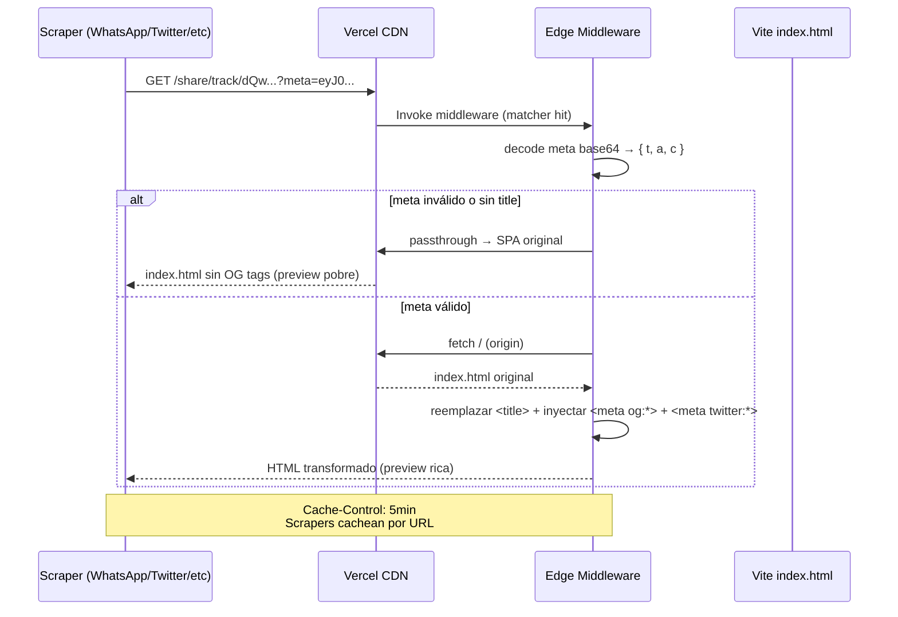

# `apps/pwa/middleware.js`

> Vercel **Edge Middleware** que intercepta `/share/track/:ytId*` y devuelve un HTML con `<meta property="og:*">` + Twitter Card inyectados server-side. Resuelve T7 del [[share-deeplink-roadmap]]: WhatsApp, Twitter, Facebook, iMessage, etc. no ejecutan JavaScript → necesitan los meta tags en el HTML inicial para hacer rich preview.

## Ubicación
`apps/pwa/middleware.js:1` (~170 líneas)

## Matcher

```js
export const config = {
  matcher: '/share/track/:ytId*',
};
```

Solo intercepta rutas de share. El resto del tráfico (UI normal de la PWA, assets, otras rutas) pasa por Vercel CDN sin overhead.

## Pipeline



## Tags inyectados

```html
<title>Never Gonna Give You Up — Rick Astley | Ritmiq</title>
<meta property="og:type" content="music.song" />
<meta property="og:site_name" content="Ritmiq" />
<meta property="og:title" content="Never Gonna Give You Up — Rick Astley" />
<meta property="og:description" content="Escucha &quot;Never Gonna Give You Up&quot; de Rick Astley en Ritmiq." />
<meta property="og:image" content="https://i.ytimg.com/vi/dQw.../hqdefault.jpg" />
<meta property="og:url" content="https://ritmiq.app/share/track/dQw...?meta=..." />
<meta property="music:musician" content="Rick Astley" />
<meta name="twitter:card" content="summary_large_image" />
<meta name="twitter:title" content="Never Gonna Give You Up — Rick Astley" />
<meta name="twitter:description" content="Escucha &quot;Never Gonna Give You Up&quot; de Rick Astley en Ritmiq." />
<meta name="twitter:image" content="https://i.ytimg.com/vi/dQw.../hqdefault.jpg" />
```

## Decode del `?meta=`

El payload base64url contiene `{ t: title, a: artist, c: coverUrl }` (mismo formato que [[share|share.js]] `buildShareLink`).

```js
function b64urlDecode(s) {
  const b64 = s.replace(/-/g, '+').replace(/_/g, '/');
  const pad = b64.length % 4 ? 4 - (b64.length % 4) : 0;
  return new TextDecoder().decode(/* atob → Uint8Array */);
}
```

Si el decode falla o no hay `title`, el middleware hace `passthrough` y la SPA sirve `index.html` original (preview pobre pero funcional).

## Escapado HTML

Todos los valores pasan por `escapeHtml()` para prevenir inyección desde el payload `?meta=`:

```js
function escapeHtml(s) {
  return s.replace(/&/g, '&amp;').replace(/</g, '&lt;')...
}
```

Sin esto, alguien podría construir un link malicioso con `<script>` en el título.

## Comportamiento para usuarios reales (con JS)

El HTML transformado tiene el mismo `<script type="module" src="/src/main.jsx">` que el original. React monta encima, ignora los OG tags, y renderiza la [[SharedView]] normal con el `?meta=` parseado por [[share|share.js]] `parseShareFromUrl()`. Sin diferencia funcional para el usuario humano.

## Cache

```http
Cache-Control: public, max-age=300, s-maxage=300
```

5 minutos. Los scrapers cachean su request por URL, así que servir desde edge cache aún más es seguro.

## Deploy

Vercel autodetecta `middleware.js` en la raíz del proyecto cuando el **Root Directory** del proyecto Vercel es `apps/pwa`. Sin config adicional.

## Qué puede romper este cambio

| Cambio | Impacto |
|---|---|
| Cambiar el matcher | Rutas que ya no se interceptan pierden la inyección OG |
| Quitar `escapeHtml` | Vulnerabilidad XSS via `?meta=` |
| Cambiar el formato base64url de `?meta=` | Hay que actualizar `share.js` también |
| Mover el archivo fuera de la raíz | Vercel no lo detecta |

## Casos de borde

- **URL `/share/track/abc` sin `?meta=`**: passthrough → SPA con preview pobre (solo `<title>Ritmiq</title>`).
- **URL con `?meta=` malformado**: passthrough silencioso.
- **Origin que devuelve 404 al fetch del HTML**: passthrough. El usuario llega al SPA igual.
- **Bots que ejecutan JS** (Discord, Slack): leen los meta del HTML inicial pero también ejecutan algo de JS. Los OG inyectados ganan porque están presentes desde el primer byte.

## Changelog

- 2026-05-27 — Creado en Fase 0.3. Commit `2a28bb2`.
