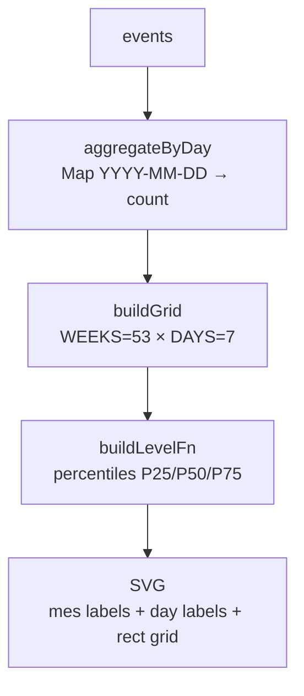

# `<ActivityHeatmap>`

> Grid 53×7 (semanas × días) estilo GitHub que muestra plays por día del último año. Buckets de intensidad **percentile-based** (P25/P50/P75) sobre las cuentas positivas del propio dataset.

## Ubicación
`packages/ui/src/components/StatsView/ActivityHeatmap.jsx:1` (~220 líneas)

## Props

```js
<ActivityHeatmap events={events} title="Actividad anual" />
```

| Prop | Tipo | Notas |
|---|---|---|
| `events` | `HistoryEvent[]` | Lista del [[history]] store |
| `title` | `string` | Default `"Actividad anual"` |

## Render



## Setup

| Constante | Valor |
|---|---|
| `CELL` | 12 |
| `GAP` | 2 |
| `WEEKS` | 53 |
| `DAYS` | 7 |
| `MONTH_LABEL_H` | 16 |
| `DAY_LABEL_W` | 24 |

## Buckets percentile-based

```js
function buildLevelFn(counts) {
  const positives = [...counts.values()].filter(v => v > 0).sort();
  const p25 = positives[floor(L * 0.25)];
  const p50 = positives[floor(L * 0.5)];
  const p75 = positives[floor(L * 0.75)];
  return (count) => {
    if (count <= 0) return 0;
    if (count <= p25) return 1;
    if (count <= p50) return 2;
    if (count <= p75) return 3;
    return 4;
  };
}
```

**Por qué percentiles y no umbrales fijos**: usuarios de bajo volumen (5 plays máximos por día) ven gradiente útil. Con umbrales fijos `[1,3,5,10]` se verían todos como nivel 1.

## Colores por nivel

CSS via `data-level`:

```css
.cell[data-level='0'] { fill: rgba(255, 255, 255, 0.06); }
.cell[data-level='1'] { fill: color-mix(in oklab, var(--color-accent) 25%, transparent); }
.cell[data-level='2'] { fill: color-mix(in oklab, var(--color-accent) 50%, transparent); }
.cell[data-level='3'] { fill: color-mix(in oklab, var(--color-accent) 75%, transparent); }
.cell[data-level='4'] { fill: var(--color-accent); }
```

## Alineación de la última columna

```js
const dow = (today.getDay() + 6) % 7; // 0=Lunes
const start = new Date(today);
start.setDate(today.getDate() - ((WEEKS - 1) * 7 + dow));
```

La última columna alinea con la semana actual. Los días futuros (post-hoy) se omiten en el render.

## Mes labels

Recorre la grid y emite un label cuando cambia el mes:

```js
for (let w = 0; w < WEEKS; w++) {
  const firstCell = grid[w * DAYS];
  if (firstCell.date.getMonth() !== lastMonth) {
    labels.push({ week: w, label: MONTH_NAMES[firstCell.date.getMonth()] });
  }
}
```

## Day labels

Solo Lun / Mié / Vie para no saturar visualmente.

## Hover tooltip

```jsx
<div className={styles.tooltip}>
  <strong>{hover.count}</strong> reproducciones
  el {hover.date.toLocaleDateString(undefined, { day, month, year })}
</div>
```

## Scroll horizontal en mobile

`.scroll { overflow-x: auto }` permite scrollear el SVG si no cabe (mobile portrait).

## Dónde se usa

[[StatsView]] entre el `statsGrid` (cards de métricas) y la sección "Trofeos".

## Qué rompe esto

| Cambio | Impacto |
|---|---|
| Cambiar `WEEKS=53` a `52` | La última columna ya no alinea con la semana actual |
| Quitar `color-mix` (Chrome < 111) | Niveles 1-3 no se ven |
| Cambiar la heurística de día (Domingo first) | Re-validar la alineación |

## Casos de borde

- **events vacío**: `buildLevelFn` retorna siempre 0 → todas las celdas en nivel 0 (gris). Aceptable.
- **Único día con plays** (usuario nuevo): P25=P50=P75=same count → ese día queda en nivel 1. Mejor que vacío.
- **Eventos con `playedAt` inválido**: `aggregateByDay` los descarta silenciosamente.

## Changelog

- 2026-05-27 — Creado en Fase 4.6. Commit `289ce3d`.
- 2026-05-31 (**fix layout + rediseño**): el SVG se **comprimía** (etiquetas de mes
  solapadas "MayJun", celdas minúsculas) porque tenía `width`/`height` en px dentro de un
  contenedor más angosto. Solución:
  - SVG con `viewBox` + `width:100%` + `style={{ minWidth: svgW*0.62, maxWidth: svgW }}` y
    `preserveAspectRatio="xMinYMin meet"`. **Desktop**: cabe completo ajustándose al panel.
    **PWA móvil**: cuando el panel < `minWidth`, el `.scroll` (`overflow-x:auto`) muestra
    scroll horizontal con **sombras-hint** en los bordes (background gradients local/scroll).
  - **Etiquetas de mes sin solape**: filtro `MONTH_LABEL_MIN_GAP_WEEKS` (3 semanas mínimo)
    para no pintar dos labels demasiado juntos.
  - Celdas con `GAP` 3, `rx` 2.5, stroke sutil, nivel 0 con más contraste; leyenda y
    footer (tooltip/hint + leyenda) en una fila. Días `Lun/Mié/Vie` con tilde; tooltip
    "reproducción/reproducciones … del último año". Tildes en todo el texto.
  - Verificado con Playwright a 1300px y 390px.
