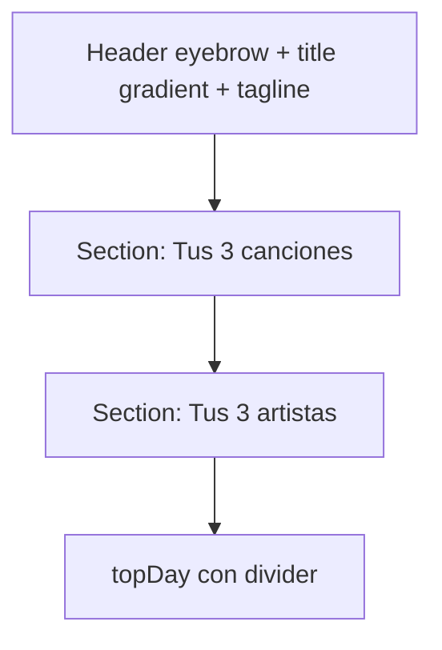

# `<MonthlyWrappedAutoTrigger>` + `<MonthlyWrappedModal>`

> Modal estilo Spotify Wrapped que resume el **mes anterior**: total plays + minutos, top 3 tracks (con cover), top 3 artistas, día más activo. Auto-trigger una vez por mes después del día 2; manual via `<MonthlyWrappedModal onClose={fn} />` (no usado todavía).

## Ubicación
`packages/ui/src/components/StatsView/MonthlyWrapped.jsx:1` (~280 líneas)

## Exports

| Export | Notas |
|---|---|
| `MonthlyWrappedAutoTrigger` | Componente "container" sin UI hasta que decide abrir el modal. Monta en `App.jsx` global |
| `MonthlyWrappedModal` | Modal stand-alone reutilizable. Útil para trigger manual ("Ver mi wrapped") futuro |

## Stores consumidos

| Fuente | Uso |
|---|---|
| [[history]] store | `events` |
| [[player]] store | (importado para uso futuro de `playNow` desde el modal) |

## Auto-trigger condiciones

```js
function shouldAutoOpen() {
  const now = new Date();
  if (now.getDate() < 2) return null;            // espera día 2 (margen de sync de historial)
  const prev = new Date(now.getFullYear(), now.getMonth() - 1, 1);
  const key = monthKey(prev);                     // "YYYY-MM"
  if (localStorage.getItem(`ritmiq.wrapped-seen-${key}`) === '1') return null;
  return key;
}
```

| Localstorage key | Vida |
|---|---|
| `ritmiq.wrapped-seen-2026-04` | Permanente hasta limpiar storage |
| `ritmiq.wrapped-seen-2026-05` | Permanente hasta limpiar storage |
| ... | una por mes consumido |

## Summary

```js
function summarize(eventsArr) {
  // Itera events filtrados por rango
  // Counts por ytId → topTracks ordenados desc
  // Counts por artist → topArtists
  // Counts por día → topDay
  // sum(durationPlayedSeconds) → totalMinutes
}
```

## Render



## Title con gradient text

```css
.title {
  background: linear-gradient(135deg, var(--color-text-1), color-mix(in oklab, var(--color-accent) 50%, var(--color-text-1)));
  background-clip: text;
  -webkit-text-fill-color: transparent;
}
```

## Click outside / cierre

`<Modal>` del proyecto cierra al click en backdrop + Escape. Cuando se cierra, `markSeen(seenKey)` setea el flag → el modal no vuelve a aparecer ese mes.

## Cómo se monta

[[App|App.jsx]]:

```jsx
<ToastHost />
<MonthlyWrappedAutoTrigger />
```

Es null hasta que decide abrir. Cero overhead.

## Qué rompe esto

| Cambio | Impacto |
|---|---|
| Cambiar el día mínimo de 2 a 1 | Wrapped puede dispararse antes de que el historial del último día sincronice |
| Cambiar el formato de la key localStorage | Re-trigger para todos los usuarios el próximo mes |
| Quitar `markSeen` en cierre | Loop infinito: el modal aparece en cada mount |

## Casos de borde

- **Mes anterior sin events**: render con `<p className={styles.empty}>` ("Sigue escuchando y el próximo wrapped será más interesante").
- **Usuario que entra el día 1**: no se dispara hasta el día 2.
- **Usuario con `events.length === 0`** (primera sesión): el useEffect no dispara hasta que llegue al menos un evento.
- **Reset del navegador** (`localStorage.clear()`): el wrapped del mes anterior vuelve a aparecer al próximo mount.

## Changelog

- 2026-05-27 — Creado en Fase 4.7. Commit `5b177ca`.
