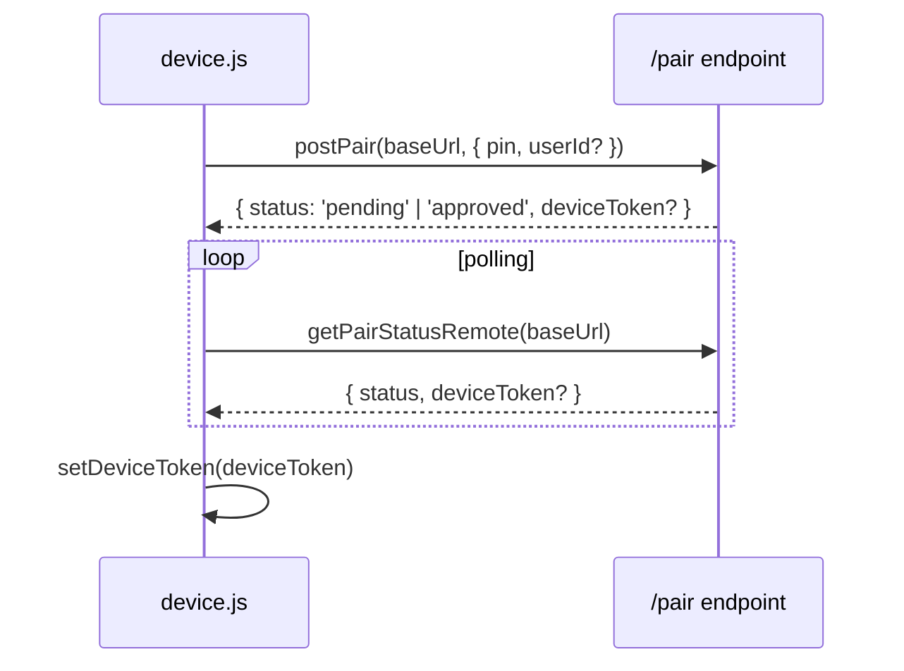

# `lib/device.js`

> Identidad del dispositivo PWA en el Modelo Y. Gestiona `device_id` (UUID persistente en localStorage), `device_token` (Bearer del LAN server), y el flujo de pareo via HTTP `/pair`.

## Ubicación
`packages/ui/src/lib/device.js:1` (108 líneas)

## Exports

| Función | Descripción |
|---|---|
| `getDeviceId(): string \| null` | UUID persistente (genera si no existe). |
| `getDeviceToken(): string \| null` | Bearer token del server LAN. null si no pareado. |
| `setDeviceToken(token)` | Persiste/borra el token del pareo. |
| `getDisplayName(): string` | Nombre visible para el owner (heurística UA: iPhone/iPad/Android/PWA). |
| `setDisplayName(name)` | Sobrescribe el nombre. |
| `generatePin(): string` | PIN de 4 dígitos (1000-9999) para el pareo. |
| `postPair(baseUrl, {pin, supabaseUserId?, cookiesB64?})` | POST `/pair` contra el desktop. |
| `getPairStatusRemote(baseUrl)` | GET `/pair/status?device_id=X`. |
| `isPaired(): boolean` | `!!getDeviceToken()`. |

## Keys localStorage

| Key | Contenido |
|---|---|
| `ritmiq:device:id` | UUID v4 del dispositivo |
| `ritmiq:device:token` | Bearer token del server LAN |
| `ritmiq:device:displayName` | Nombre editable del dispositivo |

## Anatomía (snippet clave)

### `getDeviceId`: genera si no existe
`packages/ui/src/lib/device.js:21-34`

```js
export function getDeviceId() {
  try {
    let id = localStorage.getItem(DEVICE_ID_KEY);
    if (!id) {
      id = (typeof crypto !== 'undefined' && crypto.randomUUID)
        ? crypto.randomUUID()
        : `dev_${Math.random().toString(36).slice(2)}${Date.now()}`;
      localStorage.setItem(DEVICE_ID_KEY, id);
    }
    return id;
  } catch {
    return null;
  }
}
```

**Por qué UUID y no deviceId = Supabase userId**: un usuario puede tener múltiples dispositivos. El `device_id` identifica al dispositivo, no al usuario. Además, el pareo puede iniciarse antes del login.

## Relación con el proceso de pareo



## Qué puede romper este cambio

| Cambio | Síntoma |
|---|---|
| Cambiar `DEVICE_ID_KEY` sin migración | Los dispositivos ya pareados pierden su `device_id` → deben re-parear. |
| `getDeviceId` que genere ID diferente cada vez | El server nunca reconoce el mismo dispositivo → re-pareo infinito. |

## Notas / Changelog
- 2026-05-22: nivel medio.
