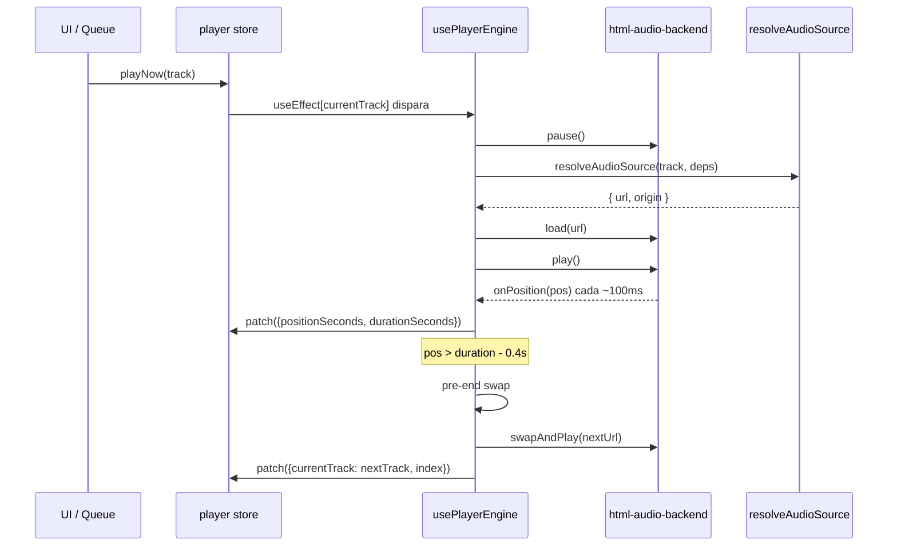

# `usePlayerEngine()`

> El hook central del reproductor. Vincula [[player]] store con el backend HTML Audio, implementa MediaSession API completa, precarga del siguiente track y el pre-end swap para reproducción continua en iOS con pantalla bloqueada.

## Ubicación
`packages/ui/src/lib/use-player.js:1` (609 líneas)

## Por qué es tan complejo

El reproductor en iOS PWA con pantalla bloqueada tiene restricciones muy específicas que hacen que la solución "obvia" no funcione:

1. Un único `<audio>` reutilizado (no Howler — Howler no garantiza continuidad en iOS background).
2. Unlock muteado en el primer gesto del usuario.
3. MediaSession con `prev/next` registrados ANTES del primer play().
4. Pre-end swap SÍNCRONO a `duration - 0.4s` mientras el `<audio>` aún está en estado `playing`.
5. `setPositionState` con la duración del **metadata** del track (no del `<audio>`, que puede ser Infinity al streamear).

## Exports

```js
function usePlayerEngine(): AudioBackend
function getSharedBackend(): AudioBackend | null  // acceso imperativo al singleton
```

`usePlayerEngine` se monta **una sola vez** en `App.jsx`. Retorna el backend para que otros hooks (`useBpmPulse`, `useCrossfade`, `useApplyAudioSettings`) lo usen.

## Inventario de `useEffect`s (en orden)

| # | Dep | Propósito |
|---|---|---|
| 1 | `[backend]` | Unlock del `<audio>` en el primer gesto del usuario |
| 2 | `[backend]` | Registrar MediaSession action handlers (una sola vez) |
| 3 | `[backend, setState]` | `onPosition` → store + MediaSession.setPositionState + historial |
| 4 | `[backend]` | Pre-end swap (swap ANTES de `ended`) |
| 5 | `[currentTrack]` | Reset de `swapDoneRef` al cambiar track |
| 6 | `[backend]` | `onEnded` fallback |
| 7 | `[backend, volume]` | Aplicar volumen |
| 8 | `[backend]` | Listener `ritmiq:seek` del scrubber |
| 9 | `[currentTrack, backend, setState]` | Cargar y reproducir track actual |
| 10 | `[currentTrack, queue, index, backend]` | Precargar URL del siguiente track |
| 11 | `[isPlaying, currentTrack, backend, setState]` | Sync play/pause |

## Anatomía del código (snippets clave)

### 1. `effectiveDuration`: duración real vs duración inflada por proxy
`packages/ui/src/lib/use-player.js:44-56`

```js
function effectiveDuration(audioDur, metaDur) {
  const m = Number.isFinite(metaDur) && metaDur > 0 ? metaDur : 0;
  const a = Number.isFinite(audioDur) && audioDur > 0 ? audioDur : 0;
  if (m > 0 && a > 0) {
    // Si audio.duration excede metadata por más de 10%, es cálculo inflado.
    if (a > m * 1.10) return m;
    return a;
  }
  return m || a || 0;
}
```

**El problema que resuelve**: algunas respuestas de googlevideo vía Cloudflared Tunnel reportan a Safari una duración 2-3x la real. El `<audio>` la computa por bitrate de los fragmentos DASH y yerra. La metadata de yt-dlp (`track.durationSeconds`) es la fuente correcta. Si `audio.duration > metadata * 1.1`, usamos la metadata.

### 2. Cache de reachability LAN/Tunnel (TTL 30s)
`packages/ui/src/lib/use-player.js:60-92`

```js
let cachedReachable = { value: null, until: 0 };
const REACHABLE_TTL = 30_000;

async function getReachableCached() {
  if (cachedReachable.until > Date.now()) return cachedReachable.value;
  // Pings en paralelo: LAN (timeout 1.2s) y Tunnel (timeout 2.5s).
  // Gana el primero que responda OK.
  const result = await new Promise((resolve) => {
    let remaining = 2;
    let resolved = false;
    const handle = (v) => {
      if (resolved) return;
      if (v) { resolved = true; resolve(v); return; }
      remaining--;
      if (remaining === 0) resolve(null);
    };
    pLan.then(handle).catch(() => handle(null));
    pTun.then(handle).catch(() => handle(null));
  });
  cachedReachable = { value: result, until: Date.now() + REACHABLE_TTL };
  return result;
}
```

**Por qué caché de 30s**: resolver LAN/Tunnel implica hacer pings HTTP (~1s cada uno). Si no cacheamos, cada cambio de track haría pings → latencia perceptible antes de cada play. 30s es suficiente para una sesión típica; al cambiar de red (`online`/`offline`) la caché se invalida.

### 3. Unlock del `<audio>` en primer gesto (iOS)
`packages/ui/src/lib/use-player.js:213-245`

```js
const unlock = () => {
  if (unlocked) return;
  unlocked = true;
  try {
    backend.init();
    const el = backend.element();
    if (el) {
      el.muted = true;
      const p = el.play();  // play() muteado en contexto de gesto
      if (p) p.then(() => { el.pause(); el.muted = false; }).catch(() => { el.muted = false; });
    }
  } catch {}
  // Limpiar todos los listeners tras el primer gesto
  window.removeEventListener('pointerdown', unlock, true);
  window.removeEventListener('touchend', unlock, true);
  window.removeEventListener('keydown', unlock, true);
};
```

**Por qué play() muteado**: iOS requiere que `HTMLAudioElement.play()` sea llamado dentro del evento de gesto del usuario. Hacer un `play()` muteado inmediatamente (antes del primer track real) "desbloquea" el elemento para futuros `play()` en background. Sin esto, reproducir desde lockscreen falla silenciosamente.

### 4. MediaSession: registrar prev/next ANTES de play/pause, y por qué se omiten seekbackward/seekforward
`packages/ui/src/lib/use-player.js:252-281`

```js
// Registrar prev/next ANTES que play/pause — iOS lee el conjunto en
// orden de registro para asociar la sesión.
ms.setActionHandler('previoustrack', () => store().prev());
ms.setActionHandler('nexttrack',     () => store().next());
ms.setActionHandler('play',  () => store().patch({ isPlaying: true }));
ms.setActionHandler('pause', () => store().patch({ isPlaying: false }));
ms.setActionHandler('seekto', (d) => { if (d?.seekTime) backend.seek(d.seekTime); });

// CRÍTICO: si registras seekbackward/seekforward, iOS los prioriza sobre
// prev/next y muestra botones de ±10s en lugar de pista anterior/siguiente.
try { ms.setActionHandler('seekbackward', null); } catch {}
try { ms.setActionHandler('seekforward',  null); } catch {}
```

**Decisión documentada**: no registrar `seekbackward`/`seekforward`. iOS los incluye en el layout del lockscreen cuando están registrados, y cuando conviven con prev/next, iOS elige mostrar los de seek en lugar de los de pista. Los registramos explícitamente como `null` para anularlos.

### 5. Pre-end swap: cambiar al siguiente a `duration - 0.4s`
`packages/ui/src/lib/use-player.js:336-413`

```js
return backend.onPosition((pos) => {
  const remaining = dur - pos;
  if (remaining > 0.4) return;

  if (store.repeat === 'one') {
    // Repeat one: reseek mismo elemento, NO swap
    backend.seek(0);
    return;
  }

  if (swapDoneRef.current === cur.id) return;  // anti-dup

  const preUrl = nextUrlRef.current;  // URL precargada
  if (!preUrl) {
    // Sin precarga: si ya terminó la canción real, saltar en foreground
    if (remaining <= 0.05) store.next();
    return;
  }

  swapDoneRef.current = cur.id;
  backend.swapAndPlay(preUrl);           // 1) swap SÍNCRONO mientras playing
  loadedTrackIdRef.current = nextTrack.id;  // 2) evitar doble load
  applyMediaSessionMetadata(nextTrack);  // 3) lockscreen
  store.patch({ index: nextIdx, currentTrack: nextTrack, isPlaying: true, positionSeconds: 0 });
});
```

**La restricción iOS que justifica todo esto**: iOS Safari mantiene la autorización del `<audio>` para reproducir en background SOLO mientras el elemento sigue reproduciendo **sin gap**. El evento `ended` ya está fuera de esa ventana → cualquier `play()` después falla silenciosamente. Disparar el swap a `duration - 0.4s`, cuando `<audio>` aún está en estado `playing`, conserva la sesión.

**Por qué `swapDoneRef`**: el `onPosition` listener se llama continuamente. Sin el ref, el swap se dispararía múltiples veces en los últimos 400ms → varios cambios de track.

### 6. ATAJO 2: mismo ytId no provoca recarga del audio
`packages/ui/src/lib/use-player.js:472-477`

```js
// Si el track tiene el MISMO ytId (track efímero persisted → UUID nuevo),
// mantenemos el audio exactamente como está; solo sincronizamos la metadata.
if (fp && loadedFingerprintRef.current === fp) {
  loadedTrackIdRef.current = currentTrack.id;
  applyMediaSessionMetadata(currentTrack);
  return;  // NO recargamos el audio
}
```

**El bug que esto resuelve**: "Guardar en playlist" llama `persistEphemeral` → el track obtiene un UUID nuevo → `currentTrack` cambia → sin este atajo, `useEffect[currentTrack]` cargaría el mismo audio de nuevo → la canción se pausa y reinicia. Con el atajo, si el `ytId` no cambió, se actualiza solo la identidad lógica y la metadata del lockscreen.

### 7. `applyMediaSessionMetadata`: album nunca vacío en iOS
`packages/ui/src/lib/use-player.js:589-598`

```js
navigator.mediaSession.metadata = new MediaMetadata({
  title: track.title || 'Ritmiq',
  artist: track.artist || 'Ritmiq',
  album: track.album || track.artist || 'Mi música',  // NUNCA vacío
  artwork,
});
```

**CRÍTICO iOS**: si `album` está vacío, iOS trata el contenido como podcast y muestra botones de ±10s en lugar de pista anterior/siguiente. Siempre poner algo en `album`.

## Flujo end-to-end de un play



## Casos de borde y gotchas

- **Race condition `useEffect[currentTrack]` vs `useEffect[isPlaying]`**: el effect de isPlaying tiene guard `if (loadedTrackIdRef.current !== currentTrack.id) return`. Sin esto, al cambiar track, el effect[isPlaying] llamaría `backend.play()` sobre el src viejo mientras el effect[currentTrack] está async cargando el nuevo → canción anterior seguiría sonando unos segundos.
- **Duración inflada por proxy**: `effectiveDuration` usa metadata cuando `audioDur > metaDur * 1.1`. Sin esto, el pre-end swap dispararía 2-3 minutos antes del fin real.
- **Precarga en shuffle desactivada**: `if (store.shuffle) return` en el useEffect de precarga. En shuffle el siguiente track es aleatorio; precargar el `index+1` sería incorrecto.
- **Delay de precarga 200ms**: antes era 1200ms. Con `cookiesFile` cacheado y `MAX_CONCURRENT=3` en el LAN server, el siguiente resolve no compite con el actual. 200ms maximiza la probabilidad de tener la URL lista al pre-end swap.
- **`getSharedBackend()`**: singleton accesible por componentes sin prop drilling (NowPlaying, EQ UI). Null antes de que `usePlayerEngine` monte.

## Performance y costes

| Operación | Frecuencia | Coste |
|---|---|---|
| `onPosition` listener | ~10 veces/seg | Mínimo (setState throttled a ~1/seg) |
| Pre-end swap | 1 por track | Síncrono, < 1ms |
| `getReachableCached` | 1 vez cada 30s | 2 pings HTTP paralelos |
| `resolveAudioSource` | 1 por track + 1 precarga | 200ms-3s (depende de LAN/Tunnel/Cloud) |
| `applyMediaSessionMetadata` | 1 por track | < 1ms |

## Dependencias entrantes
- [[App]] monta `usePlayerEngine()` una sola vez.
- [[NowPlaying]], EQ UI usan `getSharedBackend()`.

## Dependencias salientes
- [[player]] store → `patch`, `next`, `prev`, `getState`.
- [[history]] store → `record`.
- [[html-audio-backend]] → toda la interfaz `AudioBackend`.
- [[audio-source|core/audio-source]] → `resolveAudioSource`.
- [[lan-client|ui/lib/lan-client]] → `getLanBaseUrlSync`, `pingLan`, `getSignedStreamUrl`, `withTokenInUrl`.
- [[local-downloads|ui/lib/local-downloads]] → `getLocalBlobUrl`.
- [[api|ui/lib/api]] → `appInfo`, `ytStreamUrl`.
- [[track-helpers|ui/lib/track-helpers]] → `isEphemeralTrack`.

## Qué puede romper este cambio

| Cambio | Síntoma observable |
|---|---|
| Quitar unlock muteado en primer gesto | iOS nunca permite play en background → canción termina y la siguiente no empieza. |
| Registrar `seekbackward`/`seekforward` | iOS muestra ±10s en lockscreen en lugar de pista anterior/siguiente. |
| `album` vacío en MediaSessionMetadata | iOS trata el contenido como podcast → layout con ±10s. |
| Quitar pre-end swap, usar solo `ended` | En iOS con pantalla bloqueada, el evento `ended` ya está fuera del contexto de reproducción → `play()` falla silenciosamente. |
| Quitar guard `loadedTrackIdRef` en `useEffect[isPlaying]` | Al cambiar track, el audio anterior sigue sonando ~5s mientras el nuevo carga. |
| Quitar `ATAJO 2` (mismo ytId) | "Guardar en playlist" pausa y reinicia la canción en curso. |
| Usar `audio.duration` para `setPositionState` | iOS muestra duración `Infinity` → layout de live stream con ±10s. |
| Precarga en shuffle | Se precarga un track que no es el próximo → precarga desperdiciada, sin mejora de latencia. |

## Notas / Changelog
- 2026-05-22: nivel pleno. Nota más larga del vault — justificado por la complejidad de iOS background audio.
