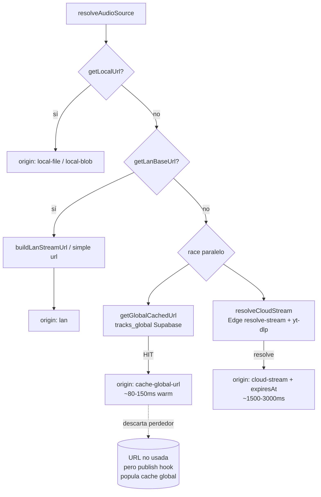

# `core/audio-source.js`

> Estrategia adaptativa para resolver la fuente de audio de un track. Implementa la cascada: **descarga local → servidor LAN → race(cache global ↔ cloud edge)**. Totalmente agnóstica del entorno (mismo código en Desktop y PWA).

## Ubicación
`packages/core/src/audio-source.js`

## Export principal

```js
async function resolveAudioSource(track: Track, deps: ResolveAudioDeps): Promise<AudioSourceResult>
```

### `ResolveAudioDeps`

Interface de dependencias inyectadas (Dependency Injection — por eso es agnóstica de entorno):

| Prop | Tipo | Responsabilidad |
|---|---|---|
| `getLocalUrl(trackId)` | `Promise<string\|null>` | Retorna URL reproducible si existe descarga local. En Desktop: `file://...`. En PWA: `blob:...` desde IndexedDB. |
| `getLanBaseUrl()` | `Promise<string\|null>` | Retorna base URL del server LAN (`http://192.168.x.x:3939`) o null si no hay desktop alcanzable. |
| `resolveCloudStream(trackId)` | `Promise<{url, expiresAt?}>` | Llama a Edge Function [[resolve-stream]] de Supabase. |
| `buildLanStreamUrl(trackId, baseUrl)?` | `string \| Promise<string>` | Opcional. Construye la URL con token Bearer (`?token=xxx`) o firma HMAC. Sin esto, usa ruta simple sin auth. |

## Anatomía del código (completo — es corto y crítico)

`packages/core/src/audio-source.js:39-63`

```js
export async function resolveAudioSource(track, deps) {
  // 1. ¿Existe descargado localmente?
  const localUrl = await deps.getLocalUrl(track.id);
  if (localUrl) {
    return {
      url: localUrl,
      origin: localUrl.startsWith('blob:') ? 'local-blob' : 'local-file',
    };
  }

  // 2. ¿Hay servidor LAN accesible?
  const lanBase = await deps.getLanBaseUrl();
  if (lanBase) {
    const url = await (deps.buildLanStreamUrl
      ? deps.buildLanStreamUrl(track.id, lanBase)
      : `${lanBase}/stream/${encodeURIComponent(track.id)}`);
    return { url, origin: 'lan' };
  }

  // 3. Fallback: cloud edge function
  const { url, expiresAt } = await deps.resolveCloudStream(track.id);
  return { url, origin: 'cloud-stream', expiresAt };
}
```

**Por qué DI en lugar de detectar el entorno con `if (typeof window.ritmiq !== 'undefined')`**: cada entorno pasa sus propias implementaciones al construir. El módulo jamás toca `window`, `localStorage`, ni IPC. Esto permite testear la cascada con mocks sin levantar Electron ni una PWA real.

**Por qué `await` sobre `buildLanStreamUrl`**: puede ser síncrona (Desktop: construye string directamente) o async (PWA: pide firma HMAC al backend antes de armar la URL). El `await` unifica ambos casos sin que el caller tenga que saber cuál es.

**Por qué `origin`**: el consumidor ([[use-player]] / [[html-audio-backend]]) puede necesitar saber si la URL es local (no expira, puede ser servida offline) o cloud (expira → necesita refresh). El campo `expiresAt` solo viene en `cloud-stream`.

**Contexto histórico del step 2**: existió una prop `getDirectStreamUrl` que intentaba servir la URL firmada de googlevideo directamente al `<audio>` para bypassear el proxy LAN. Se removió porque las URLs de googlevideo están firmadas con la IP del PC que las generó → el iPhone vía tunnel recibía 403. Ver [[lan-server]] y [[html-audio-backend]] para el detalle.

## Cascada en práctica



## Race paralelo (paso 3+4)

**Decisión clave (2026-05-24):** los pasos 3 (cache global) y 4 (cloud yt-dlp) corren **en paralelo** con `Promise.any` en vez de secuencialmente. Razón:

- Antes: `await getGlobalCachedUrl()` bloqueaba ~500ms en cold MISS antes de caer a yt-dlp. En cache vacío (caso común al arrancar la red), CADA reproducción ephemeral pagaba ese tiempo de "lotería".
- Ahora: cualquiera de los dos que responda primero con URL válida gana.

| Escenario | Resultado |
|---|---|
| Cache HIT (~100ms) + Cloud (~1500ms) | **global gana → −1400ms** |
| Cache MISS rápido (~80ms) + Cloud (~1500ms) | cloud gana eventualmente → +0ms vs antes |
| Cache MISS lento (~500ms) + Cloud (~1500ms) | cloud gana → **−500ms vs antes** |
| Cache error + Cloud OK | cloud gana |
| Ambos fallan | `AggregateError`; relanzamos último error (cloud, más informativo) |

**Efecto secundario beneficioso:** si gana global, cloud sigue corriendo en background. Su URL se descarta pero la invocación de yt-dlp dispara el hook de `publishResolvedUrl` (ver [[stream_url_cache]]), poblando el cache global aún más rápido. Costo: ~1-2% más llamadas a yt-dlp en HITs.

**Fallback secuencial:** si falta una de las deps (`getGlobalCachedUrl` o `resolveCloudStream`) — caso típico en tests unitarios o consumers minimal — el código se comporta exactamente como antes. Cero ruptura.

## Casos de borde y gotchas

- **LAN responde pero el stream falla**: `resolveAudioSource` devuelve la URL LAN correctamente. El fallo ocurre cuando el backend de audio intenta cargarla. Es responsabilidad del caller manejar ese error y llamar a `resolveAudioSource` forzando cloud (no está implementado automáticamente hoy).
- **`getLocalUrl` devuelve URL de blob destruido**: `URL.createObjectURL` genera URLs válidas hasta que el context se destruya. Si el SW recarga la PWA, los object URLs de la sesión anterior son inválidos. `dexie-adapter` los crea fresh cada vez que se llama `getLocalUrl` — no reutiliza.
- **`buildLanStreamUrl` async + lento**: si firmar la URL tarda (invocación a Supabase), la resolución total puede tardar 200-400ms antes de que empiece el audio. El consumidor debería mostrar spinner durante esto.

## Dependencias entrantes
- [[use-player]] (construye `deps` e invoca).
- [[html-audio-backend]] (en algunos caminos).

## Dependencias salientes
- Solo tipado: [[types|core/types]] (`Track`, `AudioSourceResult`).
- No importa nada de runtime — pura lógica.

## Qué puede romper este cambio

| Cambio | Síntoma observable |
|---|---|
| Invertir el orden (cloud primero) | Tracks descargados localmente hacen fetch al cloud innecesario → latencia + quota Supabase. |
| Quitar `buildLanStreamUrl` opcional | Desktop pasa URL sin token → [[lan-server]] responde 401 para todos los streams. |
| Cambiar `origin` strings | [[use-player]] o [[html-audio-backend]] que hacen `if (result.origin === 'lan')` dejan de funcionar. |
| Hacer la función síncrona | `getLanBaseUrl` y `resolveCloudStream` son async → runtime error inmediato. |

## Notas / Changelog
- 2026-05-24: paso 3+4 ahora **race paralelo** con `Promise.any` en vez de secuencial. Mejora −500ms a −2900ms en MISS/HIT respectivamente, nunca peor que antes. Fallback secuencial preservado para tests/consumers minimal.
- 2026-05-22: nivel medio.
