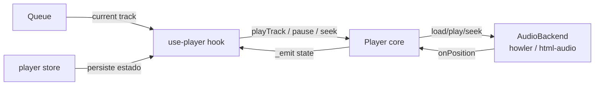

# `core/player/index.js`

> Clase `Player`: máquina de estados de reproducción agnóstica del backend de audio. Delega I/O real al `AudioBackend` inyectado (Howler en Desktop, HTML Audio en PWA). Expone estado reactivo vía `subscribe`.

## Ubicación
`packages/core/src/player/index.js:1` (106 líneas)

## Por qué existe como capa separada

Howler.js y `<audio>` tienen APIs distintas. Sin esta abstracción, la lógica de "play → cambiar estado → notificar UI" estaría duplicada en dos backends o llena de `if (isDesktop)`. El Player core solo conoce `AudioBackend` — un contrato de 6 métodos.

## Interfaz `AudioBackend`

```js
/**
 * @typedef {Object} AudioBackend
 * @property {(url: string) => Promise<void>}       load
 * @property {() => Promise<void>}                  play
 * @property {() => void}                           pause
 * @property {(seconds: number) => void}            seek
 * @property {(volume: number) => void}             setVolume
 * @property {(cb: () => void) => () => void}       onEnded   → unsubscribe
 * @property {(cb: (pos: number) => void) => () => void} onPosition → unsubscribe
 * @property {() => void}                           dispose
 */
```

Implementaciones:
- **Desktop**: [[howler-backend]] (`packages/ui/src/lib/howler-backend.js`)
- **PWA**: [[html-audio-backend]] (`packages/ui/src/lib/html-audio-backend.js`)

## API de la clase `Player`

```js
class Player {
  constructor({ backend: AudioBackend, resolveSourceUrl: (track) => Promise<string> })

  subscribe(cb: (state: PlaybackState) => void): () => void
  async playTrack(track: Track): Promise<void>
  async pause(): Promise<void>
  async resume(): Promise<void>
  seek(sec: number): void
  setVolume(v: number): void   // clamp 0..1
  dispose(): void
}
```

Estado reactivo (`PlaybackState`):

```js
{
  currentTrack: Track | null,
  isPlaying: boolean,
  positionSeconds: number,
  volume: number,       // 0..1
  repeat: 'off'|'one'|'all',
  shuffle: boolean,
}
```

## Anatomía del código (snippets clave)

### 1. Constructor: suscripción de posición al boot
`packages/core/src/player/index.js:33-52`

```js
constructor({ backend, resolveSourceUrl }) {
  this.backend = backend;
  this.resolveSourceUrl = resolveSourceUrl;
  this.state = {
    currentTrack: null,
    isPlaying: false,
    positionSeconds: 0,
    volume: 1,
    repeat: 'off',
    shuffle: false,
  };
  this._listeners = new Set();

  // Suscripción permanente a la posición.
  // No se puede unsub hasta dispose() — diseño intencional.
  this._unsubPos = backend.onPosition((pos) => {
    this.state.positionSeconds = pos;
    this._emit();
  });
}
```

**Por qué la suscripción de posición es permanente**: la posición cambia continuamente durante reproducción. Crear y destruir listeners por cada play generaría un overhead notable. Se conecta una vez y vive con el Player; `dispose()` la limpia.

**Por qué `positionSeconds` y no `positionMs`**: UI muestra segundos. Hacemos la conversión en el backend si hace falta, no en la lógica de dominio.

### 2. `playTrack`: resolución → load → play
`packages/core/src/player/index.js:64-72`

```js
async playTrack(track) {
  const url = await this.resolveSourceUrl(track);
  await this.backend.load(url);
  await this.backend.play();
  this.state.currentTrack = track;
  this.state.isPlaying = true;
  this._emit();
}
```

**Por qué actualizamos el estado DESPUÉS de `backend.play()`**: si `load` o `play` fallan, el estado no debe marcar `isPlaying: true`. El estado refleja la realidad del backend, no la intención.

**Por qué no hay try/catch aquí**: Player es un core sin UI. El error propaga al caller ([[use-player]]) que tiene contexto para mostrar toasts, reintentar, o caer a cloud-stream.

### 3. `setVolume` con clamp explícito
`packages/core/src/player/index.js:93-98`

```js
setVolume(v) {
  const clamped = Math.max(0, Math.min(1, v));
  this.backend.setVolume(clamped);
  this.state.volume = clamped;
  this._emit();
}
```

**Por qué clamp en el core y no en el backend**: si delegáramos al backend, cada implementación tendría que recordar clampear. Centralizado aquí, el backend recibe siempre valores válidos.

## Relación con Queue, stores y UI



El `Player` no conoce la `Queue` — es el [[use-player]] hook el que orquesta ambos: cuando el backend emite `onEnded`, el hook pide al Queue el siguiente track y llama `playTrack`.

## Casos de borde y gotchas

- **`playTrack` llamado mientras hay un play en curso**: `load` del backend reemplaza el audio actual. No hay "queue interna" en el Player. El caller debe llamar `pause()` antes si quiere un stop limpio.
- **`dispose()` no frena el audio**: llama `backend.dispose()` que debería parar y limpiar. Pero si el backend tiene un audio en curso sin `pause()` previa, el comportamiento es específico de la implementación.
- **`state` es mutable**: el objeto `this.state` se modifica in-place y se emite la misma referencia. Si un listener guarda la referencia y la compara por igualdad, nunca verá cambios. Los listeners deben desestructurar o acceder a propiedades específicas.
- **`repeat` y `shuffle`**: el Player los tiene en su estado pero NO los implementa. Es la responsabilidad del [[queue|Queue]] y del [[use-player]] hook que orquesta ambos.

## Dependencias entrantes
- [[use-player]] (crea la instancia, subscribe, llama métodos).
- Tests de integración (si existen).

## Dependencias salientes
- [[types|core/types]] (`Track`, `PlaybackState`, `AudioBackend`).
- [[audio-source]] vía el `resolveSourceUrl` inyectado.
- `AudioBackend` concreto: [[howler-backend]] o [[html-audio-backend]] (inyectado, no importado).

## Qué puede romper este cambio

| Cambio | Síntoma observable |
|---|---|
| Actualizar estado ANTES de `backend.play()` | Si play falla, UI muestra "reproduciendo" con ningún audio. |
| Mutar `this.state` y emitir la misma ref que antes | Listeners que hacen comparación por referencia (`===`) nunca actualizan. |
| Quitar `_unsubPos` en `dispose()` | Memory leak de listeners del backend; después de desmontar siguen actualizando estado stale. |
| Mover el clamp de volume al backend | Cada backend implementa diferente → inconsistencias entre plataformas. |
| Añadir manejo de `repeat`/`shuffle` aquí | Duplicaría la lógica de [[queue]] → dos fuentes de verdad. |

## Notas / Changelog
- 2026-05-22: nivel pleno (crítico: es el motor del reproductor).
