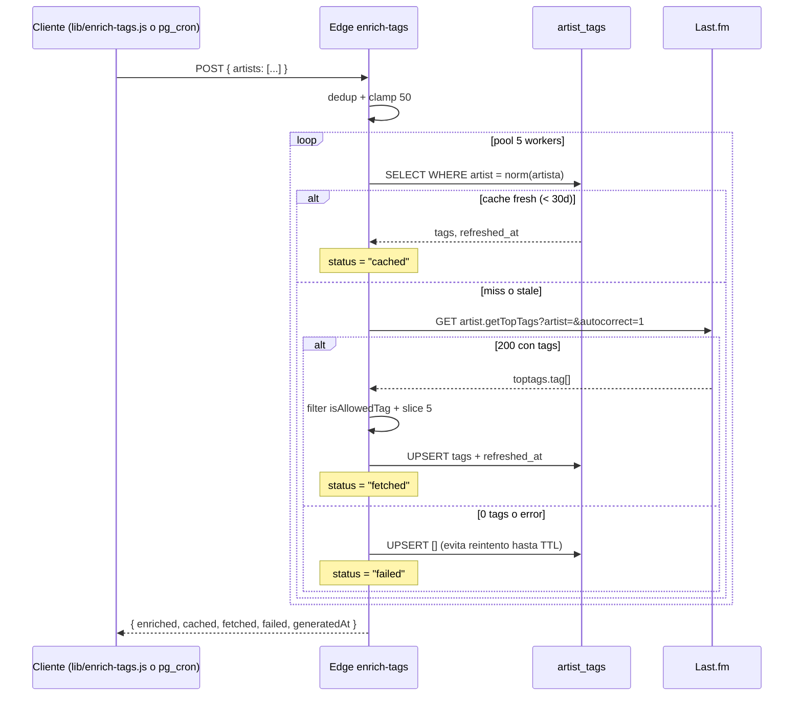

# `enrich-tags`

> Enriquece la tabla [[artist_tags]] con los top-tags de Last.fm para un batch de artistas (max 50). Diseñada para pre-poblar el cache (Spotify import) y para refresh nocturno via `pg_cron`. Concurrencia 5 para respetar el rate limit de Last.fm.

## Ubicación
`supabase/functions/enrich-tags/index.ts:1` (~230 líneas)

## Endpoint

```
POST /enrich-tags
Headers: Authorization: Bearer <user JWT o service_role>
Body: { "artists": ["Bad Bunny", "Rosalia", ...] }   // max 50
```

## Respuesta

```ts
{
  enriched: number,    // total que tienen tags ahora (cached + fetched OK)
  cached: number,      // ya estaban fresh en artist_tags (< 30d)
  fetched: number,     // se llamo a Last.fm para resolverlos
  failed: string[],    // Last.fm no devolvio tags
  generatedAt: string,
}
```

## Pipeline por artista



## Constantes

| Constante | Valor |
|---|---|
| `CACHE_TTL_MS` | 30 días |
| `MAX_ARTISTS_PER_REQUEST` | 50 |
| `CONCURRENCY` | 5 (respeta Last.fm 5 req/s) |
| `MAX_TAGS_PER_ARTIST` | 5 |

## `TAG_BLACKLIST` + `isAllowedTag`

Mismo filtrado que el endpoint [[recommendations]] (auto-genre-mix):

- Tags genéricos: `seen live`, `favorite`, `cool`, `epic`, `classic`, `spotify`...
- Décadas: `00s`, `1990s`, `70s`, etc. (no son género).
- Vocales: `male vocalists`, `female vocalists`.
- Años puros (`19\d{2}`, `20\d{2}`).
- Tags < 3 chars.

## Por qué persistir `[]` cuando Last.fm no devuelve

Last.fm a veces devuelve 0 tags por nombres mal escritos o artistas oscuros. Si NO persistimos, el siguiente caller re-intenta y vuelve a fallar → spam. Con un row `tags: []` + `refreshed_at: now()`:

- Por 30 días no se vuelve a llamar a Last.fm.
- Si el artista gana tags en Last.fm (raro), se refresca tras el TTL.
- El cliente diferencia "sin tags" vs "no procesado" via `tags.length === 0`.

## Concurrencia controlada

```ts
let nextIdx = 0;
async function worker() {
  while (true) {
    const i = nextIdx++;
    if (i >= artists.length) return;
    await enrichOne(admin, artists[i]);
  }
}
await Promise.all(Array.from({ length: 5 }, worker));
```

Pool de 5 workers consume el array compartido. Mantiene exactamente 5 calls en flight contra Last.fm. Sin esto, `Promise.all` directo lanzaría las 50 de golpe → 429.

## Quién llama a este endpoint

| Caller | Cuándo |
|---|---|
| [[enrich-tags|lib/enrich-tags.js]] | Cliente — Home onMount con top 10 artistas (throttled 60s en localStorage). |
| `cron_refresh_artist_tags` (PgSQL) | Diariamente a 04:15 UTC con top 30 artistas de los últimos 7 días. Llama via `pg_net`. |

## Variables de entorno

- `LASTFM_API_KEY` (Supabase secret) — obligatoria.
- `SUPABASE_URL`, `SUPABASE_SERVICE_ROLE_KEY` (auto-inyectadas) — para el `createClient(admin)`.

## Deploy

```bash
supabase functions deploy enrich-tags --project-ref <ref>
```

## Qué puede romper este cambio

| Cambio | Impacto |
|---|---|
| Quitar el `[]` persist en failed | Re-spam de Last.fm en cada call con artistas oscuros |
| Subir `CONCURRENCY` a 10 | Riesgo 429 de Last.fm |
| Bajar `MAX_TAGS_PER_ARTIST` a 3 | Auto-genre-mix tiene menos señal para identificar género dominante |
| Permitir > 50 artistas por request | Worker tarda > 10s; riesgo de timeout del edge |

## Casos de borde

- **Artistas con caracteres especiales** (`Beyoncé`, `Sigur Rós`): Last.fm acepta UTF-8 en el query param; `autocorrect=1` normaliza.
- **Artista con misma denominación**: Last.fm desambigua por popularity. El primero gana.
- **lfm.getTopTags devuelve 5xx**: el `try/catch` en `topTagsByArtist` retorna `[]` → cuenta como failed.

## Changelog

- 2026-05-27 — Creada en Fase 5.1. Commit `894b44d`. Deployada vía CLI el mismo día.
