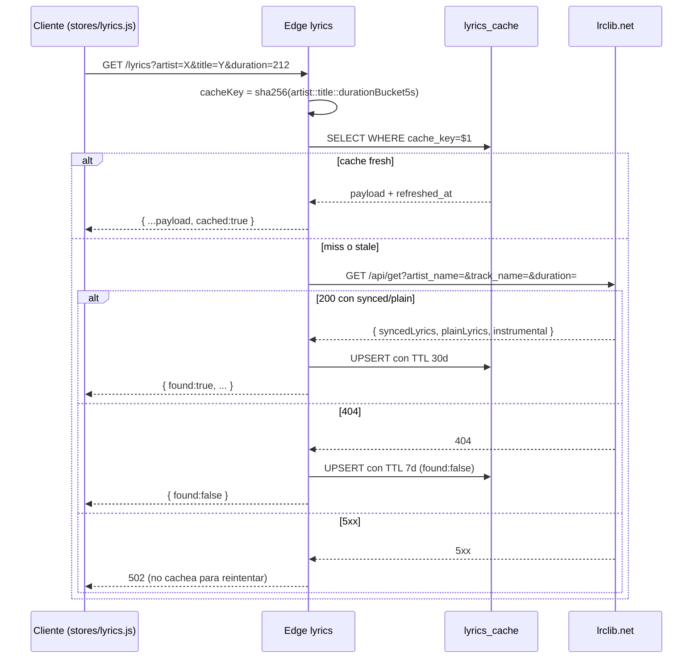

# `lyrics`

> Resuelve la letra (sincronizada si existe) de un track vía `lrclib.net`. Cache server-side en [[lyrics_cache]] con TTL 30d para encontradas / 7d para no encontradas.

## Ubicación
`supabase/functions/lyrics/index.ts:1` (~180 líneas)

## Endpoint

```
GET /lyrics?artist=<a>&title=<t>&duration=<n>
Headers: Authorization: Bearer <user JWT>
```

## Respuesta

```ts
{
  found: boolean,
  synced: string | null,        // formato LRC: "[mm:ss.xx]Line\n..."
  plain:  string | null,        // texto plano si solo está plain
  instrumental: boolean,
  source: 'lrclib',
  cached: boolean,
  generatedAt: string,          // ISO timestamp
}
```

## Pipeline



## Constantes

| Constante | Valor |
|---|---|
| `LRCLIB_BASE` | `https://lrclib.net/api/get` |
| `TTL_FOUND_MS` | 30 días |
| `TTL_MISS_MS` | 7 días |
| `User-Agent` | `Ritmiq/0.1 (https://ritmiq.app)` (recomendado por lrclib) |

## Cache key

```ts
const durBucket = duration ? Math.round(duration / 5) * 5 : 0;
const cacheKey = await sha256Hex(`${normArtist}::${normTitle}::${durBucket}`);
```

**Por qué bucket de 5s**: las distintas fuentes (yt-dlp, Last.fm, lrclib) reportan duraciones con drift de ±2s. El bucket evita que pequeñas variaciones inviten cache miss innecesarios.

## Por qué cachear los `found:false`

lrclib es público gratuito mantenido por voluntarios. Cada track sin letra martilleo a su API. Cachear los misses con TTL 7d:

- Reduce la carga de lrclib.
- Si el track adquiere letra en el futuro (alguien lo subió), el TTL corto garantiza re-fetch.

## Validación de identidad

```ts
if (!req.headers.get('authorization')) return 401;
```

No se valida estrictamente el JWT (anti-abuso público suficiente). lrclib no requiere identidad del usuario; solo evitamos que cualquiera con la URL del endpoint lo consuma libremente.

## Qué puede romper este cambio

| Cambio | Impacto |
|---|---|
| Cambiar bucket de 5s | Invalida todo el cache hasta el próximo refresh |
| Quitar User-Agent | lrclib puede ratelimitarnos sin advertencia |
| Quitar `Authorization` check | Endpoint abierto al público → abuso potencial |
| Mover lrclib a otro mirror | Verificar que el formato de respuesta sea idéntico |

## Casos de borde

- **Artista o título con `&`, `?`, `#`**: el endpoint los URLencodea correctamente; lrclib los acepta.
- **Track con `duration=null`**: bucket 0 — agrupa todos los duracion-less con la misma key (aceptable; son raros).
- **Letras con BOM o encoding raro**: lrclib normaliza a UTF-8 antes de servir.

## Variables de entorno

- `SUPABASE_URL` (auto-inyectada)
- `SUPABASE_SERVICE_ROLE_KEY` (auto-inyectada, para escribir en `lyrics_cache`)

## Deploy

```bash
supabase functions deploy lyrics --project-ref <ref>
```

## Changelog

- 2026-05-27 — Creada en Fase 4.1. Commit `1375f40`. Deployada vía Management API el mismo día.
