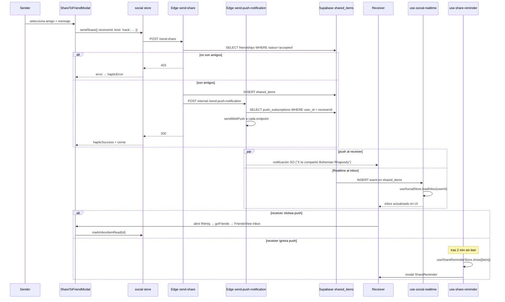

# Compartir un track con un amigo

> Sender comparte → Edge Function valida amistad → INSERT en `shared_items` → push notification al receiver → Realtime actualiza su inbox → reminder si no se lee.

## Diagrama

## Decisiones documentadas

- **Validación de amistad en Edge** ([[send-share]]) — RLS no basta porque requiere lógica de pares ordenados.
- **Push + Realtime juntos** — push captura usuarios con app cerrada, Realtime actualiza UI si está abierta.
- **Reminder client-side** ([[use-share-reminder]]) — cubre el caso de push perdida o ignorada.
- **Playlist snapshot completo** ([[shared_items]]) — el receptor reproduce aunque la playlist original cambie después.
- **`message` max 280 chars** — convención compartida (UI valida, Edge re-valida con slice).

## Módulos involucrados

- UI: [[ShareToFriendModal]], [[ShareReminder]], [[FriendsView]].
- Estado: [[social]] store, [[use-share-reminder]].
- Edge: [[send-share]], [[send-push-notification]].
- DB: [[shared_items]], [[push_subscriptions]], [[friendships]].
- Realtime: [[use-social-realtime]] canal `shared_items`.

## Notas / Changelog
- 2026-05-22: F8.
