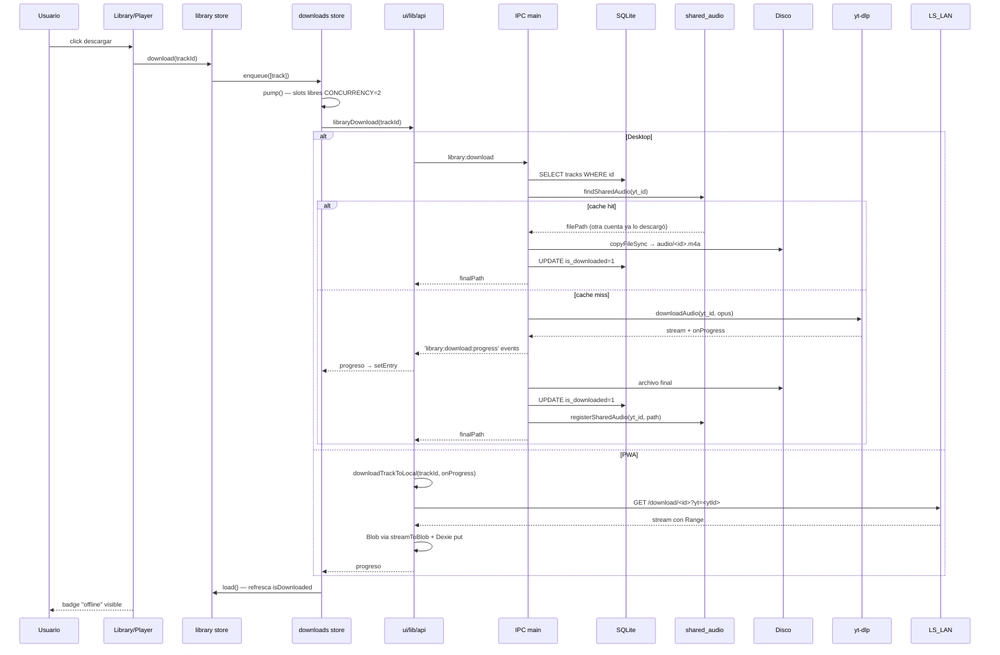

# Descarga offline de un track

> Flujo de descarga en Desktop (archivo en disco) y PWA (Blob en IndexedDB). Cubre el cache compartido `shared_audio` que evita re-descargar tracks ya guardados.

## Diagrama

## Decisiones críticas

- **Cache `shared_audio` PRIMERO** ([[ipc#library:download]]) — si otra cuenta ya lo descargó, copy + UPDATE en ~50ms.
- **Coalescing en `lan-server`** ([[lan-server#downloadSharedAudio]]) — múltiples PWAs piden el mismo ytId → un solo yt-dlp.
- **Formato según destino**: Desktop usa opus (Chromium decode), PWA usa m4a (iOS Safari).
- **Smart Download** ([[playlists#addTrack]]) — si la playlist es offline, encola automáticamente al añadir track.

## Casos de borde documentados

- Track importado de Spotify (no en SQLite local) → IPC acepta `{ trackId, fallback }` para sync antes de descargar.
- Cache shared apunta a archivo borrado → `existsSync` guard → fallback a yt-dlp.
- Descarga interrumpida → blob parcial no se guarda (solo al final).

## Módulos involucrados

- UI: [[Library]], [[Downloads]], [[DownloadIndicator]], [[DownloadProgress]].
- Estado: [[downloads]] store, [[library]] store.
- API: [[api]] adapter.
- Desktop: [[ipc]], [[lan-server]], [[ytdlp-wrapper]], [[schema]] (`shared_audio`).
- PWA: [[local-downloads]], [[dexie-adapter]].

## Notas / Changelog
- 2026-05-22: F8.
