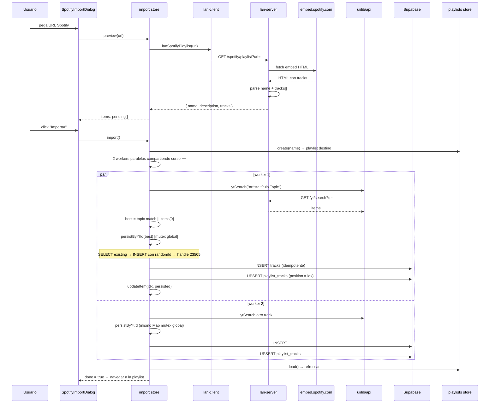

# Importar playlist de Spotify

> Sin OAuth: parseamos el embed público de Spotify, matcheamos cada track en YouTube via ytSearch, y persistimos en Supabase con mutex por `yt_id`.

## Diagrama

## Decisiones documentadas

- **Sin OAuth Spotify** — parseamos el embed público en el [[lan-server]] (server-side para evitar CORS). Funciona con cualquier URL de share.
- **Sufijo "Topic"** en search ([[import]]) — prioriza canales oficiales de música.
- **Mutex global por `yt_id`** (`persistInflight` Map) — dos workers con mismo ytId → una sola INSERT.
- **Handler de 23505** — race entre el SELECT y el INSERT → re-leer el ganador en lugar de fallar.
- **CONCURRENCY=2** — balance entre velocidad (~100 tracks en 5 min) y rate limit de YouTube.
- **`cursor++` atómico** — JS single-threaded garantiza que ningún worker procese el mismo índice.

## Módulos involucrados

- UI: [[SpotifyImportDialog]].
- Estado: [[import]] store, [[playlists]] store, [[library]] store.
- Red: [[lan-client]] (`lanSpotifyPlaylist`), [[lan-server]] (`/spotify/playlist`).
- API: [[api|ui/lib/api]] (`ytSearch`, `libraryAddFromMeta`).
- DB: [[tracks]], [[playlists]].

## Notas / Changelog
- 2026-05-22: F8.
