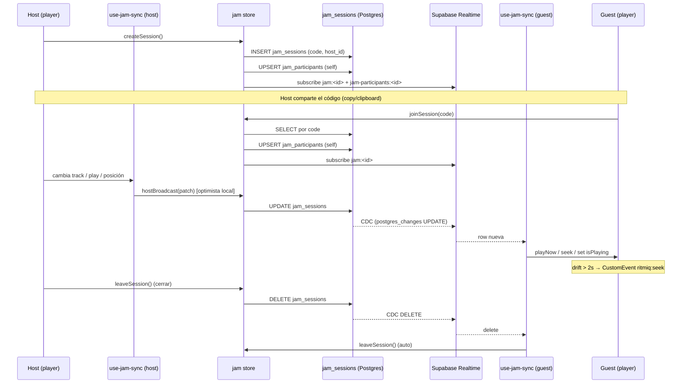

# Jam mode — escucha colaborativa

> El host crea una sesión con un código corto. Los amigos se unen con el código. El host
> controla la reproducción; sus comandos (track/posición/play-pause) se propagan a los
> participantes via Supabase Realtime CDC. Cada cliente reproduce el mismo `ytId` desde su
> propia red (no hay transmisión de audio).

## Diagrama

## Modelo

- **Host → participants** (no peer-to-peer, sin WebRTC, sin transmisión de audio).
- Cada cliente reproduce el mismo `ytId` desde su propia conexión.
- Solo el host puede `UPDATE jam_sessions` (RLS). Los guests solo leen.
- **Roles** (Bloque 3.2): `jam_participants.role` (`host`/`guest`) para UI. El host puede
  **pasar el control** via `jam_transfer_host` → reasigna `host_id` y los roles; el cambio
  llega por CDC y cada cliente recalcula su `mode`. Ver [[jam_participants]] y [[jam|store jam]].

## Decisiones documentadas

- **Realtime Postgres CDC** en vez de WebRTC: simplicidad. El precio es drift de 1-3s entre
  clientes (sin sync de reloj preciso). Ver [[Decisiones-Tecnicas-ADR|ADR-019]] (sync Jam).
- **Optimista en el host**: `hostBroadcast` aplica el cambio local antes del round-trip;
  los guests esperan el CDC. Ver [[jam]].
- **Throttle de posición 5s**: el `positionSeconds` cambia ~30Hz; broadcast solo cada 5s +
  inmediato en track-change/play-pause. Ver [[use-jam-sync]].
- **Código legible**: 6 chars de `ABCDEFGHJKLMNPQRSTUVWXYZ23456789` (sin 0/O, 1/I).
- **Cleanup 24h**: cron `ritmiq-cleanup-jam-sessions` borra sesiones stale. Ver [[jam_sessions]].

## Invitación via deep-link (Bloque 3.3)

- **Compartir**: en la vista `create`, "Compartir invitación" usa `navigator.share` (mobile)
  o copia el enlace `<origin>/jam/<CODE>` al portapapeles (desktop). Ver [[JamModal]].
- **Recibir**: [[App|App.jsx]] detecta `/jam/<code>` al boot (`detectJamDeepLink`), limpia la
  URL con `replaceState` y setea `pendingJoinCode` en [[jam|store jam]]. Cuando hay user
  logueado, monta el [[JamModal]] con `initialCode` → vista `join` pre-rellenada.
- ⚠️ **Verificación pendiente en prod**: `/jam/<code>` depende del SPA fallback de Vercel
  (Vite preset). `/share/track/*` ya funciona así; el middleware OG NO intercepta `/jam`. Si
  en prod diera 404, añadir un `vercel.json` con rewrite SPA para `/jam/:code`.

## Intro educativa (mini-wizard)

La 1ª vez que el usuario abre el [[JamModal]] ve una intro de 3 pasos que explica el modelo
(escucha sincronizada / el host controla / cada quien reproduce desde su propia red, con un
desfase de 1-2s que se corrige solo). Gate `localStorage` `ritmiq.jam-intro-seen`. Un
deep-link `/jam/<code>` salta la intro (el invitado va directo a unirse). Re-verible desde
"¿Cómo funciona una jam?" en el menú. Detalles en [[JamModal]].

## Cola colaborativa de sugerencias (Bloque 3.4)

Tabla [[jam_queue]]: cualquier participante sugiere canciones a una cola compartida; cada
sugerencia muestra **avatar + nombre** de quien la propuso. El **host** decide qué suena
(tap → `playSuggestion`: marca `played_at` + aplica al player local → se propaga por el sync),
el orden y puede quitar cualquiera; el **guest** ve la lista y solo quita sus sugerencias no
reproducidas. La UI reutiliza el [[QueuePanel]]: con jam activa ese panel pasa a ser la "Cola
del Jam"; sin jam vuelve a ser la cola normal. Se sugiere con "Sugerir a la jam" en el menú de
track ([[PlaylistView]] y [[NowPlaying]]) — encola automáticamente para aprobación del host.
Mientras la jam está activa, el **guest no puede usar los controles de transporte** del
[[Player]]/[[NowPlaying]] (el host controla); además [[use-jam-sync]] **revierte centralmente**
cualquier pause/cambio que se cuele por MediaSession, teclado o clic. Ver
[[Decisiones-Tecnicas-ADR|ADR-024]].

### Arranque coordinado + avance FIFO (Bloque 3.7) — reemplaza el modelo de drift

> El enfoque de "perseguir la posición del host con seek/playbackRate" (Bloques 3.1/3.5) se
> **descartó**: cortaba la canción y la ralentizaba audiblemente. Modelo actual:

1. **Transporte por broadcast** (canal `jam:<id>`, baja latencia), no por CDC de `jam_sessions`.
2. **Arranque coordinado**: host envía `prepare {track}` → cada cliente carga sin sonar
   (`prepareForSync`, posición 0) y responde `ready` → host **espera a TODOS** (UI "Esperando a
   N…" + botón "Reproducir igualmente"; deja de esperar a quien sale de presencia) → `start
   {startInMs}` → todos arrancan desde 0 a la vez. **Sin `playbackRate`** (fin de la
   ralentización); seek solo emergencia.
3. **Avance automático FIFO**: al terminar la canción, el host toma sola la siguiente sugerencia
   pendiente de [[jam_queue]] (`jamAdvance`); sin aprobar. Cola vacía → se detiene.
4. **Indicador** spinner/check por participante ([[JamModal]] `readyByUser`).

Ver [[Decisiones-Tecnicas-ADR|ADR-026]], [[use-jam-sync]], [[jam|store jam]], [[html-audio-backend]].

## Invitar amigos a la jam (Bloque 3.6)

Desde **Amigos**, si eres host de una jam activa, cada amigo tiene un botón "Invitar". Modelo
"al invitar": la jam ya existe (eres host); la invitación lleva su `code`. El amigo recibe:
1. **Toast accionable** "Unirse" si tiene la app abierta ([[use-social-realtime]] 4º canal).
2. **Push** si la tiene cerrada ([[send-jam-invite]], `type='jam_invite'`).
3. Una **tarjeta** en su pestaña Solicitudes ([[FriendsView]]).

Si **acepta** → [[respond-jam-invite]] devuelve el `code` → `joinSession(code)` → entra a la jam.
Si **rechaza** → push al host (`type='jam_invite_rejected'`) + toast si está abierto. Tabla
[[jam_invites]], edge functions [[send-jam-invite]]/[[respond-jam-invite]]. Ver
[[Decisiones-Tecnicas-ADR|ADR-025]].

## Gotchas conocidos

- **SELECT abierto**: la RLS de [[jam_sessions]] es `using (true)` → conociendo un código se
  puede leer el track actual de una sesión. Aceptable para uso personal/familiar.
- **Host abandona sin cerrar**: la sesión queda stale hasta el cron de 24h.
- **Drift**: umbral actual de corrección 2s (seek duro). Mejora planeada: compensación con
  `playbackRate` para drifts pequeños (Bloque 3.1, [[Decisiones-Tecnicas-ADR|ADR-019]]).

## Módulos involucrados

- UI: [[JamModal]].
- Estado: [[jam|store jam]].
- Bridge al player: [[use-jam-sync]].
- DB: [[jam_sessions]], [[jam_participants]].
- Player: [[player|store player]].

## Notas / Changelog

- 2026-05-29: flujo creado (F12, doc retroactiva de Fase 8).
