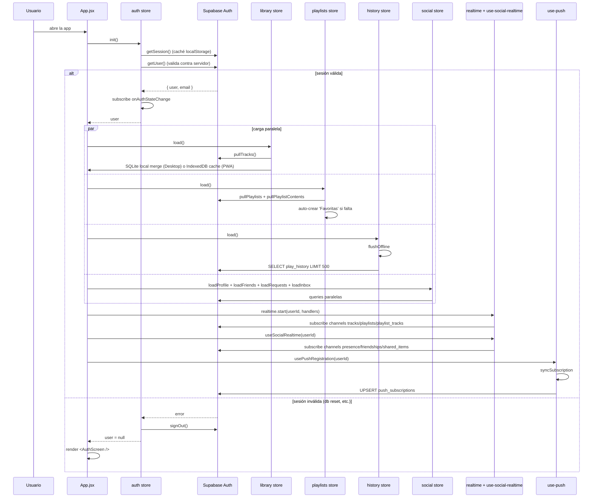
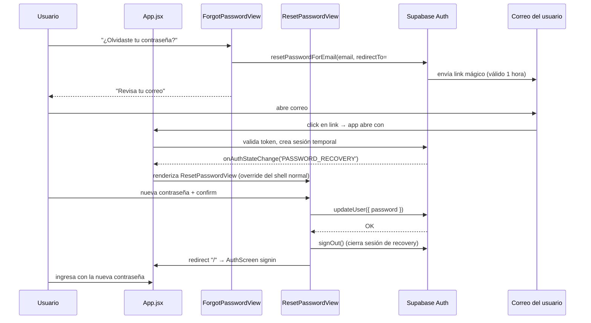

# Login y sesión — carga inicial de la app

> Flujo desde que el usuario se autentica hasta que la app tiene toda la data cargada (library, playlists, social, history) y conexiones Realtime activas.

## Diagrama

## Decisiones documentadas

- **`getUser()` después de `getSession()`** ([[auth#init]]) — la caché localStorage puede estar stale tras `db reset`. La validación contra servidor detecta sesiones inválidas.
- **Carga paralela** — library, playlists, history, social cargan en paralelo. Total ~500ms-2s.
- **Hidratación Dexie en PWA primero** ([[library#load]], [[playlists#load]]) — UI reactiva al instante, Supabase pull en background.
- **Auto-crear Favoritas** ([[playlists#load]]) — si la playlist no existe (sesión nueva), se crea automáticamente; FK 23503 = sesión inválida → sign-out forzado.
- **Realtime tras data inicial** — evita race entre `load` y eventos `applyRemote`.

## Módulos involucrados

- [[Auth]] componente, [[AuthScreen]].
- Stores: [[auth]], [[library]], [[playlists]], [[history]], [[social]].
- Hooks: [[use-social-realtime]], [[use-push]], [[use-presence]].
- Helpers: [[realtime]], [[sync]], [[supabase|ui/lib/supabase]].

## Flujo de recuperación de contraseña

## Vistas del AuthScreen

| Vista | Trigger | Acción |
|---|---|---|
| `SignInView` (default) | apertura del shell sin sesión | `signIn(email, password)` |
| `SignUpView` | click en "Crear una" | `signUp(email, password, { username, displayName })` con username obligatorio |
| `ForgotPasswordView` | click en "¿Olvidaste tu contraseña?" | `resetPassword(email)` |
| `ResetPasswordView` | URL hash `#reset-password` o evento `PASSWORD_RECOVERY` (renderizado por App.jsx, no por el shell) | `updatePassword(newPassword)` |

## Notas / Changelog
- 2026-05-26: Añadido flujo de recovery (ForgotPasswordView + ResetPasswordView). El shell del AuthScreen ahora soporta 3 modos (signin/signup/forgot). Documentación actualizada en [[Auth]].
- 2026-05-22: F8.
