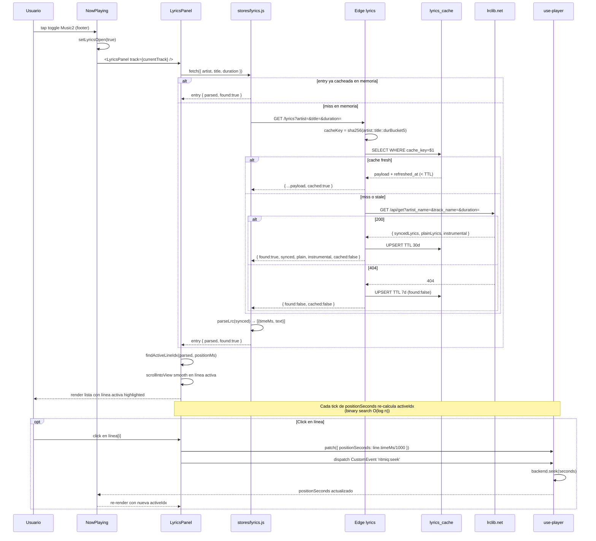

# Letras sincronizadas

> Usuario abre [[NowPlaying]] → toca el toggle de Letra → [[LyricsPanel]] llama [[lyrics|store]] → Edge Function [[lyrics]] consulta cache [[lyrics_cache]] o lrclib.net → Cliente parsea LRC → render con línea activa + auto-scroll + seek por click.

## Diagrama



## Flujo de cache (server + cliente)

| Nivel | Almacén | TTL | Invalidación |
|---|---|---|---|
| **Cliente memoria** | `useLyricsStore.entries[key]` | sesión | `reset()` al logout |
| **Server Postgres** | `lyrics_cache.refreshed_at` | 30d found / 7d miss | sin pruning automático (futuro: pg_cron) |
| **HTTP (sin cache)** | — | — | edge function no añade `Cache-Control` |

## Cache key (server)

```ts
const durBucket = duration ? Math.round(duration / 5) * 5 : 0;
const cacheKey = await sha256Hex(`${normArtist}::${normTitle}::${durBucket}`);
```

Bucket de 5s tolera drifts de duración entre fuentes (yt-dlp vs Last.fm vs lrclib).

## Parseo del LRC

```ts
parseLrc("[00:12.34]Some line\n[00:12][00:45.10]Repeated chorus")
// → [
//     { timeMs: 12340, text: "Some line" },
//     { timeMs: 12000, text: "Repeated chorus" },
//     { timeMs: 45100, text: "Repeated chorus" },
//   ]
```

Soporta:
- `[mm:ss.xx]` con centisegundos
- `[mm:ss]` sin centisegundos
- Múltiples timestamps en una línea (`[mm:ss][mm:ss]text`)
- Filtra metadata `[ti:Title]`, `[ar:Artist]`

## Búsqueda de línea activa (cliente)

```ts
function findActiveLineIdx(parsed, positionMs) {
  // Binary search O(log n) por la última línea cuyo timeMs <= positionMs
  let lo = 0, hi = parsed.length - 1, ans = -1;
  while (lo <= hi) {
    const mid = (lo + hi) >> 1;
    if (parsed[mid].timeMs <= positionMs) { ans = mid; lo = mid + 1; }
    else hi = mid - 1;
  }
  return ans;
}
```

## Auto-scroll

```js
activeRef.current.scrollIntoView({ behavior: 'smooth', block: 'center' });
```

El ancestor scrollable más cercano es el `.root` de [[NowPlaying]] (toda la vista). `.lineItem` tiene `scroll-margin-top/bottom: 30vh` para centrar correctamente.

## Seek por click

Mismo patrón que `onScrubCommit` del scrubber de [[NowPlaying]]:

```js
patch({ positionSeconds: seconds });
window.dispatchEvent(new CustomEvent('ritmiq:seek', { detail: { seconds } }));
```

[[use-player]] consume el evento y llama `backend.seek(seconds)`.

## Estados de fallo

| Estado | Causa | UI |
|---|---|---|
| `error` | Network fail / 5xx tras retries | `<AlertCircle>` + mensaje |
| `found:false` | lrclib no tiene la letra | "No encontramos letra para esta canción" |
| `instrumental:true` | lrclib marca como instrumental | Badge "Instrumental" |
| `parsed.length === 0` pero `plain` | Solo letra plana sin timestamps | `<pre>` scrollable sin highlight |

## Notas / Changelog

- 2026-05-27 — Creado como documentación retroactiva de Fase 4.1 + 4.2 (commits `1375f40`, `555231e`, `1220428`).
