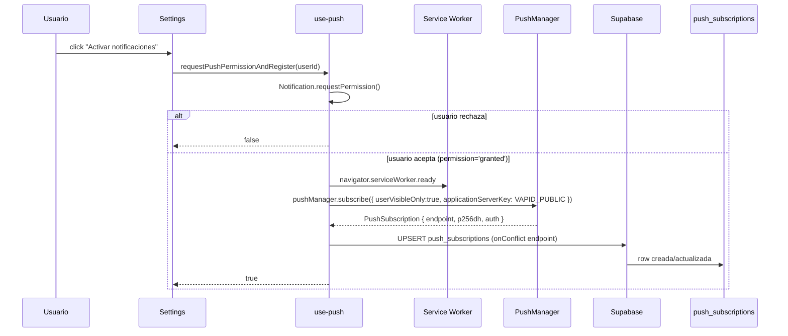
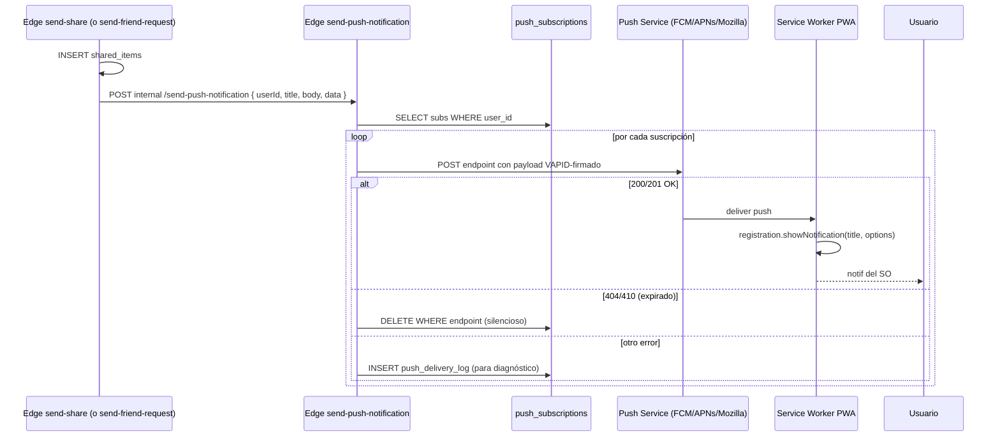
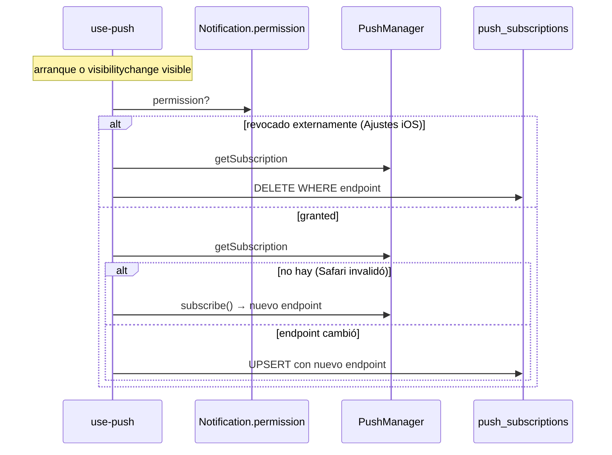

# Push Notifications end-to-end

> Suscripción, persistencia en Supabase, envío via Edge Function, manejo de endpoints expirados.

## Diagrama de suscripción

## Diagrama de envío (push automática tras share / friend request)

## Diagrama de sync periódico (iOS edge cases)

## Decisiones documentadas

- **`removePushDevice` vs `forgetPushDevice`** ([[use-push]]) — el primero solo borra DB (re-activable). El segundo llama `unsubscribe()` (iOS bloquea re-suscripción).
- **`requestPermission` debe estar en onClick** — iOS bloquea silenciosamente si se llama desde async.
- **Re-sync en `visibilitychange`** — detecta revocación de permiso fuera de la app.
- **`push_delivery_log` solo errores no-expirados** — 404/410 son esperados (browser limpia subs), no se loguean.
- **Streak reminders** ([[streak-reminder]]) — cron horario calcula timezone de cada usuario para enviar al mediodía y 9pm locales.

## Módulos involucrados

- UI: [[SettingsView]] sección notificaciones.
- Hook: [[use-push]], [[use-badge]] (badge del icono).
- Edge: [[send-push-notification]], [[send-share]], [[send-friend-request]], [[streak-reminder]].
- DB: [[push_subscriptions]], `push_delivery_log`.
- Service Worker: gestiona `pushevent` y `notificationclick`.

## Notas / Changelog
- 2026-05-22: F8.
