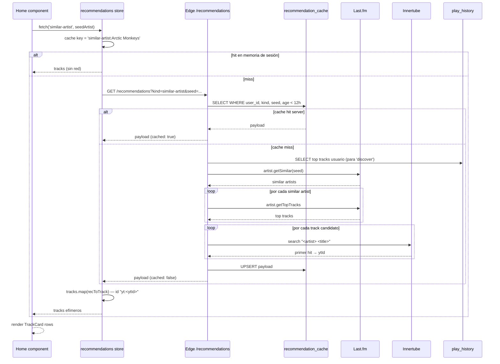

# Recomendaciones para Home

> El Home arma 4+ filas: `similar-artist`, `mix-by-track`, `genre-mix`, `discover`. Cada una pasa por Last.fm + Innertube + cache server 12h.

## Diagrama

## Decisiones documentadas

- **Cache server 12h** — Last.fm y YouTube similar artists no cambian con frecuencia.
- **Tracks efímeros** — `id = "yt:<ytId>"`, no se persisten en `tracks` hasta que el usuario los guarde explícitamente.
- **`reason` propagado** — campo extra para mostrar "Similar a Arctic Monkeys" como subtítulo de la fila.
- **`discover` filtra biblioteca del usuario** — evita recomendar tracks que ya tiene.
- **Cron de limpieza** ([[migrations#20260515]]) — borra entries con TTL excedido cada hora.

## Módulos involucrados

- UI: [[Home]] + sub-componentes (`HomeRow`, `TrackCard`).
- Estado: [[recommendations]] store, [[history]] store (para `discover`), [[library]] store.
- Edge: [[recommendations]] function.
- DB: [[recommendation_cache]].
- APIs externas: Last.fm (`ws.audioscrobbler.com`), Innertube (`youtube.com/youtubei/v1/search`).

## Notas / Changelog
- 2026-05-22: F8.
