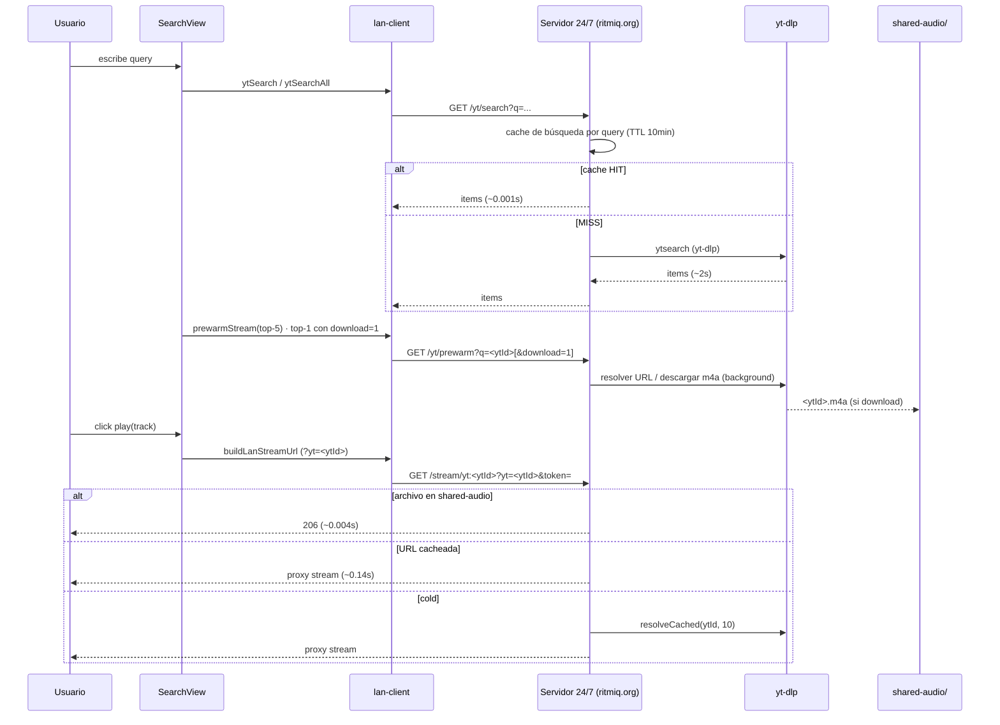

# Reproducción vía Servidor 24/7

> Flujo desde que el usuario busca hasta que suena, usando el **servidor casero
> 24/7** como host primario (modo `auto`). Complementa a
> [[Reproduccion-Track-Online]] (que cubre la cascada desktop/cloud).

## Diagrama

## Selección de host

`use-player.js` `getReachableCached()` ordena los candidatos según `serverMode`
(default `auto` → servidor primero) y hace `pingLan(/health)`. Ver
[[Multi-Endpoint-y-Seleccion-Host]].

## Persistencia de la búsqueda

La búsqueda (query, resultados, tab, scroll) persiste al navegar fuera y volver;
solo se limpia con el botón X. Ver [[SearchView]] y el store `search.js`.

## Fix relacionado (efímeros en desktop)

En el desktop, los tracks efímeros (`yt:<ytId>`, resultados de búsqueda) se
resuelven por el **lan-server local** (`getLanBaseUrl` ya no los excluye). Antes
caían al cloud, cuyas URLs de googlevideo están IP-locked → 403 → "audio load
failed (code 4)". Ver `use-player.js` `getLanBaseUrl`.

## Ver también

- [[Cache-y-Rendimiento]] — detalle de las capas de caché y prewarm.
- [[Reproduccion-Track-Online]] — cascada general.
- [[Sincronizacion-LAN]], [[Tunnel-Cloudflared]].
