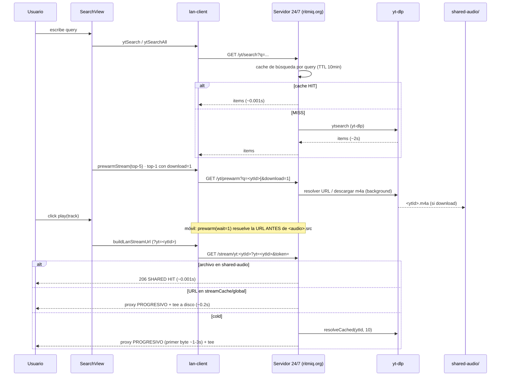

# Reproducción vía Servidor 24/7

> Flujo desde que el usuario busca hasta que suena, usando el **servidor casero
> 24/7** como host primario (modo `auto`). Complementa a
> [[Reproduccion-Track-Online]] (que cubre la cascada desktop/cloud).

## Diagrama

```mermaid
sequenceDiagram
  participant U as Usuario
  participant SV as SearchView
  participant LC as lan-client
  participant SRV as Servidor 24/7 (ritmiq.org)
  participant YT as yt-dlp
  participant FS as shared-audio/

  U->>SV: escribe query
  SV->>LC: ytSearch / ytSearchAll
  LC->>SRV: GET /yt/search?q=...
  SRV->>SRV: cache de búsqueda por query (TTL 10min)
  alt cache HIT
    SRV-->>LC: items (~0.001s)
  else MISS
    SRV->>YT: ytsearch (yt-dlp)
    YT-->>SRV: items (~2s)
    SRV-->>LC: items
  end
  SV->>LC: prewarmStream(top-5) · top-1 con download=1
  LC->>SRV: GET /yt/prewarm?q=<ytId>[&download=1]
  SRV->>YT: resolver URL / descargar m4a (background)
  YT-->>FS: <ytId>.m4a (si download)
  U->>SV: click play(track)
  Note over LC,SRV: móvil: prewarm(wait=1) resuelve la URL ANTES de <audio>.src
  SV->>LC: buildLanStreamUrl (?yt=<ytId>)
  LC->>SRV: GET /stream/yt:<ytId>?yt=<ytId>&token=
  alt archivo en shared-audio
    SRV-->>U: 206 SHARED HIT (~0.001s)
  else URL en streamCache/global
    SRV-->>U: proxy PROGRESIVO + tee a disco (~0.2s)
  else cold
    SRV->>YT: resolveCached(ytId, 10)
    SRV-->>U: proxy PROGRESIVO (primer byte ~1-3s) + tee
  end
```

## Servido progresivo en cache-miss (Fase 1)

**Antes** el servidor descargaba el m4a **completo** antes de enviar el primer
byte (~6-12s). **Ahora** en cache-miss sirve de forma progresiva:

1. Resuelve **solo la URL** de googlevideo (rápido; cacheada 30min + global).
2. Si es **m4a nativo** → `proxyAudioWithCache`: proxy en vivo googlevideo→
   cliente (primer byte inmediato) **+ tee a disco en paralelo** (queda
   cacheado para la próxima). Anti-502: fetch con Range + timeout de primer
   byte (`RITMIQ_PROXY_FIRST_BYTE_TIMEOUT_MS`, def. 4s). Como el servidor
   reenvía bytes al túnel de inmediato, Cloudflare nunca ve un backend colgado.
3. **Garantía de cache:** en paralelo se encola `schedulePrewarmDownload` (yt-dlp
   con `--http-chunk-size`, robusto contra throttle); el tee es best-effort.
4. **Fallback sin regresión:** opus/webm (iOS no decodifica) o proxy sin primer
   byte → `downloadSharedAudio` (descarga+remux) como antes.

TTFB en cache-miss: **~6-12s → ~1-3s**. Ver `packages/server-core/src/lan-server.js`
(`proxyAudioWithCache`) y `packages/yt/src/ytdlp-wrapper.js` (`isNativeM4aUrl`).

## Fix iOS — móvil no reproducía canciones nuevas

iOS Safari **aborta** la reproducción si el primer byte tarda demasiado (~4s en
cache-miss por túnel+celular, dominado por yt-dlp); Chrome (desktop) es más
tolerante. Fix: el cliente **móvil espera** a que el servidor resuelva la URL
antes de asignar `<audio>.src`:

- `/yt/prewarm?wait=1` → el servidor hace `await resolveCached` (prioridad 10) y
  deja la URL en `streamCache` antes de responder.
- `use-player.js` `loadAndPlayCurrent`: si `!isDesktop` y es track de YouTube,
  `await prewarmStream(ytId, { wait: true, timeoutMs: 7000 })` antes de `load`.

Resultado: cuando el `<audio>` pide bytes la URL ya está lista → TTFB ~0.2-1s
→ iOS ya no aborta. El desktop no usa `wait` (LAN local ya es rápido).

## Selección de host

`use-player.js` `getReachableCached()` ordena los candidatos según `serverMode`
(default `auto` → servidor primero) y hace `pingLan(/health)`. Ver
[[Multi-Endpoint-y-Seleccion-Host]].

## Persistencia de la búsqueda

La búsqueda (query, resultados, tab, scroll) persiste al navegar fuera y volver;
solo se limpia con el botón X. Ver [[SearchView]] y el store `search.js`.

## Fix relacionado (efímeros en desktop)

En el desktop, los tracks efímeros (`yt:<ytId>`, resultados de búsqueda) se
resuelven por el **lan-server local** (`getLanBaseUrl` ya no los excluye). Antes
caían al cloud, cuyas URLs de googlevideo están IP-locked → 403 → "audio load
failed (code 4)". Ver `use-player.js` `getLanBaseUrl`.

## Ver también

- [[Cache-y-Rendimiento]] — detalle de las capas de caché y prewarm.
- [[Reproduccion-Track-Online]] — cascada general.
- [[Sincronizacion-LAN]], [[Tunnel-Cloudflared]].
