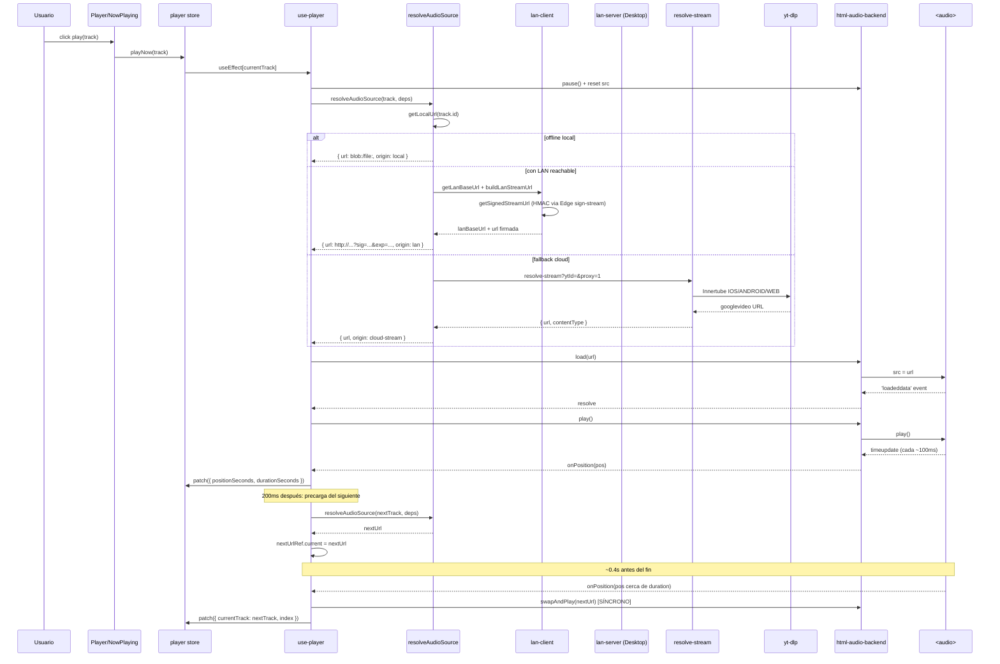

# Reproducción de un track online (PWA)

> Flujo completo desde que el usuario clickea play hasta que el audio empieza a sonar. Cubre la cascada LAN → Tunnel → Cloud y la precarga del siguiente track.

## Diagrama

## Decisiones críticas

- **LAN > Tunnel > Cloud** en orden de prioridad ([[connectivity#recomputeSource]]) — minimiza latencia + costos.
- **HMAC firmada** ([[sign-stream]]) — el LAN server NO consulta Supabase, valida solo con el secret.
- **Pre-end swap** ([[use-player]]) — iOS background playback requiere `play()` SÍNCRONO mientras el `<audio>` aún está reproduciendo (no en `ended`).
- **Precarga 200ms tras play** — el siguiente URL está listo cuando llega el swap.

## Módulos involucrados

- UI: [[Player]], [[NowPlaying]], [[QueuePanel]].
- Lógica: [[use-player]], [[audio-source]], [[html-audio-backend]].
- Red: [[lan-client]], [[connectivity]].
- Servidor LAN: [[lan-server]] (Desktop).
- Edge: [[sign-stream]], [[resolve-stream]].
- YT: [[ytdlp-wrapper]].

## Notas / Changelog
- 2026-05-22: F8 — flujo end-to-end documentado.
