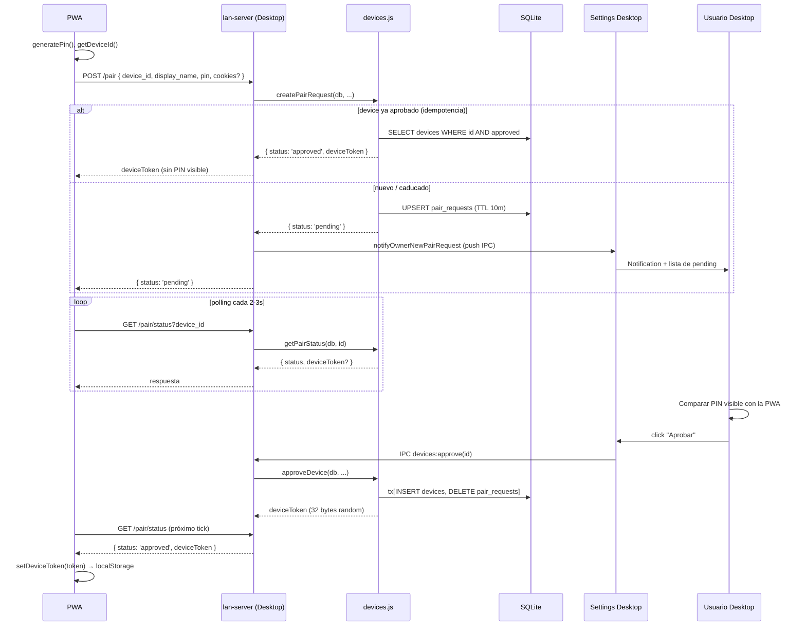
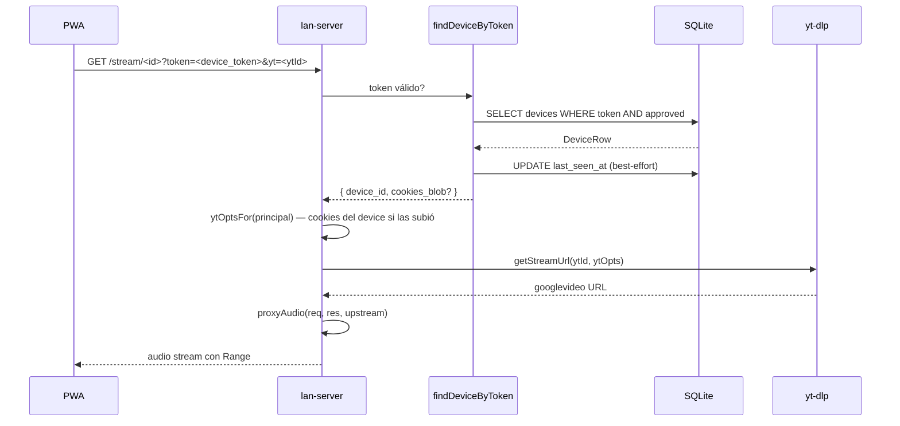

# Pareo y reproducción LAN (Modelo Y)

> Flujo de pareo de una PWA con un Desktop + reproducción posterior usando `device_token` (Modelo Y).

## Diagrama de pareo

## Diagrama de reproducción tras pareo

## Decisiones documentadas

- **Modelo Y** ([[devices]]) — cada desktop autoriza por sí mismo, sin RLS Supabase.
- **`device_token` 32 bytes random** — Brute force inviable (2^256 espacio).
- **`?token=` en URL** — el `<audio>` HTML no acepta headers custom.
- **`cookies_blob` por device** — cifrado con safeStorage, cada PWA usa sus propias cookies de YouTube.
- **TTL 10 min** en `pair_requests` — PIN expira si el owner no aprueba a tiempo.
- **Auto-pair Supabase DESACTIVADO** (decisión 17/05) — compromiso de cuenta != compromiso de devices.

## Módulos involucrados

- PWA: [[device|ui/lib/device]], [[lan-client]], [[SettingsDialog]] (PwaPairingSection).
- Desktop: [[lan-server]], [[devices]], [[device-cookies]], [[ipc]] (handlers `devices:*`).
- DB: tabla `devices`, `pair_requests` ([[schema]]).

## Notas / Changelog
- 2026-05-22: F8.
