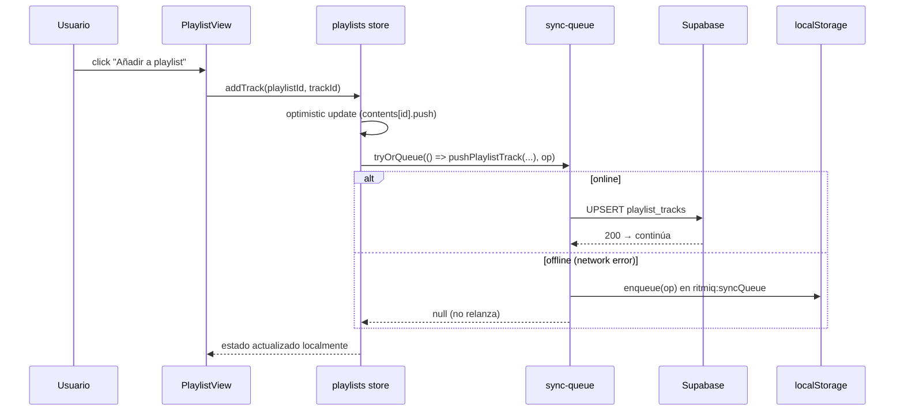
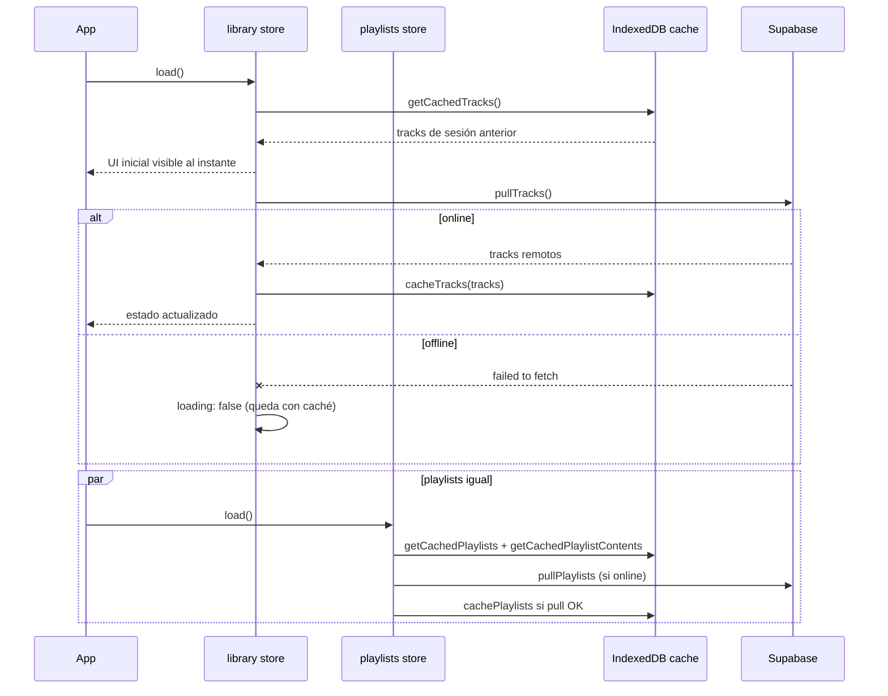

# Sincronización offline-first

> Cómo las mutaciones del usuario llegan a Supabase incluso si la red está caída, y cómo la app rehidrata desde caché local al arrancar sin red.

## Diagrama de mutación offline (ej. añadir track a playlist)



## Diagrama de flush al recuperar red

```mermaid
sequenceDiagram
  participant Conn as connection.js / connectivity.js
  participant SQ as sync-queue
  participant LS as localStorage
  participant SB as Supabase

  Note over Conn: navigator.onLine cambia a true
  Conn->>SQ: flushQueue()
  SQ->>LS: read() → ops[]
  loop FIFO
    SQ->>SB: applyOp(op) → push según kind
    alt OK
      SB-->>SQ: 200
      SQ->>LS: ops.shift() + write
    else fail
      SQ->>LS: bumpAttempts(op) (o descartar si >= 8)
      break loop
    end
  end
```

## Diagrama de hidratación offline (arranque PWA sin red)



## Decisiones documentadas

- **Optimistic local + push diferido** ([[playlists]], [[library]] stores) — UI siempre responsiva.
- **`tryOrQueue` distingue red de lógica** ([[sync-queue]]) — solo errores de red encolan; FK/validación propagan.
- **FIFO con stop en primer fallo** — evita aplicar ops dependientes en orden incorrecto.
- **Max 8 attempts** — ops inválidas se descartan tras 8 intentos.
- **Dexie como cache de metadata** ([[local-downloads]]) — `trackCache`, `playlistCache`, `playlistContentsCache`.
- **Realtime al volver online** — Supabase emite cambios que ocurrieron mientras estaban offline (sincronización completa automática).

## Módulos involucrados

- Stores: [[library]], [[playlists]], [[history]] (cola offline `pendingPlays`).
- Helpers: [[sync]], [[sync-queue]], [[connection]], [[connectivity]], [[local-downloads]] (cache Dexie).
- DB local: [[dexie-adapter]].
- Realtime: [[realtime]], [[use-social-realtime]].

## Notas / Changelog
- 2026-05-22: F8 — 9º flujo.
