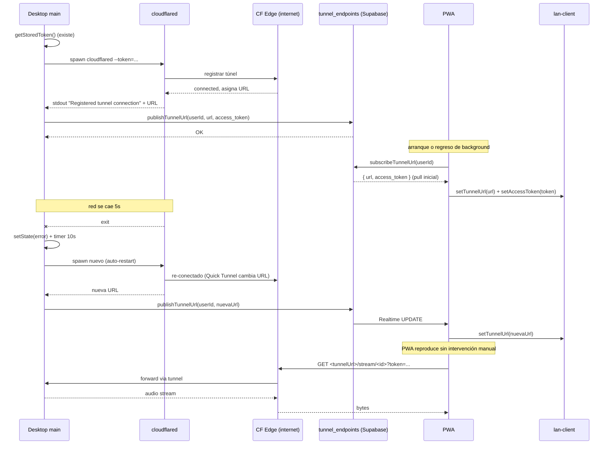

# Cloudflare Tunnel + Tunnel Registry

> Flujo de exposición del LAN server vía Cloudflare Tunnel + descubrimiento automático de la URL del tunnel por la PWA usando Supabase Realtime.

## Diagrama

## Decisiones documentadas

- **Quick Tunnel cambia de URL al reiniciar** → registry resuelve sin intervención manual del usuario.
- **NUNCA borrar `tunnelUrl` local aunque Supabase devuelva null** ([[tunnel-registry]]) — las cuentas pareadas no son owners, su query a `tunnel_endpoints` siempre devuelve null.
- **`access_token` persistido en Supabase** — iOS evict localStorage tras ~7 días, este permite rehidratar.
- **Auto-restart con backoff 10s** ([[cloudflared]]) — bug transitorio de red se recupera solo.
- **Keepalive cada 3 min** ([[lan-client#startTunnelKeepalive]]) — el Quick Tunnel se cierra por inactividad tras ~5 min.

## Módulos involucrados

- Desktop: [[cloudflared|main/cloudflared]], [[ipc]] (handlers `tunnel:*`).
- Cloud: [[tunnel_endpoints]] tabla.
- PWA: [[tunnel-registry]], [[lan-client]], [[connectivity]].

## Notas / Changelog
- 2026-05-22: F8.
