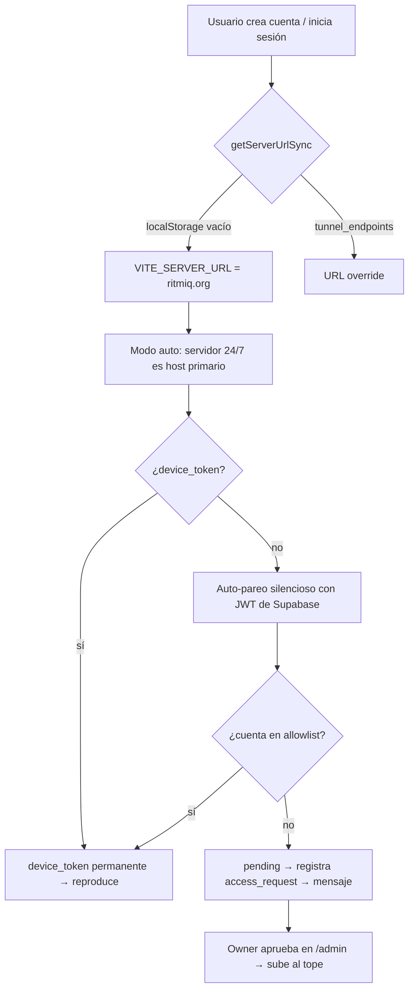

# Migración al servidor 24/7 — cómo funciona ahora

> Nota de cabecera que resume **qué cambió** al migrar el "algoritmo" de
> YouTube del desktop a un servidor casero 24/7, y **cómo funciona el flujo
> completo** para un dispositivo nuevo. Para el detalle de cada pieza ver los
> enlaces al final.

## De dónde venimos → a dónde vamos

**Antes**: el LAN server (búsqueda/resolución/stream/descarga con `yt-dlp`)
vivía **solo en el desktop** (Electron). Si el PC estaba apagado, la PWA caía a
Edge Functions (frágiles, sin cookies) o no funcionaba.

**Ahora**: el mismo código vive en `@ritmiq/server-core` y corre 24/7 en un
**servidor casero** (Docker, túnel `ritmiq.org`). Es el **host primario por
defecto**: todo dispositivo apunta al servidor automáticamente y escucha música
sin encender el PC. El desktop local queda como **dualidad opcional** de
aceleración (modo "Mi PC").

Servidor de referencia: `192.168.68.117`, túnel `ritmiq.org` (Named Tunnel de
Cloudflare, movido del desktop al servidor). Despliegue: Docker + Compose en
`~/ritmiq`.

## Flujo completo de un dispositivo nuevo

1. **Descubrimiento**: el cliente conoce `ritmiq.org` por `VITE_SERVER_URL`
   (build) o por `tunnel_endpoints` (Supabase). Ver
   [[Multi-Endpoint-y-Seleccion-Host]].
2. **Selección de host**: en modo `auto` (default) el **servidor 24/7** va
   primero; "Mi PC" (`prefer-desktop`) prioriza el lan-server local.
3. **Auto-pareo silencioso**: al reproducir/descargar sin `device_token`, el
   cliente hace `POST /pair` con el **JWT de Supabase**. Si la cuenta está
   aprobada → recibe un `device_token` **permanente** (no caduca). Si no →
   `pending` y se registra en `access_requests`. Ver
   [[Administracion-Dispositivos]] y [[Autenticacion-y-JWT]].
4. **Reproducción/descarga**: con `device_token`, el servidor resuelve con
   `yt-dlp` + cookies del owner, sirve desde caché de archivos o descarga
   (anti-throttle). Ver [[Cache-y-Rendimiento]].

## Seguridad del modelo

- **Identidad verificada**: el `supabase_user_id` sale del `sub` del JWT
  verificado (JWKS ES256), nunca del body → sin suplantación.
- **Allowlist de cuentas**: solo cuentas aprobadas reproducen. Gestionable **en
  caliente** desde el panel `/admin` (tabla `allowed_accounts`) o vía
  `RITMIQ_ALLOWED_USERS` (env).
- **`VITE_SERVER_URL` es pública** (el túnel ya lo es): la seguridad la dan
  JWT + allowlist, no la URL.

## Dónde aprobar cuentas (panel /admin)

`https://ritmiq.org/admin` → pegar el **access-token del dueño** (lo imprime el
servidor al arrancar, o `ritmiq-admin token`). Secciones:
- **Cuentas por aprobar** — cuentas que intentaron usar el servidor (botón
  Aprobar) + añadir manual por `user_id`.
- **Cuentas aprobadas** — con botón Quitar.
- **Solicitudes de dispositivo (PIN)** y **Dispositivos** (pareo clásico).

## Actualización de la PWA (deploys)

La PWA se despliega en **Vercel**. El Service Worker comprueba actualización en
cada arranque y cada `visibilitychange` (sin throttle) + cada 30 min, y
**auto-aplica** la versión nueva con recarga suave (salvo que se esté
reproduciendo audio → muestra toast "Actualizar"). Las descargas en IndexedDB
sobreviven a la actualización. Ver `apps/pwa/src/pwa-update.js`.

> **Importante**: los cambios que solo tocan el **servidor** (`server-core`) NO
> generan una actualización de la PWA — se despliegan aparte (Docker). Un deploy
> de PWA solo aparece si cambió `packages/ui` / `apps/pwa`.

## Historial de fixes clave (2026-07)

| Fix | Qué resolvía |
|---|---|
| Servidor host primario (`orderCandidates`) | el desktop/PWA usaban el desktop local aunque el servidor tuviera cookies |
| Re-resolución 403 (`onUpstreamDead`) | URL de googlevideo caducada → "code 4"; ahora re-resuelve |
| m4a nativo + `--http-chunk-size` | descargas 2.4x más rápidas + anti-throttle |
| Descargar+servir en cache-miss de `/stream` | 502 del túnel Cloudflare en canciones no cacheadas |
| Cookies del owner (`RITMIQ_YTDLP_COOKIES_FILE`) | resoluciones fiables (menos bot-checks) |
| `VITE_SERVER_URL` + auto-pareo + allowlist en caliente | todo dispositivo apunta al servidor sin config |
| `getReachableLanBaseUrl` incluye servidor | descargas caían siempre a Edge (502 "desde la nube") |
| `/spotify/playlist` acepta device_token | import de Spotify fallaba (401) para no-owners |
| SW: check en cada foco + auto-aplicar | los deploys tardaban 24h en llegar |

## Ver también

- [[README|Índice Servidor Headless]] · [[server-core]] · [[apps-server]]
- [[Autenticacion-y-JWT]] · [[Administracion-Dispositivos]] · [[Cache-y-Rendimiento]]
- [[Multi-Endpoint-y-Seleccion-Host]] · [[Reproduccion-Servidor-24-7]]
